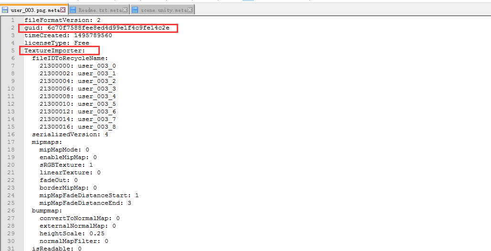
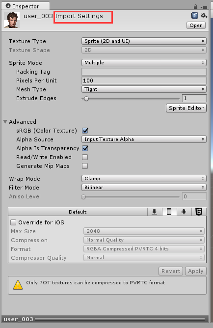

#### meta文件
参考：[unity官网](https://docs.unity3d.com/Manual/BehindtheScenes.html)  

---
##### guid
unity里的每个文件都伴随着一个meta文件，里面会有一个guid，这个guid是unity指向引用的基础。  
如果改变guid，unity会认为对应的文件是一个新的资源，这样会导致原来引用此文件的预设或者场景丢失引用。

##### meta文件 
打开个一个meta文件，你会发现里面存有guid，创建时间等，如果打开的是个对应图片的meta，你会看到对应的TextureImporter，这个与你在unity此图片的import setting有关。里面有一些 Texture Type, Wrap Mode, Filter Mode and Aniso Level的参数。如果打开的是个对应脚本的meta，就会看到对应的MonoImporter里面的参数。
  
  
