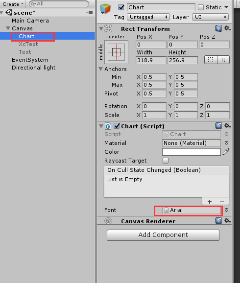
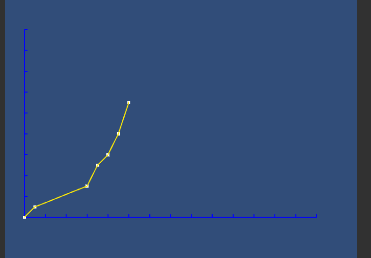

## 使用mesh绘制简单折线图  
有时候会想要在unity做个图表什么的，这里仅给出一个绘制折线图的思路  
这里是用canvasRenderer，所以需要挂在UGUI的canvas下  
  
然后进行调用:  

    List<Vector2> v2List= new List<Vector2>(4)
    {
        new Vector2(0000,0),
        new Vector2(1000,1),
        new Vector2(6000,3),
        new Vector2(7000,5),
        new Vector2(8000,6),
        new Vector2(9000,8),
        new Vector2(10000,11),
    };
    Chart.Plot(v2List,100,0.1f);  
结果如下：  

Chart类文件放在同级的cs文件夹下。