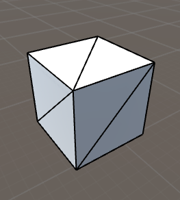
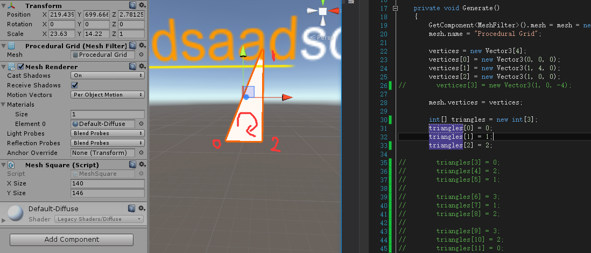

## Mesh Learn
Mesh是Unity内的一个组件，称为网格组件。  

* Mesh 网格
* MeshFilter 网格过滤器
* Mesh Renderer 网格渲染器  

>**Mesh**：是指模型的网格，建模就是建网格。  

>**Mesh Filter**：**内包含一个Mesh组件**，可以根据MeshFilter获得模型网格的组件，也可以为MeshFilter设置Mesh内容。MeshFilter的作用就是把Mesh扔给MeshRender将模型或者说是几何体绘制显示出来  

>**Mesh Render**：是用于把网格渲染出来的组件

**Mesh**的属性：  

* 顶点坐标（vertex）
* 法线（normal）
* 纹理坐标（uv）
* 三角形序列（triangle） 

>**顶点坐标**：顶点坐标数组存放Mesh的每个顶点的空间坐标，假设某mesh有n个顶点，则vertex的size为n  

>**法线**：法线数组存放mesh每个顶点的法线，大小与顶点坐标对应，normal[i]对应顶点vertex[i]的法线  

>**纹理坐标**：它定义了图片上每个点的位置的信息. 这些点与3D模型是相互联系的, 以决定表面纹理贴图的位置. UV就是将图像上每一个点精确对应到模型物体的表面. uv[i]对应vertex[i]

>三角形序列：每个mesh都由若干个三角形组成，而三角形的三个点就是顶点坐标里的点，三角形的数组的size = 三角形个数*3.


#### Mesh的构造  
一个Mesh通常由许许多多三角面构成的。如图：  
  
所以构建Mesh需要以下几步  
1.通过配置顶点坐标确定Mesh的顶点。`mesh.vertices`  
2.通过配置triangle确定Mesh的每个面。`mesh.triangles`  
3.通过配置uv坐标来对应贴图的点。`mesh.uv`

#### 现在开始构建一个简单的Mesh
要想画个Mesh出来需要有MeshFilter和MeshRenderer组件。  

	[RequireComponent(typeof(MeshFilter), typeof(MeshRenderer))]
新建Mesh

	Mesh mesh=new Mesh();
确定**mesh**的顶点坐标

	vertices = new Vector3[4];
	vertices [0] = new Vector3(0, 0, 0);
	vertices [1] = new Vector3(1, 4, 0);
	vertices [2] = new Vector3(1, 0, 0);
	vertices [3] = new Vector3(1, 0, -4);
	mesh.vertices = vertices;
确定**triangles**的顺序  

    int[] triangles = new int[12];
    triangles [0] = 0;
    triangles [1] = 1;
    triangles [2] = 3;
    
    triangles [3] = 0;
    triangles [4] = 2;
    triangles [5] = 1;
    
    triangles [6] = 3;
    triangles [7] = 1;
    triangles [8] = 2;
    
    triangles [9] = 3;
    triangles [10] = 2;
    triangles [11] = 0;  
    mesh.triangles = triangles;
这里是使用的三点确定一个面👌🏻，总共确定了四个面。上面的0，1，2，3代表的是第0，1，2，3个顶点。即：vertices[0]~vertices[3];对于顺序也是有要求的，如图：  
   
**顺时针转为正面，逆时针则为背面。**
  
经过这样一番步骤就构建好了Mesh，然后还要贴纹理  

	Vector2[] uv = new Vector2[vertices.Length];
	uv [0] = new Vector2(0f, 0f);  
	uv [1] = new Vector2(0f, 1f);  
	uv [2] = new Vector2(1f, 1f);
	uv [3] = new Vector2(1, 0f);
	mesh.uv = uv;
这里uv数组的4个元素分别顺序对应mesh.vertices的4个顶点。而Vector2(0f, 0f)里面的参数则贴图的坐标。Vector2(0f, 0f)是贴图的左上角，Vector2(1f, 1f)是贴图的右上角。  
**这个同样解释了为什么Unity自带的Cube用了24个顶点**，这样就可以分别对每个面设置uv了  

附完整代码：  

```c#
using UnityEngine;
using System.Collections;

[RequireComponent(typeof(MeshFilter), typeof(MeshRenderer))]
public class MeshSquare : MonoBehaviour
{

    public int xSize , ySize;
    private Vector3[] vertices;
    private Mesh mesh;

    private void Awake ()
    {
        Generate();
    }

    private void Generate ()
    {
        GetComponent<MeshFilter>().mesh = mesh = new Mesh();
        mesh.name = "Procedural Grid";

        vertices = new Vector3[4];
        vertices [0] = new Vector3(0, 0, 0);
        vertices [1] = new Vector3(1, 4, 0);
        vertices [2] = new Vector3(1, 0, 0);
        vertices [3] = new Vector3(1, 0, -4);
       
        mesh.vertices = vertices;

        int[] triangles = new int[12];
        triangles [0] = 0;
        triangles [1] = 1;
        triangles [2] = 3;

        triangles [3] = 0;
        triangles [4] = 2;
        triangles [5] = 1;

        triangles [6] = 3;
        triangles [7] = 1;
        triangles [8] = 2;

        triangles [9] = 3;
        triangles [10] = 2;
        triangles [11] = 0;

        mesh.triangles = triangles;
        Vector2[] uv = new Vector2[vertices.Length];
        uv [0] = new Vector2(0f, 0f);  
        uv [1] = new Vector2(0f, 1f);  
        uv [2] = new Vector2(1f, 1f);
        uv [3] = new Vector2(1, 0f);
        mesh.uv = uv;

        mesh.RecalculateNormals();
    }

    private void OnDrawGizmos ()
    {
        if (vertices == null)
        {
            return;
        }

        Gizmos.color = Color.black;
        for (int i = 0; i < vertices.Length; i++)
        {
            Gizmos.DrawSphere(vertices [i], 0.1f);
        }
    }

}
```

