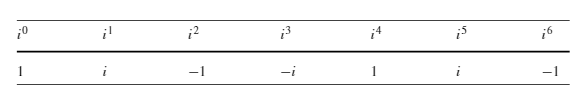
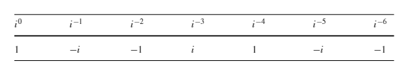

### 3.复数

#### 3.1 介绍

这章我们我们探究等式没有实数根衍生出的平方为-1的虚数$i$。反过来这会引导我们学习复数的代数运算。

很多四元数的性质都是和复数有联系的。复数值得我们仔细研究。

#### 3.2  虚数

虚数是在解方程时没有实数根的时候发现的如$x^2+16=0$。简单的解决方案是声明存在一个量$i$，$i^2=-1$。这就允许我们表达这个等式的解$x= \pm 4i$。

探究$i$究竟是什么是没有意义的。$i$就是一个平方为$-1$的数。尽管如此，我们还是发现了用图形描述的方式，这个下章介绍。

$i$就是imaginary

虚数集记为$\mathbb{I}$， 这允许我们将一个虚数记为

* $ib \in \mathbb {I}$,    $b \in \mathbb {R}$,     $i^2 = -1$

#### 3.3  i 的n次幂

因为$i^2=−1 $ ，我们可以求$i$的n次幂

* $i^4=i^2i^2=1$

* $i^5=ii^4=i$

所以有

$(1,i,−1,−i,1,...)$ 的循环方式让我们想到了 Cartesian坐标系逆时针方向的坐标轴顺序 $(x, y,−x,−y,x,...)$

一个实数轴和一个虚数轴组合成了一个**复数平面**。这个以后介绍。

上面的序列可以被描述为。

*  $i^{4n}=1$

* $i^{4n+1}=i$

* $i^{4n+2}=−1$
* $i^{4n+3}=−i$

$n \in \mathbb {N}$

那么负数次幂呢。

* $i^{-1}  = \frac {1}{i} = \frac {1(-i)}{i(-i)} = -i$

类似的 

* $i^{−2}=\frac {1}{i^2}=\frac{1}{−1}=−1$
* $i^{-3} = i^{-1}i^{-2} = -i(-1)=i$

负数次幂的序列

$(1,−i,−1,i,1,...)$这个序列类似 Cartesian坐标系顺时针方向的坐标轴顺序$(x,−y,−x,y,x,...)$ 

更奇怪的是  $i^i = e^{-\pi /2} = 0.207879576...$  这个会在第四章解释。

接下来我们看虚数和实数的结合。

#### 3.4 复数

根据定义，一个复数是一个实数和一个虚数的和。可以表示为

* $z = a+c $    $a \in \mathbb {R},   c \in \mathbb {I}$

也可以写为

* $z = a+bi$     $a,b \in \mathbb{R}, i^2 = -1$

复数的集合记作$\mathbb {C}$。实数也是复数(只是它没有虚部)。实数和虚数都是复数的子集。

记作

* $\mathbb {R} \subset \mathbb{C}$

* $\mathbb {I} \subset \mathbb{C}$

$\subset$ 代表子集

#### 3.5 复数加减

实部和虚部分别加减

对于$a_1,b_1,a_2,b_2\in R$

* $z_1=a_1+b_1i$

* $z_2=a_2+b_2i$

* 则：$z_1±z_2=(a_1±a_2)+(b_1±b_2)i$

其结果也是封闭的

#### 3.6 实数乘以复数

$λ(a+bi)=λa+λbi$

#### 3.7 复数相乘

对于$a_1,b_1,a_2,b_2\in R$

* $z_1=a_1+b_1i$

* $z_2=a_2+b_2i$

$z_1z_2=(a_1+b_1i)(a_2+b_2i)$

​		$=(a_1a_2−b_1b_2)+(a_1b_2+b_1a_2)i$

结果也是封闭的

#### 3.7.1 复数的平方

$z=a+bi$

$z^2=(a+bi)(a+bi)$

​	$=(a^2−b^2)+2abi$

#### 3.8 复数的模

$z=a+bi$

$|z|=\sqrt{a^2+b^2}$

#### 3.9 共轭复数

$(a+bi)(a−bi)=a^2−abi+abi−b^2i2$

​							$=a^2+b^2$

$z=a+bi$

$z$的共轭记作$\bar{z}$或$z^*$

$zz^∗=a^2+b^2=|z|^2$

#### 3.10 复数的商

利用共轭可以求复数的商

$\frac{a_1+b_1i}{a_2+b_2i}=\frac{(a_1+b_1i)(a_2−b_2i)}{(a_2+b_2i)(a_2−b_2i)}$

​			$=\frac{a_1a_2−a_1b_2i+b_1a_2i−b_1b_2i^2 }{a_2^2+b_2^2}$

​			$=\frac{a_1a_2+b_1b_2}{a_2^2+b_2^2}+\frac{b_1a_2−a_1b_2}{a_2^2+b_2}i$

#### 3.11 复数的乘法逆元

对于$z=a+bi$

$z^{-1}  = \frac {1}{z}$

​	$= \frac{z^*}{zz^*}$

​	$=\frac {z^*}{|z|^2}$

​	$=(\frac {a}{a^2+b^2})-(\frac{b}{a^2+b^2})i$

#### 3.12  $i$的平方根

假设$i$平方根为$a+bi$

有

$i = (a+bi)(a+bi)$

$= a^2-b^2 + 2abi$

等式左侧和右侧的实部和虚部 分别相等

即

$a^2−b^2=0$

$2ab=1$

求得$a=b = \frac{\sqrt{2}}{2}$

所以  $\sqrt{i} = \pm \frac{\sqrt{2}}{2}(1+i)$

#### 3.13 域结构

$\mathbb {C}$ 是一个域。即满足先前对域的所有定义。

#### 3.14 有序对

复数的形式a+bi，也可以写成bi+a

不是有序的。

我们用两个函数去求它的系数

$Re(a+bi)=a$

$Im(a+bi)=b$

这样我们就可以使用有序对来表示复数

重写定理为

* $z_1=(a_1,b_1)$

* $z_2=(a_2,b_2)$

* $z_1+z_2=(a_1+a_2,b_1+b_2)$

* $z_1z_2=(a_1a_2−b_1b_2,b_1a_2+a_1b_2)$

这样非常简洁。继续探索基于有序对的表示。

* $z=(a, b)$

  $=(a,0)+(0,b)$

  $=a(1,0)+b(0,1)$

这里创建了一个单位有序对 (1,0)和(0,1)

计算(1,0)(1,0) = (1-0,0) = (1,0)

计算(0,1)(0,1) = (0−1,0) = (-1,0)

即$(0,1)^2=−1$

$(0,1)=\sqrt{−1 }$ 是虚数

这样就可以用**(a,b)代表a+bi**

##### 3.14.1 乘以一个系数

$λ(a, b)=(λa, λb)$

##### 3.14.2 复数共轭

* $z=(a, b)$

* $z^∗=(a,−b)$

* $zz^∗=(a, b)(a,−b)$

  ​	$=(a^2+b^2,ba−ab)$

  ​	$=(a^2+b^2,0)=a^2+b^2$

##### 3.14.3 商

* $\frac{z_1}{z_2}=\frac{(a_1,b_1)}{(a_2,b_2)}$

  $=\frac{(a_1,b_1)(a_2,b_2)}{(a_2,−b_2)(a_2,−b_2)}$

  $=\frac{(a_1a_2+b_1b_2,b_1a_2−a_1b_2)}{(a_2^2+b_2^2,0)}$

  $=(\frac{a_1a_2+b_1b_2}{a_2^2+b_2^2},\frac{b_1a_2−a_1b_2}{a_2^2+b_2})$

##### 3.14.4 逆

 我们有

* $z^{−1}=\frac{z^∗}{zz^∗}$

  $z=(a, b)$

* $z^{−1}=\frac{(a,−b)}{(a, b)(a,−b)}$

  ​		$=\frac{(a,−b)}{(a^2+b^2,0)}$

  ​		$=(\frac{a}{a^2+b^2},\frac{−b}{a^2+b^2})$

#### 3.15 复数的矩阵表示形式

我们将复数$C$表示成两个矩阵的和$R$代表实部，$I$代表虚部

* $C=R+I$

也可以写成

* $C = a\hat{R}+b\hat{I}$		$a,b \in \mathbb {R}$

这里$\hat{R}=1$ ,$\hat{I} =i$

1的等价矩阵表示就是$2\times2$的单位矩阵

​	$\begin{bmatrix}1 &0 \\ 0& 1\end{bmatrix}$

之前说到$i$可以被认为是某种旋转操作。第四章我们会讲到，复数乘以$i$相当于旋转了90°。现在我们用一个矩阵表示

* ​	$\begin{bmatrix}\cos90^{\circ} &-\sin90^{\circ} \\ \sin90^\circ& \cos90^{\circ}\end{bmatrix} = 	\begin{bmatrix}0 &-1 \\ 1& 0\end{bmatrix}$

也可以这样推导 $(a+bi) \times i = -b+a$

* $\begin{bmatrix}? &? \\ ?&?\end{bmatrix}\begin{bmatrix}a\\b\end{bmatrix} = 	\begin{bmatrix}-b \\ a\end{bmatrix}$

  这个矩阵就是$i$的等效矩阵  即$\begin{bmatrix}0 &-1 \\ 1& 0\end{bmatrix}$

这样1和$i$的矩阵表示都有了

那么任意一个复数可以表示成

* $\begin{bmatrix}a &-b \\ b&a\end{bmatrix} =a \begin{bmatrix}1 &0 \\ 0&1\end{bmatrix} + b\begin{bmatrix}0 &-1 \\ 1&0\end{bmatrix}$

计算下$i$的平方

* $\begin{bmatrix}0 &-1 \\ 1& 0\end{bmatrix}\begin{bmatrix}0 &-1 \\ 1& 0\end{bmatrix} = -1\begin{bmatrix}1 &0 \\ 0& 1\end{bmatrix}$

下面我们用矩阵的形式表示上面复数的一些公式。

##### 3.15.1 加减

$z_1=a_1+b_1i$

$z_2=a_2+b_2i$

* $z_1 = \begin{bmatrix}a_1 &-b_1 \\ b_1&a_1\end{bmatrix}$

* $z_2 = \begin{bmatrix}a_2 &-b_2 \\ b_2&a_2\end{bmatrix}$

* $z_1\pm z_2 = \begin{bmatrix}a_1 &-b_1 \\ b_1&a_1\end{bmatrix}  \pm \begin{bmatrix}a_2 &-b_2 \\ b_2&a_2\end{bmatrix}$

  ​				$=\begin{bmatrix}a_1\pm a_2 &-(b_1\pm b_2) \\ b_1\pm b_2&a_1 \pm a_2\end{bmatrix}$ 

##### 3.15.2 积

$z_1=a_1+b_1i$

$z_2=a_2+b_2i$

* $z_1z_2 = \begin{bmatrix}a_1 &-b_1 \\ b_1&a_1\end{bmatrix} \begin{bmatrix}a_2 &-b_2 \\ b_2&a_2\end{bmatrix}$

  ​		$=\begin{bmatrix}a_1a_2−b_1b_2 &−(a_1b_2+b_1a_2) \\ a_1b_2+b_1a_2&a_1a_2−b_1b_2\end{bmatrix} $

##### 3.15.3 模

$z=a+bi$

* $|z|^2 = \begin{vmatrix} a&-b \\b  & a\end{vmatrix} = a^2 + b^2$

##### 3.15.4 复数共轭

$z=a+bi$

* $z^*=a-bi$

  ​	$=\begin{bmatrix}a &b \\ -b&a\end{bmatrix} $

$zz^* = a^2+b^2$

* $zz^*  = \begin{bmatrix}a &-b \\ b&a\end{bmatrix}\begin{bmatrix}a &b \\ -b&a\end{bmatrix}$

  ​	$=\begin{bmatrix}a^2+b^2 &0 \\ 0&a^2+b^2\end{bmatrix}$

##### 3.15.5 逆

$A = \begin{bmatrix}a_{11} &a_{12} \\ a_{21}&a_{22}\end{bmatrix}$

矩阵的逆

* $A^{-1} = \frac{1}{a_{11}a_{22}- a_{12}a_{21}} \begin{bmatrix}a_{22} &-a_{12} \\ -a_{21}&a_{12}\end{bmatrix}$

$z=a+bi$

复数的逆

$z=\begin{bmatrix}a &-b \\ b&a\end{bmatrix}$

* $z^{-1} = \frac{1}{a^2+b^2}\begin{bmatrix}a &b \\ -b&a\end{bmatrix}$

  ​		$= \frac{a}{a^2+b^2}-\frac{b}{a^2+b^2}i$

##### 3.15.6 商

$z_1=a_1+b_1i$

$z_2=a_2+b_2i$

* $\frac{z_1}{z_2} = z_1z_2^{-1}$

  ​	$ = \begin{bmatrix}a_1 &-b_1 \\ b_1&a_1\end{bmatrix} \frac{1}{a^2+b^2}\begin{bmatrix}a_2 &b_2 \\ -b_2&a_2\end{bmatrix}$

  ​	$=\frac{1}{a^2+b^2}\begin{bmatrix}a_1a_2+b_1b_2 &−(b_1a_2-a_1b_2) \\ b_1a_2-a_1b_2&a_1a_2+b_1b_2\end{bmatrix} $

#### 3.16 总结

##### 定义：

* $\mathbb {I}$ 是一个虚数集合：$bi \in \mathbb {I}$ , $b\in \mathbb {R}$,  $i^2 = -1$

* $\mathbb {C}$是复数的集合且是一个域(满足域的性质)。

  * $z= a+bi$    $ a\in \mathbb {R}$, $bi \in \mathbb {I}$,   $z \in \mathbb {C}$

    ​	$=\begin{bmatrix}a &-b \\ b&a\end{bmatrix}$

##### 有序对：

* $a+bi = (a,b)$

##### 加法和减法：

* $z_1=a_1+b_1i$

  $z_2=a_2+b_2i$

  $z_1\pm z_2 = a_1\pm a_2 + (b_1\pm b_2)i$

  ​				$=\begin{bmatrix}a_1\pm a_2 &-(b_1\pm b_2) \\ b_1\pm b_2&a_1 \pm a_2\end{bmatrix}$ 

##### 积：

* $z_1z_2=(a_1+b_1i)(a_2+b_2i)$

  ​		$=(a_1a_2−b_1b_2)+(a_1b_2+b_1a_2)i$

  ​		$=\begin{bmatrix}a_1a_2−b_1b_2 &−(a_1b_2+b_1a_2) \\ a_1b_2+b_1a_2&a_1a_2−b_1b_2\end{bmatrix}$

##### 平方：

* $z^2 = (a+bi)^2$

  ​     $=(a^2-b^2) + 2abi$

    	$=\begin{bmatrix}a^2-b^2 &-2ab \\ 2ab&a^2-b^2\end{bmatrix}$

##### 模：

$z=a+bi$

* $|z|=\sqrt{a^2+b^2}$
* $|z|^2 =\begin{vmatrix} a&-b \\b  & a\end{vmatrix} = a^2 + b^2$

##### 共轭：

$z=a+bi$

* $z^*=a-bi$

  ​	$=\begin{bmatrix}a &b \\ -b&a\end{bmatrix} $

##### 商：

$z_1=a_1+b_1i$

$z_2=a_2+b_2i$

* $\frac{z_1}{z_2} =\frac{a_1a_2+b_1b_2}{a_2^2+b_2^2}+\frac{b_1a_2−a_1b_2}{a_2^2+b_2}i$

  ​	$= z_1z_2^{-1}$

  ​	$ = \begin{bmatrix}a_1 &-b_1 \\ b_1&a_1\end{bmatrix} \frac{1}{a^2+b^2}\begin{bmatrix}a_2 &b_2 \\ -b_2&a_2\end{bmatrix}$

  ​	$=\frac{1}{a^2+b^2}\begin{bmatrix}a_1a_2+b_1b_2 &−(b_1a_2-a_1b_2) \\ b_1a_2-a_1b_2&a_1a_2+b_1b_2\end{bmatrix} $

##### 逆：

$z=a+bi$

* $\frac {1}{z}= \frac {z^*}{|z|^2}$

  ​	$=(\frac {a}{a^2+b^2})-(\frac{b}{a^2+b^2})i$

  ​	$=\frac{1}{a^2+b^2}\begin{bmatrix}a &b \\ -b&a\end{bmatrix}$

##### $\pm i $ 的平方根

* $\sqrt{i} = \pm \frac{\sqrt{2}}{2}(1+i)$

  ​	$=\frac{\sqrt{2}}{2}\begin{bmatrix}1 &-1 \\ 1&1\end{bmatrix}$

* $\sqrt{-i} = \pm \frac{\sqrt{2}}{2}(1-i)$

  ​		$=\frac{\sqrt{2}}{2}\begin{bmatrix}1 &1 \\ -1&1\end{bmatrix}$

