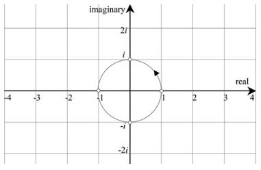
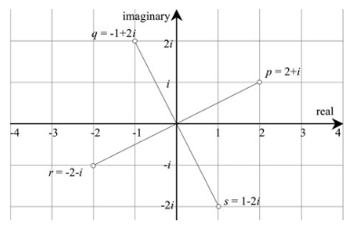
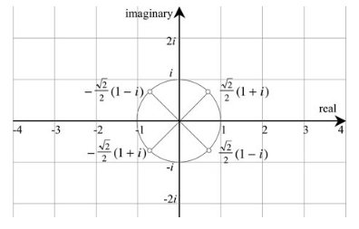
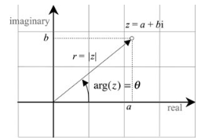
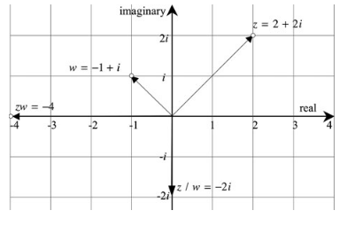

### 4.复数平面

#### 4.3 复数平面

##### 1.1欧拉公式

欧拉公式

* $e^{i\theta} = \cos\theta + i\sin\theta$

当$\theta = \pi$时

* $e^{i\pi}=-1$  或者写为  $e^{i\pi} +1 =0$

公式里集合了5个重要的常量：$0,1,e,\pi$和$i$，还有基本的运算 加，乘，幂

另一个推论就是当$\theta = \pi/2$的时候

* $e^{i\pi/2}= \cos\frac{\pi}{2}+ i\sin\frac{\pi}{2} = i$

因此：

* $i^i = (e^{i\pi/2})^i$

  ​	$=  e^{i^2\pi/2}$

  ​	$=e^{\pi/2}$

  ​	$=0.207879576$

结果是个实数

##### 1.2 旋转与复数相乘

之前我们说过$(1,i,−1,−i,1,...)$的顺序很像Cartesian 坐标轴的逆时针顺序，如图

我们知道$i^0=1$,$i^1=i$,$i^2=−1$,$i^3=−i$ ,$i^4=1$  乘以$i$就像逆时针旋转了90°

举个例子：我们对 $2+i$ 依次乘以$i$

$p=2+i,q=−1+2i,r=−2−i,s=1−2i$

如图

顺时针旋转就是除以$i$， $i^{-1} = -i$ 。 也就是相当于乘以 $-i$

即上面s->r->q->p可以通过乘以$-i$得到

所以一个复数旋转$\pm 90^{\circ} $可以通过乘以$ \pm i$

$i$变换的等效矩阵表示是 $\begin{bmatrix}0 &-1 \\ 1& 0\end{bmatrix}$即$\begin{bmatrix}\cos90^{\circ} &-\sin90^{\circ} \\ \sin90^\circ& \cos90^{\circ}\end{bmatrix}$

在第3章，我们知道$\sqrt{\pm i}$是

* $\sqrt{i} = \pm \frac{\sqrt{2}}{2}(1+i)$

* $\sqrt{-i} = \pm \frac{\sqrt{2}}{2}(1-i)$

参考下图

$\frac{\sqrt{2}}{2}(1+i) = \frac{\sqrt{2}}{2}+ \frac{\sqrt{2}}{2}i =\begin{bmatrix}\frac{\sqrt{2}}{2} &0 \\ 0& \frac{\sqrt{2}}{2}\end{bmatrix} + \begin{bmatrix}0 &-\frac{\sqrt{2}}{2} \\ \frac{\sqrt{2}}{2}& 0\end{bmatrix} =\begin{bmatrix}\frac{\sqrt{2}}{2} &-\frac{\sqrt{2}}{2} \\ \frac{\sqrt{2}}{2}& \frac{\sqrt{2}}{2}\end{bmatrix} = \begin{bmatrix}\cos45^{\circ} &-\sin45^{\circ} \\ \sin45^\circ& \cos45^{\circ}\end{bmatrix}$

即逆时针旋转45度。

$\frac{\sqrt{2}}{2}(1+i) \cdot \frac{\sqrt{2}}{2}(1+i)$可以理解成将复数1 逆时针旋转两次45°

$-\frac{\sqrt{2}}{2}(1+i) \cdot -\frac{\sqrt{2}}{2}(1+i)$ 则是将复数1 逆时针旋转两次225°

这似乎意味着我们可以构造一个复数用来旋转另一个复数任意一个角度。

#### 4.4 极坐标表示

上图中复数的长度$r = \sqrt{a^2+b^2}$，这也是为什么复数的范数使用毕达哥拉斯公式定义的原因

*  $r =|z| = \sqrt{a^2+b^2}$

线和实数轴的夹角$\theta$叫做辐角(argument of z)写作$arg(z)=\theta$

这里

* $\tan\theta = \frac{b}{a} $

怎么计算辐角

* 第一象限 $a>0,b>0$         $\theta = \arctan(b/a)$
* 第二第三象限  $a<0 $           $\theta = \arctan(b/a)+\pi$
* 第四象限 $a>0,b<0$        $\theta = \arctan(b/a) + 2\pi$

参照上图可以看到$a=r\cos\theta$ , $b = r\sin\theta$

所以 

* $z = a+ bi$

  ​	$= r\cos\theta + ri\sin\theta$

  ​	$=r(\cos\theta + i\sin\theta)$

根据上面的公式，再结合欧拉公式$e^{i\pi} = \cos\theta + i\sin\theta$

可以得到复数在极坐标平面下的表示

* $z = re^{i\theta}$

这样我们第三章计算的一些复数间的乘积和商就有了极坐标下的另一种表示。

如有极坐标下的两复数

* $z =  re^i\theta$

  $w = se^{i\phi}$

##### 积

* $zw = rse^{i\theta}e^{i\phi}$

  ​	$=rse^{i(\theta+\phi)}$

  ​	$=rs[cos(\theta+\phi)+isin(\theta+\phi)]$

所以两个复数相乘得到新的复数

范数为长度相乘

* $|zw| = rs$

辐角为两辐角相加

* $arg(zw) = \theta + \phi$

##### 商

* $\frac{z}{w} = \frac{re^{i\theta}}{se^{i\phi}}$

  ​	$= \frac{r}{s}e^{i(\theta - \phi)}$

范数为长度相除

* $|\frac{z}{w}| = \frac{r}{s}$

辐角为两辐角相减

* $arg(z/w) = \theta - \phi$ 

##### 举个例子：

有两个复数

* $z= 2+2i$

  $w =-1+i$

写成极坐标形式

* $z = 2\sqrt{2}(\cos45^{\circ} + i\sin45^{\circ}) = 2\sqrt{2}e^{i\pi/4}$
* $w = \sqrt{2}(\cos135^{\circ} + i\sin135^{\circ}) = \sqrt{2}e^{i3\pi/4}$

##### 算积

使用复数代数算出两者的积为

* $zw = (2+2i)(-1+i) = -4$

使用极坐标运算 则是

* 算出大小$|zw| = 2\sqrt{2}\sqrt{2} = 4$
* 算出角度$arg(zw) = 45^\circ +135^\circ = 180^\circ$

也就是-4

##### 算商

* $\frac{z}{w} = \frac{(2+2i)(-1-i)}{(-1+i)(-1-i)}$

  ​	$=\frac{-2-2i-2i-2i^2}{1+1}$

  ​	$=-2i$

* $|z/w|= \frac{2\sqrt{2}}{\sqrt{2}} = 2$

  $arg(z/w) = 45^{\circ} - 135^{\circ} = - 90^{\circ}$

  也就是 -2i

##### 算$\sqrt{i}$

使用欧拉公式算$\sqrt{i}$

* 欧拉公式 ：$e^{i\theta} = \cos\theta + i\sin\theta$

  我们知道$i$的辐角$\theta = \pi/2$

  即$ e^{i\pi/2} = \cos\frac{\pi}{2}+i \sin\frac{\pi}{2} = i$

  两边同时取根号得

  $e^{i\pi/4} = \pm \sqrt{i}$

  $\cos\frac{\pi}{4} +i\sin\frac{\pi}{4} = \pm \sqrt{i}$

  $\pm \frac{\sqrt{2}}{2}(1+i) = \pm\sqrt{i}$

同样的方法算$\sqrt{-i}$

* $-i$的辐角$\theta = -\pi/2$

  $ e^{-i\pi/2} = \cos(-\frac{\pi}{2})+i \sin(-\frac{\pi}{2}) = -i$

  ​		$=\cos(\frac{\pi}{2})-i \sin(\frac{\pi}{2}) = -i$

  两边同时取根号得

  $e^{-i\pi/4} = \pm \sqrt{-i}$

  $\cos(\frac{\pi}{4})-i \sin(\frac{\pi}{4}) = \pm\sqrt{-i}$

  $\pm \frac{\sqrt{2}}{2}(1-i) = \pm\sqrt{-i}$

更高的根次可以使用类似的方法求得。

#### 4.5 旋转因子

极坐标下范数(模)为$r$的复数$z = re^{i\theta} $乘以一个范数为$s$复数$w = e^{i\phi}$， 可以的得到范数为$rs$的新的复数。

为了不缩放$z$，w必须是一个单位复数，即范数为1。这种情况下w就是一个旋转因子。例如 4+5i 乘以 1+0i，结果即不缩放也不旋转。但是4+5i乘以0+i，不缩放但是旋转了90度。

因此将2+2i旋转 $45^{\circ}$，可以乘以$e^{i\pi/4}$。

* $e^{i\pi/4} = \cos45^{\circ} + i\sin45^{\circ} = \frac{\sqrt{2}}{2}{(1+i)}$

   $\frac{\sqrt{2}}{2}{(1+i)}(2+2i) = \frac{\sqrt{2}}{2}4i$

  ​								$=2\sqrt{2}i$

* 因此$e^{i\theta}$会将一个复数旋转$\theta$度。

**可以通过乘以$\cos\theta+i\sin\theta$将一个复数$x+yi$旋转一个角度$\theta$：**

* $x' + y'i = (\cos\theta+i\sin\theta)(x+yi)$

  ​			$= x\cos\theta - ysin\theta + i(x\sin\theta + y\cos\theta)$

用矩阵形式表示

* $\begin{bmatrix}x' &-y' \\ y'& x'\end{bmatrix}= \begin{bmatrix}\cos\theta &-\sin\theta \\ \sin\theta& \cos\theta\end{bmatrix} \begin{bmatrix}x &-y \\ y& x\end{bmatrix}$

**共轭复数$\cos\theta-i\sin\theta$：则是旋转角度$-\theta$**

我们定义旋转因子$R_\theta$ 和它的共轭 $R_\theta^† $

* $R_\theta = \cos\theta+i\sin\theta$
* $R_\theta^† = \cos\theta-i\sin\theta$

$R_\theta$ 为旋转$+\theta$， $R_\theta^† $是旋转$-\theta$

#### 4.6 总结

##### 4.6.1 运算总结

复数：

* $z= a+bi$

  $|z| = \sqrt{a^2+b^2}$

极坐标形式

* $z = re^{i\theta}$

  $z = r(\cos\theta + i\sin\theta)$

  $r = |z|$

  $\tan\theta = b/a$

  $\theta = arg(z)$
  * 第一象限 $a>0,b>0$         $\theta = \arctan(b/a)$
  * 第二第三象限  $a<0 $           $\theta = \arctan(b/a)+\pi$
  * 第四象限 $a>0,b<0$        $\theta = \arctan(b/a) + 2\pi$

积：

* $z =  re^i\theta$

  $w = se^{i\phi}$

  $zw = rse^{i\theta}e^{i\phi}$

  ​	$=rse^{i(\theta+\phi)}$

  ​	$=rs[cos(\theta+\phi)+isin(\theta+\phi)]$

商

* $\frac{z}{w} = \frac{r}{s}e^{i(\theta - \phi)}$

  ​	$=\frac{r}{s}[cos(\theta-\phi)+isin(\theta-\phi)]$

旋转因子：

* $R_\theta = \cos\theta+i\sin\theta$
* $R_\theta^† = \cos\theta-i\sin\theta$

#### 4.7 例子

