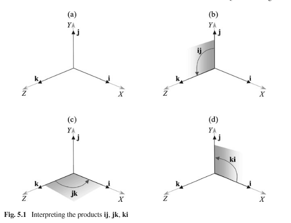

#### 5.2 一些历史

哈密顿(Hamilton)定义了四元数$q$，相关的规则有：

* $q = s +ia+jb + kc$ 		$s,a,b,c \in \mathbb{R}$

且

* $i^2 = j^2 = k^2 = ijk=-1$

* $ij = k$，    $jk = i$ ，  $ki = j$

  $ji = -k$， $kj = -i$，  $ik = -j$

我们倾向的写法

* $q = s + ai+ bj+ck$

可以看到通过哈密顿的写法，$ij$是可以被替换成$k$的。这个多出的虚部k是$ij = k$，$jk = i$ ，$ki = j$这个循环的关键。这个和笛卡尔坐标系的两个单位矢量的叉积非常像。

* $i\times j = k$，$j\times k = i$ ，$k\times i = j$

##### 相乘看作旋转

P.G. Tait 给了另一种解释，将$i,j,k$ 看作是笛卡尔坐标系的$x,y,z $坐标轴，如上图，$i$乘以$j$可以认为是对j做了一个变换，即在$yz$平面上对$j$旋转了一个角度使之与$k$重合，当然这个变换对k也生效，即$ik = -j$

##### 三种表示方法

* $q = s+ xi +yj+zk$

* $q = s + \mathbf{v}$

* $q = [s,\mathbf{v}]$

  $s,x,y,z \in \mathbb{R}$, $v\in \mathbb{R}^3$

  且$ i^2 = j^2 = k^2 = -1$

本书我们采用第三种形式。

#### 5.3 定义一个四元数

两个四元数$q_a$和$q_b$

* $q_a=s_a+x_ai+y_aj+z_ak$
* $q_b=s_b+x_bi+y_bj+z_bk$

还有一些必要的规则。

且

* $i^2 = j^2 = k^2 = ijk=-1$

  $ij = k$，    $jk = i$ ，  $ki = j$

  $ji = -k$， $kj = -i$，  $ik = -j$

我们的目标是证明$q_a$ 和 $q_b$可以被有序对表示，即

* $q_a = [s_a, \mathbf{a}]$

* $q_b = [s_b, \mathbf{b}]$

  ​	$s_a,s_b \in \mathbb{R}$, $a,b \in \mathbb{R}^3$

有序对展开

* $q_aq_b = [s_a, \mathbf{a}][s_b, \mathbf{b}] = (s_a+x_ai+y_aj+z_ak)(s_b+x_bi+y_bj+z_bk)$

  ​		$=(s_as_b - x_ax_b-y_ay_b-z_az_b)$

  ​		$=+(s_ax_b + s_bx_a + y_az_b - y_bz_a)i$

  ​		$= +(s_ay_b +s_by_a+z_ax_b-z_bx_a)j$

  ​		$= +(s_az_b+s_bz_a+x_ay_b-x_by_a)k$

上面两个四元数相乘构成了另一个四元数。这也证明了它的**封闭性**。

西蒙 奥尔特曼 建议用有序对代替虚部。

* $i = [0, \mathbf{i}]$    $j = [0, \mathbf{j}]$    $k = [0, \mathbf{k}]$

它们本身就是四元数，且是单位四元数。这个想法和在笛卡尔坐标系里使用基底定义向量的方式不谋而合。

我们将[1,$\mathbf{0}$] = 1​,则：

* $[s_a, \mathbf{a}][s_b, \mathbf{b}] = (s_a+x_ai+y_aj+z_ak)(s_b+x_bi+y_bj+z_bk)$

  ​		$=(s_as_b - x_ax_b-y_ay_b-z_az_b)[1,\mathbf{0}] $

  ​		$=+(s_ax_b + s_bx_a + y_az_b - y_bz_a)[0, \mathbf{i}]$

  ​		$= +(s_ay_b +s_by_a+z_ax_b-z_bx_a)[0, \mathbf{j}]$

  ​		$= +(s_az_b+s_bz_a+x_ay_b-x_by_a)[0, \mathbf{k}]$

即：

* $[s_a, \mathbf{a}][s_b, \mathbf{b}]=[s_as_b - x_ax_b-y_ay_b-z_az_b,\mathbf{0}] $

  ​					$+[0,(s_ax_b + s_bx_a + y_az_b - y_bz_a) \mathbf{i}]$

  ​					$ +[0,(s_ay_b +s_by_a+z_ax_b-z_bx_a) \mathbf{j}]$

  ​					$ +[0,(s_az_b+s_bz_a+x_ay_b-x_by_a) \mathbf{k}]$

纵向来看，

* $[s_a, \mathbf{a}][s_b, \mathbf{b}]=[s_as_b - x_ax_b-y_ay_b-z_az_b,\mathbf{0}] $

  ​					$+[0,s_a(x_b\mathbf{i}+y_b\mathbf{j}+z_b\mathbf{k}) + s_b(x_a\mathbf{i}+y_a\mathbf{j}+z_a\mathbf{k}) $

  ​					$+ (y_az_b - y_bz_a)\mathbf{i}+ (z_ax_b-z_bx_a)\mathbf{j}+(x_ay_b-x_by_a)\mathbf{k}]$

即：

* $[s_a, \mathbf{a}][s_b, \mathbf{b}]=[s_as_b - x_ax_b-y_ay_b-z_az_b, $

  ​					$s_a(x_b\mathbf{i}+y_b\mathbf{j}+z_b\mathbf{k}) + s_b(x_a\mathbf{i}+y_a\mathbf{j}+z_a\mathbf{k}) $

  ​					$+ (y_az_b - y_bz_a)\mathbf{i}+ (z_ax_b-z_bx_a)\mathbf{j}+(x_ay_b-x_by_a)\mathbf{k}]$

假设：

* $\mathbf{a}= x_a\mathbf{i}+y_a\mathbf{j}+z_a\mathbf{k}$

  $\mathbf{b}= x_b\mathbf{i}+y_b\mathbf{j}+z_b\mathbf{k}$

替换下得：

* $[s_a, \mathbf{a}][s_b, \mathbf{b}]=[s_as_b - \mathbf{a} \cdot \mathbf{b},s_a\mathbf{b} + s_b\mathbf{a} + \mathbf{a} \times \mathbf{b}]$

这个就被定义为**四元数的积**。注：$\mathbf{a} \cdot \mathbf{b}=(x_ax_b)+(y_ay_b)+(z_az_b)$是个标量，$ \mathbf{a} \times \mathbf{b}$就是按照分配率相乘，然后去掉标量部分，是个矢量。

##### 5.3.1 单位四元数

* $i = [0, \mathbf{i}]$  

  $i^2 =  [0, \mathbf{i}] [0, \mathbf{i}]$

  ​		$=[ -\mathbf{i} \cdot  \mathbf{i}, \mathbf{i} \times  \mathbf{i}]$

  ​		$=[-1,0]$

结果是为-1的实四元数。$[0, \mathbf{j}]，[0, \mathbf{k}]$也一样

接下来计算$ij,jk,ki$的积

* $ij = [0, \mathbf{i}][0, \mathbf{j}]$

  ​	$=[-\mathbf{i} \cdot \mathbf{j}, \mathbf{i}\times \mathbf{j}]$

  ​	=$[0,\mathbf{k}]$

* $jk = [0, \mathbf{j}][0, \mathbf{k}]$

  ​	$=[-\mathbf{j} \cdot \mathbf{k}, \mathbf{j}\times \mathbf{k}]$

  ​	=$[0,\mathbf{i}]$

* $ki = [0, \mathbf{k}][0, \mathbf{i}]$

  ​	$=[-\mathbf{k} \cdot \mathbf{i}, \mathbf{k}\times \mathbf{i}]$

  ​	=$[0,\mathbf{j}]$

* $ijk =  [0, \mathbf{i}][0, \mathbf{j}][0, \mathbf{k}]$

  ​	$=[0, \mathbf{k}][0, \mathbf{k}]$

  ​	$=[-\mathbf{k} \cdot \mathbf{k}, \mathbf{k}\times \mathbf{k} ]$

  ​	$=[-1,0]$

四元数的运算满足结合律

* $i(jk) =  [0, \mathbf{i}]([0, \mathbf{j}][0, \mathbf{k}])$

  ​	$=[0, \mathbf{i}][0, \mathbf{i}]$

  ​	$=[-\mathbf{i} \cdot \mathbf{i}, \mathbf{i}\times \mathbf{i} ]$

  ​	$=[-1,0]$

#### 5.4  代数定义

一个四元数由一个有序对定义

* $q = [s, \mathbf{v}]$    $s\in \mathbb{R}, \mathbf{v}\in \mathbb{R}^3$

如果用各个分量表示$\mathbf{v}$，可得

* $q = [s, x\mathbf{i}+y\mathbf{j}+z\mathbf{k}]$   $s,x,y,z \in \mathbb{R}$

#### 5.5 加减法

* $q_a = [s_a, \mathbf{a}]$

  $q_b = [s_b, \mathbf{b}]$

  $q_a \pm q_b =  [s_a \pm s_b, \mathbf{a} \pm \mathbf{b}]$

#### 5.6 实四元数

实四元数向量部分为0

* $q = [s,\mathbf{0}]$

实四元数的积也是实四元数，就像之前我们了解的复数的虚部为0一样，$ b=0$的$a+bi$

* $q_a = [s_a, \mathbf{0}]$

  $q_b = [s_b, \mathbf{0}]$

  $q_aq_b =  [s_a, \mathbf{0}][s_b, \mathbf{0}]$

  ​		$= [s_as_b, \mathbf{0}]$

#### 5.7 四元数乘以标量

* $q = [s, \mathbf{v}]$ 

  $\lambda q = \lambda [s, \mathbf{v}]$

  ​	$=[\lambda s,\lambda \mathbf{v}]$

可以理解成一个实四元数乘以一个四元数

* $q = [s, \mathbf{v}]$ 

  $\lambda = [\lambda , \mathbf{0}]$

  $\lambda q = [\lambda ,\mathbf{0}][s, \mathbf{v}]$

  ​	$=[\lambda s,\lambda \mathbf{v}]$

#### 5.8 纯四元数

标量部分为0定义为纯四元数如下：

* $q = xi + yj+ zk$

是一个只有虚部的纯向量。

* $q = [0, \mathbf{v}]$

两个纯虚四元数相乘不一定是纯虚四元数

* $q_a = [0, \mathbf{a}]$

  $q_b = [0, \mathbf{b}]$

  $q_aq_b =  [0, \mathbf{a}][s_b, \mathbf{b}]$

  ​		$= [-\mathbf{a} \cdot \mathbf{b}, \mathbf{a} \times \mathbf{b}]$

#### 5.9 单位四元数

一个向量$\mathbf{v}$可以定义成一个距离乘以一个表示方向的单位向量

* $\mathbf{v} = v \mathbf{\hat{v}}$   这里$v = |\mathbf{v}|$,  且 $ |\mathbf{\hat{v}}| = 1$

参考这个我们可以定义纯虚四元数

* $q= [0, \mathbf{v}]$

  ​	$=[0,v\mathbf{\hat{v}}]$

  ​	$=v[0,\mathbf{\hat{v}}]$

$[0,\mathbf{\hat{v}}]$就称为单位四元数。

* $\hat{q}= [0, \mathbf{\hat{v}}]$

所以一个纯虚四元数也可以被记作：

* $q=v\hat{q}$

单位四元数的平方

* $\hat{q}^2 = [0, \mathbf{\hat{v}}][0, \mathbf{\hat{v}}]$

  ​		$=[-\mathbf{\hat{v}} \cdot \mathbf{\hat{v}}, \mathbf{\hat{v}} \times \mathbf{\hat{v}}]$

  ​		$=[-1,0]$

  ​		$=-1$

#### 5.10 四元数的加法形式

一个四元数可以表示成一个实四元数和一个纯虚四元数相加

* $q  = [s, \mathbf{v}]$

  ​	$=[s, \mathbf{0}] + [0, \mathbf{v}]$

那么两个四元数相乘可以表示成

* $q_a = [s_a,\mathbf{0}]+[0,\mathbf{a}]$

  $q_b = [s_b,\mathbf{0}]+[0,\mathbf{b}]$

  $q_aq_b=([s_a,\mathbf{0}]+[0,\mathbf{a}])([s_b,\mathbf{0}]+[0,\mathbf{b}])$

  ​		$=[s_a,\mathbf{0}][s_b,\mathbf{0}] + [s_a,\mathbf{0}][0,\mathbf{b}]+[0,\mathbf{a}][s_b,\mathbf{0}]+[0,\mathbf{a}][0,\mathbf{b}]$

  ​		$=[s_as_b,0] +[0,s_a\mathbf{b}]+[0,s_b\mathbf{a}] + [\mathbf{a} \cdot \mathbf{b}, \mathbf{a} \times \mathbf{b}]$

  ​		$=[s_as_b - \mathbf{a} \cdot \mathbf{b},s_a\mathbf{b} + s_b\mathbf{a} + \mathbf{a} \times \mathbf{b}]$

看来加法和分配率都能用

#### 5.11 

将四元数表示成加法形式可以更进一步

* $q  = [s, \mathbf{v}]$

  ​	$=[s, \mathbf{0}] + [0, \mathbf{v}]$

  ​	$=[s, \mathbf{0}] + v[0, \mathbf{\hat{v}}]$

  ​	$=s+v\hat{q}$

s是一个标量，v是向量的长度，$\hat{q}$是单位四元数$[0,\mathbf{\hat{q}}]$

表示形式上和复数很像

* $z = a+bi$
* $q = s+ v\hat{q}$

a,b,s,v是标量， i是单位虚数，$\hat{q}$是单位四元数

#### 5.12 共轭

复数的共轭 z=a+bi

* $z^* = a-bi$

类似的四元数共轭 $q  = [s, \mathbf{v}]$

* $q^*  = [s, -\mathbf{v}]$

* $qq^* = [s, \mathbf{v}][s, -\mathbf{v}]$

  ​		$=[s^2 - \mathbf{v} \cdot (-\mathbf{v}),-s\mathbf{v}+s\mathbf{v} + \mathbf{v}\times (-\mathbf{v})]$

  ​		$=[s^2 + v^2, \mathbf{0}]$

* $q^*q =[s, -\mathbf{v}] [s, \mathbf{v}]$

  ​		$=[s^2 -  (-\mathbf{v})\cdot \mathbf{v} ,s\mathbf{v}-s\mathbf{v} + (-\mathbf{v})\times  \mathbf{v}]$

  ​		$=[s^2 + v^2, \mathbf{0}]$

接下来证明$ (q_aq_b)^* = q_b^*q_a^*$

* $q_a = [s_a,\mathbf{a}]$

  $q_b = [s_b,\mathbf{b}]$

  $q_aq_b=[s_a, \mathbf{a}][s_b, \mathbf{b}]$

  ​		$=[s_as_b - \mathbf{a} \cdot \mathbf{b},s_a\mathbf{b} + s_b\mathbf{a} + \mathbf{a} \times \mathbf{b}]$

  $(q_aq_b)^* =[s_as_b - \mathbf{a} \cdot \mathbf{b},-s_a\mathbf{b}- s_b\mathbf{a} - \mathbf{a} \times \mathbf{b}]$

  

* $q_a^* = [s_a,-\mathbf{a}]$

  $q_b^* = [s_b,-\mathbf{b}]$

  $q_b^*q_a^*=[s_b, -\mathbf{b}][s_a, -\mathbf{a}]$

  ​		$=[s_as_b - \mathbf{a} \cdot \mathbf{b},-s_a\mathbf{b}  -s_b\mathbf{a} - \mathbf{a} \times \mathbf{b}]$

即

* $(q_aq_b)^* = q_b^*q_a^*$

#### 5.13 四元数的范数

复数的范数$ z = a+bi$定义为

* $|z| = \sqrt{a^2+b^2}$

等价于

* $zz^* = |z|^2$

类似的，四元数的范数被定义成

* $|q| = \sqrt{s^2+v^2}   $,       这里$ v= |\mathbf{v}|$

也可写成

* $qq^* = |q|^2$

#### 5.14 归一化四元数

* $q' = \frac{q}{\sqrt{s^2+v^2}}$

不能将单位四元数$[0,\mathbf{\hat{v}}]$和归一化四元数$q'$搞混了

如四元数

* $q = [1,4 \mathbf{i} + 4\mathbf{j} - 4\mathbf{k}]$

的范数是7。

那么该四元数归一化后为

* $q' = \frac{1}{7}[1,4 \mathbf{i} + 4\mathbf{j} - 4\mathbf{k}]$

归一化四元数也可以写成这种形式

* $q =  [\cos{\frac{1}{2}\theta}, \sin{\frac12\theta} \mathbf{\hat{v}}]$

因为$ \cos^2\theta + \sin^2\theta = 1$

#### 5.15 四元数的积

* $q_aq_b=[s_a, \mathbf{a}][s_b, \mathbf{b}]$

  ​		$=[s_as_b - \mathbf{a} \cdot \mathbf{b},s_a\mathbf{b} + s_b\mathbf{a} + \mathbf{a} \times \mathbf{b}]$

##### 5.15.1 纯四元数的积

* $q_a = [0, \mathbf{a}]$

  $q_b = [0, \mathbf{b}]$

  $q_aq_b =  [0, \mathbf{a}][s_b, \mathbf{b}]$

  ​		$= [-\mathbf{a} \cdot \mathbf{b}, \mathbf{a} \times \mathbf{b}]$

##### 5.15.2  两个归一化四元数的积

* $q_a = [s_a,  \mathbf{a}]$

  $q_b = [s_b , \mathbf{b}]$

当$|q_a|=|q_b| = 1 $他们的积是**也是一个归一化的四元数**。

证明：

假设 $q_c = [s_c, \mathbf{c}]$  证   $|q_c| = s_c^2 +c^2 = 1$

$[s_c, \mathbf{c}] = [s_a, \mathbf{a}][s_b, \mathbf{b}]=[s_as_b - \mathbf{a} \cdot \mathbf{b},s_a\mathbf{b} + s_b\mathbf{a} + \mathbf{a} \times \mathbf{b}]$

$s_c = s_as_b - \mathbf{a} \cdot \mathbf{b}$

$\mathbf{c} = s_a\mathbf{b} + s_b\mathbf{a} + \mathbf{a} \times \mathbf{b}$

略

##### 5.15.3 四元数的平方

* $q = [s, \mathbf{v}]$

  $q^2 =[s, \mathbf{v}][s, \mathbf{v}]$ 

  ​		$=[s^2 - \mathbf{v}\cdot  \mathbf{v},2s \mathbf{v}+  \mathbf{v}\times  \mathbf{v}]$

  ​		$=[s^2 -\mathbf{v}\cdot  \mathbf{v}, 2s\mathbf{v} ]$

  ​		$= [s^2-x^2-y^2-z^2,2s(x\mathbf{i}+y\mathbf{j}+z\mathbf{k})]$

纯四元数的平方

* $q= [0,\mathbf{v},]$

  $q^2= [0,\mathbf{v}][0,\mathbf{v}]$

  ​		$=[0- \mathbf{v}\cdot \mathbf{v}, \mathbf{v}\times \mathbf{v}]$

  ​		$=[-(x^2+y^2+z^2),\mathbf{0}]$

所以纯虚四元数的平方为实数且**单位四元数的平方为-1**

##### 5.15.4 四元数积的范数

* $q_a = [s_a,  \mathbf{a}]$

  $q_b = [s_b , \mathbf{b}]$

  $q_c = q_aq_b$

  $|q_c|^2 = |q_aq_b|^2$

  ​		$= s_a^2(s_b^2+b^2)+a^2(s_b^2+b^2)$

  ​		$=(s_a^2+a^2)(s_b^2+b^2)$

  $a,b$分别为 $\mathbf{a}， \mathbf{b}$的范数

即两个四元数的积的范数等于两个四元数范数的积

* $|q_aq_b|^2 = |q_a|^2|q_b|^2$

  $|q_aq_b| = |q_a||q_b|$

##### 5.16 四元数的逆

定义$q^{-1}$

* $qq^{-1} = [1,\mathbf{0}] = 1$

为了将$q^{-1}$分离出来我们将左右两边同乘以共轭$q^*$

* $q^*qq^{-1} = q^*$

  $|q|^2q^{-1} = q^*$

  $q^{-1} = \frac{q^*}{|q|^2}$

如果$q$是归一化的四元数则

* $q^{-1} = q^*$

这个在计算旋转的时候非常有用。

将$q^{-1} = \frac{q^*}{|q|^2}$代入可得以下等式成立

* $(q_aq_b)^{-1} = q_b^{-1}q_a^{-1}$

$qq^{-1} = q^{-1}q$ 所以

* $qq^{-1} = \frac{qq^*}{|q|^2} = 1$

  $q^{-1}q = \frac{q^*q}{|q|^2} = 1$

因此$q_b/q_a$ 

* $q_c = \frac{q_b}{q_a}$

  ​	$=q_bq_a^{-1}$

  ​	$=\frac{q_bq_a^*}{|q|^2}$

#### 5.17 矩阵

矩阵提供了表示四元数积的另一种形式。

下面写下四元数相乘的矩阵形式

* $[s_a, \mathbf{a}][s_b, \mathbf{b}]=[s_as_b - x_ax_b-y_ay_b-z_az_b,\mathbf{0}] $

  ​					$+[0,(s_ax_b + s_bx_a + y_az_b - y_bz_a) \mathbf{i}]$

  ​					$ +[0,(s_ay_b +s_by_a+z_ax_b-z_bx_a) \mathbf{j}]$

  ​					$ +[0,(s_az_b+s_bz_a+x_ay_b-x_by_a) \mathbf{k}]$

   				$= \begin{bmatrix}s_a &-x_a  &-y_a  &-z_a \\ x_a & s_a & -z_a &y_a \\ y_a & z_a &s_a  & -x_a\\ z_a &-y_a  &x_a  &s_a \end{bmatrix}\begin{bmatrix}s_b\\x_b \\y_b \\z_b \end{bmatrix}$

##### 5.17.1 正交矩阵

通过证明矩阵与它转置的积是单位矩阵来证明它是正交矩阵。

用矩阵$\mathbf{Q}$ 表示对应四元数$q$

* $q = [s, x\mathbf{i}+y\mathbf{k}+z\mathbf{k}] $	 这里 $1 = s^2+x^2+y^2+z^2$

  $\mathbf{Q} = \begin{bmatrix}s &-x  &-y  &-z \\ x & s & -z &y \\ y & z &s& -x\\ z &-y  &x  &s \end{bmatrix}$ 

  $\mathbf{Q}^T = \begin{bmatrix}s &x  &y  &z \\ -x & s & z &-y \\ -y & -z &s& x\\ -z &y  &-x  &s \end{bmatrix}$ 

  $\mathbf{Q}\mathbf{Q}^T = \begin{bmatrix}s &-x  &-y  &-z \\ x & s & -z &y \\ y & z &s& -x\\ z &-y  &x  &s \end{bmatrix}\begin{bmatrix}s &x  &y  &z \\ -x & s & z &-y \\ -y & -z &s& x\\ -z &y  &-x  &s \end{bmatrix}$

  ​			$=\begin{bmatrix}1 &0  &0  &0\\ 0 & 1 & 0 &0 \\ 0 & 0 &1& 0\\ 0 &0  &0  &1 \end{bmatrix}$

这种情况下$\mathbf{Q} = \mathbf{Q}^{-1}$

#### 5.18 四元代数

有序对提供了一个表示四元数的简单方式，用$[1,\mathbf{0}]$表示实数单位1，$[0, \mathbf{i}]$    $[0, \mathbf{j}]$    $[0, \mathbf{k}]$分别代表三个单位虚部分量。

这样，一个四元数就变成了四个分量的线性组合。

四元数支持除法，遵循通常的代数定理，除了交换律。被称为可除代数(**division algebra**)，**除环**

#### 5.19 总结

四元数和复数很像，有四个虚部。所以继承了复数的一些特性，如范数，共轭，单位范数和逆。

可以被加，减，乘，除，等运算。但是不像复数，四元数不满足交换律。

##### 5.19.1 运算的总结

**表示**

* $q_a = [s_a, \mathbf{a}] = [s_a,x_a\mathbf{i}+y_a\mathbf{j}+z_a\mathbf{k}]$

* $q_b = [s_b, \mathbf{b}] = [s_b,x_b\mathbf{i}+y_b\mathbf{j}+z_b\mathbf{k}]$

**加和减**

* $q_a \pm q_b =  [s_a \pm s_b, \mathbf{a} \pm \mathbf{b}]$

**积**

* $q_aq_b=[s_a, \mathbf{a}][s_b, \mathbf{b}]$

  ​		$=[s_as_b - \mathbf{a} \cdot \mathbf{b},s_a\mathbf{b} + s_b\mathbf{a} + \mathbf{a} \times \mathbf{b}]$

  ​		$= \begin{bmatrix}s_a &-x_a  &-y_a  &-z_a \\ x_a & s_a & -z_a &y_a \\ y_a & z_a &s_a  & -x_a\\ z_a &-y_a  &x_a  &s_a \end{bmatrix}\begin{bmatrix}s_b\\x_b \\y_b \\z_b \end{bmatrix}$

**平方**

$q^2 =[s, \mathbf{v}][s, \mathbf{v}]$ 

​		$= [s^2-x^2-y^2-z^2,2s(x\mathbf{i}+y\mathbf{j}+z\mathbf{k})]$

**纯虚四元数的积**

* $q^2= [0,\mathbf{v}][0,\mathbf{v}]$

  ​	$=[0- \mathbf{v}\cdot \mathbf{v}, \mathbf{v}\times \mathbf{v}]$

  ​	$=[-(x^2+y^2+z^2),\mathbf{0}]$

**范数**

* $|q| = \sqrt{s^2+v^2}$

**单位四元数**

* $|q'| = \sqrt{s^2+v^2} = 1$ 

**共轭**

* $q^* = [s,\mathbf{v}]$
* $(q_aq_b)^* = q_b^*q_a^*$

**逆**

* $q^{-1} = \frac{q^*}{|q|^2}$

* $(q_aq_b)^{-1} = q_b^{-1}q_a^{-1}$

