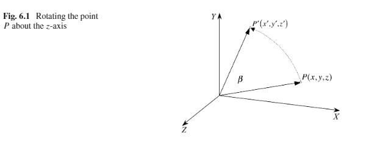
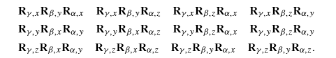
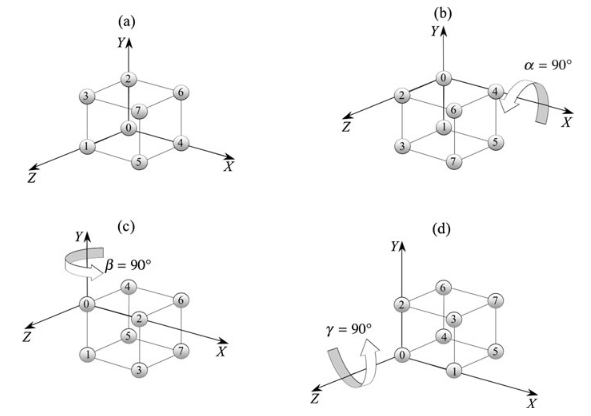
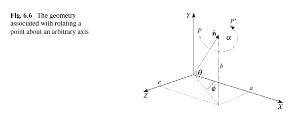
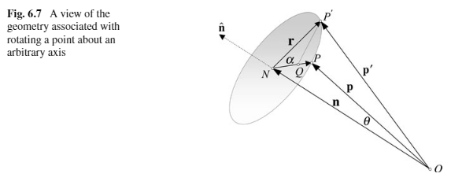
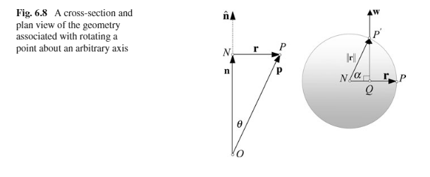

#### 6.1 介绍

这章我们回顾计算机图形软件中3D欧拉角的旋转变换。万向锁问题，最后是用矩阵完成旋转，在下一章用四元数完成相同旋转

#### 6.2 3D旋转变换

传统的旋转是基于欧拉角的。有万向锁的问题

#### 6.3 笛卡尔坐标系的旋转

在平面上旋转一个让一个点围绕原点旋转一个角度的矩阵是

* $R_\beta = \begin{bmatrix}\cos\beta &-\sin\beta \\\sin\beta  & \cos\beta\end{bmatrix}$

旋转方向按照上图则是**右手定则**

扩展到3D空间下绕z轴旋转一个角度

* $R_{\beta,z} = \begin{bmatrix}\cos\beta &-\sin\beta &0\\\sin\beta  & \cos\beta&0 \\0 &0&1\end{bmatrix}$

这里用矩阵乘以一个坐标$\begin{bmatrix}x\\y \\z \end{bmatrix}$可得$\begin{bmatrix}x\cos\beta -y\sin\beta \\x\sin\beta +y\cos\beta \\z \end{bmatrix}$ 结果是保持$z$坐标不变的情况下绕$z$轴旋转了一个角度

类似的绕$x$轴旋转矩阵为：

* $R_{\beta,x} = \begin{bmatrix}1 &0 &0\\0  & \cos\beta&-\sin\beta \\0 &\sin\beta&\cos\beta\end{bmatrix}$

绕$y$轴旋转

* $R_{\beta,y} = \begin{bmatrix}\cos\beta &0 &\sin\beta\\0  &1&0 \\-\sin\beta&0&\cos\beta\end{bmatrix}$

#### 6.4 

#### 6.5 组合旋转

绕轴旋转组合顺序有很多

可以是两个相同轴中间加另一个轴，也可以是三个轴

如下旋转：

虽然看似绕x，y，z轴旋转了，但是仔细看会发现立方体绕0-4的轴旋转了两次，0-2被忽略了，即失去了一个维度，这就是万向锁

#### 6.6 绕任意轴旋转

如图，如果要按照上图，将$P$绕方向$\mathbf{\hat{n}}$旋转$\alpha$ 度至$P'$。第一个方法是使用矩阵的三角函数，这个十分复杂，第二种方法是使用向量分析。

##### 6.6.1 矩阵

之前我们只学习了绕坐标轴旋转，所以我们需要先将$\mathbf{\hat{n}}$旋转至于一个坐标轴对齐，然后围绕坐标轴旋转$\alpha$ 然后再旋转回来。这里我们选择$x$-轴。整个过程，点$P$也要跟着变换。

如

* $\mathbf{\hat{n}} = a\mathbf{i}+b\mathbf{j}+c\mathbf{k}$

变换过程

* $\begin{bmatrix}x'\\y' \\z' \end{bmatrix} = R_{-\phi,y}R_{\theta,z}R_{\alpha,x}R_{-\theta,z}R_{\phi,y}\begin{bmatrix}x\\y \\z \end{bmatrix}$

对应的

* $R_{\phi,y} = \begin{bmatrix}\cos\phi &0 &\sin\phi \\0  &1&0 \\-\sin\phi &0&\cos\phi \end{bmatrix}$     $R_{-\theta,z} =  \begin{bmatrix}\cos\theta&\sin\theta&0\\-\sin\theta& \cos\theta&0 \\0 &0&1\end{bmatrix}$

  $R_{\alpha,x} = \begin{bmatrix}1 &0 &0\\0  & \cos\alpha&-\sin\alpha\\0 &\sin\alpha&\cos\alpha\end{bmatrix}$    $R_{\theta,z} = \begin{bmatrix}\cos\theta&-\sin\theta&0\\\sin\theta& \cos\theta&0 \\0 &0&1\end{bmatrix}$

  $R_{-\phi,y} = \begin{bmatrix}\cos\phi &0 &-\sin\phi \\0  &1&0 \\\sin\phi &0&\cos\phi \end{bmatrix}$

设：

$R_{-\phi,y}R_{\theta,z}R_{\alpha,x}R_{-\theta,z}R_{\phi,y} = \begin{bmatrix}a_{11} &a_{12}  &a_{13}\\a_{21}   &a_{22}&a_{23} \\a_{31}&a_{32}&a_{33}\end{bmatrix}$

算一下：

* $a_{11} = \cos^2\phi\cos^2\theta+\cos^2\phi\sin^2\theta\cos\alpha + \sin^2\phi\cos\alpha$
* $a_{12} = \cos\phi\cos\theta\sin\theta-\cos\phi\sin\theta\cos\theta\cos\alpha - \sin\phi\cos\theta\sin\alpha$
* $a_{13} = \cos\phi\sin\phi\cos^2\theta+ \cos\phi\sin\phi\sin^2\theta\cos\alpha + \sin^2\phi\sin\theta\sin\alpha+\cos^2\phi\sin\theta\sin\alpha-\cos\phi\sin\phi\cos\alpha$
* $a_{21} =  \sin\theta\cos\theta\cos\phi-\cos\theta\sin\theta\cos\phi\cos\alpha+\cos\theta\sin\phi\sin\alpha$
* $a_{22} = \sin^2\theta+\cos^2\theta\cos\alpha$
* $a_{23} = \sin\theta\cos\theta\sin\phi-\cos\theta\sin\theta\sin\phi\cos\alpha-\cos\theta\cos\phi\sin\alpha$
* $a_{31} =\cos\phi\sin\phi\cos^2\theta+\cos\phi\sin\phi\sin^2\theta\cos\alpha - \cos^2\phi\sin\theta\sin\alpha-\sin^2\phi\sin\theta\sin\alpha-\cos\phi\sin\phi\cos\alpha$
* $a_{32} = \sin\phi\cos\theta\sin\theta - \sin\phi\sin\theta\cos\theta\cos\alpha +\cos\phi\cos\theta\sin\alpha$
* $a_{33} = \sin^2\phi\cos^2\theta+\sin^2\phi\sin^2\theta\cos\alpha - \cos\phi\sin\phi\sin\theta\sin\alpha+\cos\phi\sin\phi\sin\theta\sin\alpha+\cos^2\phi\cos\alpha$

根据上图$a^2+b^2+c^2 = 1$化简下得：

* $\begin{bmatrix}x'_p\\y'_p \\z'_p \end{bmatrix} = \begin{bmatrix}a^2K+\cos\alpha&abK-c\sin\alpha &acK+b\sin\alpha \\abK+c\sin\alpha  &b^2K+\cos\alpha&bcK-a\sin\alpha \\acK-b\sin\alpha &bcK+a\sin\alpha&c^2K+\cos\alpha \end{bmatrix}\begin{bmatrix}x_p\\y_p \\z_p \end{bmatrix}$

  $K=1-\cos\alpha$

这里a,b,c是旋转轴方向的归一化各分量

$\alpha$是绕旋转轴旋转的角度

##### 6.6.2 向量

下面我们用向量解决这个问题

参考上面两图

注：**上面两图的旋转方向是左手定则，和6.6.1中的方向相反**

$\mathbf{\hat{n}} = a\mathbf{i}+b\mathbf{j}+c\mathbf{k}$

原来的位置$P(x_p,y_p,z_p)$，旋转后的位置$P'(x'_p,y'_p,z'_p)$。

$O$是原点。

* $\mathbf{p}' =\overrightarrow{ON}+\overrightarrow{NQ}+\overrightarrow{QP'}$

算$\overrightarrow{ON}$

* $|\mathbf{n}| = |\mathbf{p}|\cos\theta = \mathbf{\hat{n}}\cdot \mathbf{p}$

  注：这里的$\theta$是6.7中的，和6.6.1 矩阵中的$\theta$无关

* $\overrightarrow{ON} = \mathbf{n}=\mathbf{\hat{n}}(\mathbf{\hat{n}}\cdot \mathbf{p} )$

算$\overrightarrow{NQ}$

* $\overrightarrow{NQ} = \frac{NQ}{NP}\mathbf{r} = \frac{NQ}{NP'}\mathbf{r}= \cos\alpha\mathbf{r}$

  注：图中标注$\mathbf{r}$应为$\overrightarrow{NQ}$方向

  因为：$\mathbf{p} = \mathbf{n}+\mathbf{r} = \mathbf{\hat{n}}(\mathbf{\hat{n}}\cdot \mathbf{p})+ \mathbf{r}$

  所以：$\mathbf{r} =  \mathbf{p}- \mathbf{\hat{n}}(\mathbf{\hat{n}}\cdot \mathbf{p})$

* $\overrightarrow{NQ} =[\mathbf{p}- \mathbf{\hat{n}}(\mathbf{\hat{n}}\cdot \mathbf{p})]\cos\alpha$

算$\overrightarrow{QP'}$

* $\mathbf{\hat{n}}\times \mathbf{p} = \mathbf{w} $   (这里用左手定则)

* $|\mathbf{w}| = |\mathbf{\hat{n}}|\cdot |\mathbf{p}|\sin\theta = |\mathbf{p}|\sin\theta$  (向量叉乘)

* $\because  |\mathbf{r}| = |\mathbf{p}|\sin\theta$

  $\therefore |\mathbf{w}|=|\mathbf{r}|$

* $\because \frac{QP'}{NP'} =\frac{QP'}{|\mathbf{r}|}=\frac{QP'}{|\mathbf{w}|} = \sin\alpha$

* $\therefore  \overrightarrow {QP'} = \mathbf{w}\sin\alpha = (\mathbf{\hat{n}}\times \mathbf{p})\sin\alpha$

最后计算$\mathbf{p}'$

$\mathbf{p}' =\overrightarrow{ON}+\overrightarrow{NQ}+\overrightarrow{QP'}$

​	$=\mathbf{\hat{n}}(\mathbf{\hat{n}}\cdot \mathbf{p} )+[\mathbf{p}- \mathbf{\hat{n}}(\mathbf{\hat{n}}\cdot \mathbf{p})]\cos\alpha+\mathbf{w}\sin\alpha = (\mathbf{\hat{n}}\times \mathbf{p})\sin\alpha$

令$K=1-\cos\alpha$

得：

$\mathbf{p}' = \mathbf{p}\cos\alpha+\mathbf{\hat{n}}(\mathbf{\hat{n}}\cdot \mathbf{\hat{p}})K + (\mathbf{\hat{n}} \times \mathbf{p})\sin\alpha$

代入下反正算出的结果和上面矩阵的一样

* $\begin{bmatrix}x'_p\\y'_p \\z'_p \end{bmatrix} = \begin{bmatrix}a^2K+\cos\alpha&abK-c\sin\alpha &acK+b\sin\alpha \\abK+c\sin\alpha  &b^2K+\cos\alpha&bcK-a\sin\alpha \\acK-b\sin\alpha &bcK+a\sin\alpha&c^2K+\cos\alpha \end{bmatrix}\begin{bmatrix}x_p\\y_p \\z_p \end{bmatrix}$

  $K=1-\cos\alpha$

用一个简单的例子测试下结论：

围绕旋转轴$\mathbf{\hat{n}}= (1/\sqrt{2})$  旋转点$P(10,0,0)$