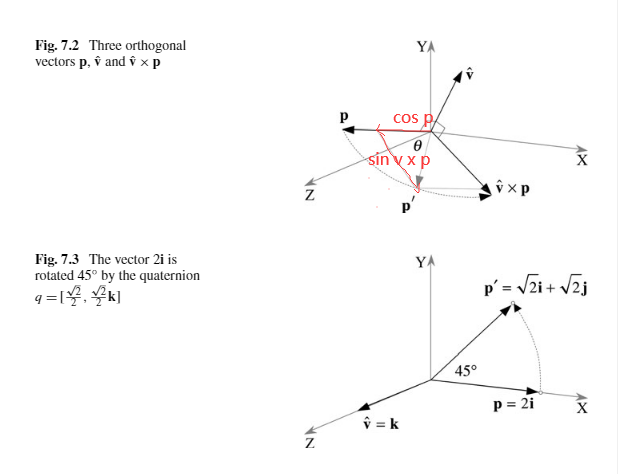
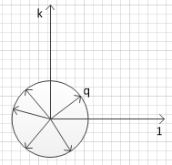

#### 7.1 介绍

这章我们介绍如何使用四元数将一个向量绕一个任意轴旋转。通过回顾四元数相关的历史，我们发现一个厉害的人，本杰明·奥林德·罗德里格斯 发现了半角旋转。

对于一个特定的四元数乘积，当一个四元数被表示为

* $q =  [\cos{\theta}, \sin{\theta} \mathbf{v}]$

一个向量绕轴$\mathbf{v}$旋转角度$\theta$。但是我们会发现，对于一个四元数的乘积，表示为

* $q =  [\cos{\frac{1}{2}\theta}, \sin{\frac{1}{2}\theta} \mathbf{v}]$

才是将一个向量绕轴$\mathbf{v}$旋转角度$\theta$，这个半角表示是罗德里格斯发现的。

关于复合代数的一小段揭示了四元数是非常特殊的，并告诉我们为什么汉密尔顿不能找到基于超复数$z=s+ai+bj$的代数。

为了找到四元数的旋转性质，我们测试各种四元数的乘积。从正交四元数开始，然后到使用三个四元数的乘积$qpq^{-1}$，这里$q$是单位四元数(纯虚且范数为1)，$p$是纯虚四元数。

有两种方法使用矩阵表示四元数的积。使用特征向量和特征值，最后我们研究四元数的插值。

我们继续使用**小写斜体字母的有序对**来表示**四元数**。使用**粗体小写字母**表示向量。

#### 7.2 一些历史

本杰明·奥林德·罗德里格斯

##### 7.2.1 复合代数

#### 7.3 四元数的积

一个四元数$q$表示成一个标量$s$和一个向量$\mathbf{v}$的有序对

* $q= [s,\mathbf{v}]$    $s \in \mathbb{R}$ ,  $\mathbf{v} \in \mathbb{R}^3$

如果细化下$\mathbf{v}$的组成部分，可以表示成

* $q= [s, x\mathbf{i} + y\mathbf{j} + z\mathbf{k}  ]$    $s,x,y,z \in  \mathbb{R}$

哈密尔顿希望一个四元数可以表示成类似复数的转子，之前第二章讲到过

*  $\mathbf{R}_\theta = \cos\theta +i\sin\theta$

这个转子可以将一个复数旋转$\theta$, 是不是一个归一化的四元数$q$也可以用来当做转子旋转向量(该向量使用纯虚四元数表示)，这个只有在**特殊情况下**才成立，为了理解这个，我们先构造一个归一化的四元数$q$ 和一个纯虚四元数$p$。

* $q = [s,\lambda \mathbf{\hat{v}}]$     $s,\lambda \in \mathbb{R}, \mathbf{\hat{v}} \in \mathbb{R}_3$

  $|\mathbf{\hat{v}}| = 1$

  $s^2+ \lambda^2 = 1$

* $p = [0,\mathbf{p}]$       $           p\in \mathbb{R}$

接着计算$p' = qp$  然后检验结果看看 是不是p旋转了某个角度。

* $p' = qp$

  ​	$=[s,\lambda \mathbf{\hat{v}}][0, \mathbf{p}]$

  ​	$= [- \lambda \mathbf{\hat{v}}\cdot  \mathbf{p}, s \mathbf{p}+\lambda \mathbf{\hat{v}}\times  \mathbf{p}]$

 可以看到结果是一个有标量和向量部分的一般四元数。(也就是说不能使用这个作为转子？)

##### 7.3.1 特殊情况

这个特殊情况就是上面的$\mathbf{\hat{v}}$与$\mathbf{p}$正交，这样$\cos\theta$ 为0，可以**消除标量部分**，即

* $p' = [0,s \mathbf{p}+\lambda \mathbf{\hat{v}}\times  \mathbf{p}]$

下图展示了与$\mathbf{\hat{v}}$ 和$\mathbf{p}$正交的情况。$\mathbf{\hat{v}}\times  \mathbf{p}$垂直于包含$\mathbf{\hat{v}}$和  $\mathbf{p}$的平面。

因为$\mathbf{\hat{v}}$是单位四元数，所以$|\mathbf{p}| = |\mathbf{\hat{v}} \times \mathbf{p}|$，这意味着我们有两个垂直且长度相等的向量，如 $\mathbf{p}$和$\mathbf{\hat{v}} \times \mathbf{p}$

因此，为了绕$\mathbf{\hat{v}}$旋转$\mathbf{p}$，那么我们可以让$s= \cos\theta$ 且$ \lambda = \sin\theta$ 。(因为我们之前定义$q$是归一化四元数，即$s^2+ \lambda^2 = 1$)。 那么有

* $p' = [0,s\mathbf{p} + \lambda \mathbf{\hat{v}} \times \mathbf{p}]$

  ​	$= [0, \cos\theta \mathbf{p} + \sin\theta \mathbf{\hat{v}}\times \mathbf{p}]$

**注意：上述公式是根据四元数相乘的公式，将$\mathbf{q}\mathbf{p}$相乘得到的。$ q=[s,\lambda \mathbf{\hat{v}}]=[\cos\theta,\sin\theta\mathbf{\hat{v}}]$，如果满足$\mathbf{\hat{v}}$与$\mathbf{p} $垂直，就能导出上述公式，这里q扮演了一个转子的角色**

**扩展：这里$q$，所有可能的情况就是$\theta$取所有角度，如果$\mathbf{\hat{v}} = \mathbf{k}$ 那么$q$如图。方向1，是与i,j,k 同时垂直的第四元**

如何证明这个$\theta$就是$\mathbf{p}$朝$ \mathbf{\hat{v}}\times \mathbf{p}$旋转的角度呢，

* 可以使用向量相加的方式(上图红线)。

* 也可以类比复数平面的转子$[\cos\theta,i\sin\theta ]$ (将[1,0]绕与[1,0]，[0,i]两向量同时垂直的轴旋转$\theta$度)。$ \cos\theta \mathbf{p} + \sin\theta \mathbf{\hat{v}}\times \mathbf{p}$就是$\mathbf{\hat{p}}$绕 $\mathbf{\hat{v}}$旋转$\theta$度，并且长度乘$|\mathbf{p} |$

举个例子，如果纯虚数$\mathbf{p}=2\mathbf{i}$ ，$\mathbf{\hat{v}}$为Z轴方向的单位向量即$\mathbf{k}$。旋转的角度为45°。 那么

**算$qp$**：

* 首先满足条件$\mathbf{\hat{v}}$与$\mathbf{p}$垂直，所以可以使用公式，$p' = [0, \cos\theta \mathbf{p} + \sin\theta \mathbf{\hat{v}}\times \mathbf{p}]$

* 代入得 $p' = [0, \cos45^{\circ} 2\mathbf{i} + \sin45^{\circ} \mathbf{k}\times 2\mathbf{i}]$

  ​				$=[0,\sqrt{2}\mathbf{i} + \sqrt{2}\mathbf{j}]$

这里求的是$qp$，另外还有一些组合值得探索，如：$pq$,    $q^{-1}p$,    $pq^{-1}$ 。而$qp^{-1}$和$p^{-1}q$就没必要看了，因为$p^{-1}$就是$p$的反方向。

**试下 $pq$看看结果是什么：**

* $p = [0,2\mathbf{i}]$            $q =[s,\lambda \mathbf{\hat{v}}] = [\frac{\sqrt{2}}{2},\frac{\sqrt{2}}{2}\mathbf{k}]$

* $p' = pq$

  ​	$=[0,2\mathbf{i}][\frac{\sqrt{2}}{2},\frac{\sqrt{2}}{2}\mathbf{k}]$

  ​	$=[2\mathbf{i}\cdot\mathbf{k},\frac{\sqrt{2}}{2}\cdot 2\mathbf{i} + 2\mathbf{i}\times \frac{\sqrt{2}}{2}\mathbf{k}]$

  ​	$=[0,\sqrt{2}\mathbf{i} - \sqrt{2}\mathbf{j}]$

结果是$\mathbf{p}$旋转了-45°到了$\mathbf{p}' = \sqrt{2}\mathbf{i} - \sqrt{2}\mathbf{j}$， (那这样岂不是和$qp$时，转子$q$的角度为-45°时结果一样)

**然后试试 $q^{-1}p$：**

* $p' = pq^{-1}$

  ​	$=[0,2\mathbf{i}][\frac{\sqrt{2}}{2},\frac{\sqrt{2}}{2}\mathbf{k}]$

  ​	$=[2\mathbf{i}\cdot\mathbf{k},\frac{\sqrt{2}}{2}\cdot 2\mathbf{i} + 2\mathbf{i}\times \frac{\sqrt{2}}{2}\mathbf{k}]$

  ​	$=[0,\sqrt{2}\mathbf{i} - \sqrt{2}\mathbf{j}]$

