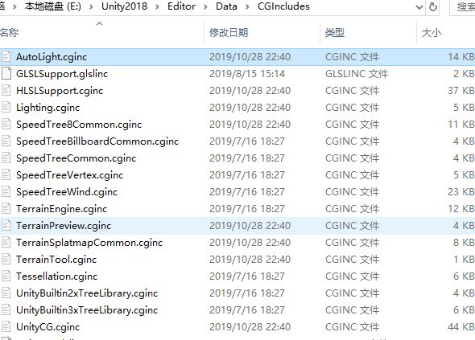

#### 内置函数路径  
shader里有一些封装的方便外部调用的函数，文件为路径 ..\Editor\Data\CGIncludes

还有一些数学方法，是使用了HLSL里的内置方法，可以参考[官方链接](https://docs.microsoft.com/en-gb/windows/win32/direct3dhlsl/dx-graphics-hlsl-intrinsic-functions)

这里只举几个例子。

* smoothstep：返回一个[0,1]的平缓埃尔米特插值，如smoothstep(min,max,x)，就是将x在[min,max]范围内的值映射到[0,1]，x小于min的部分返回0，大于max的部分返回1。如smoothstep(0, 0.01, x)，就是将x在[0,0.01]的范围放大到[0,1]然后小于0和大于0.01的部分分别取0和0.01。

  

