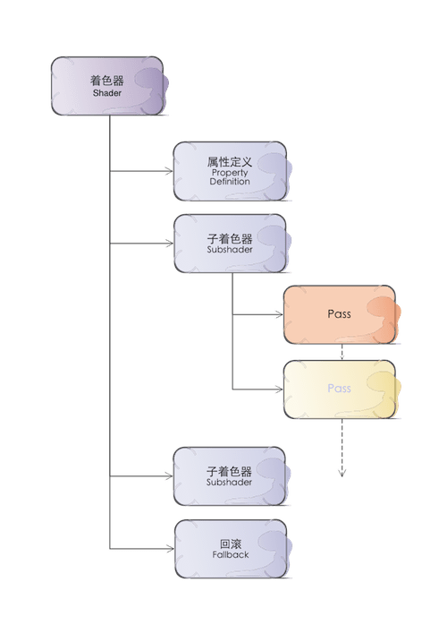
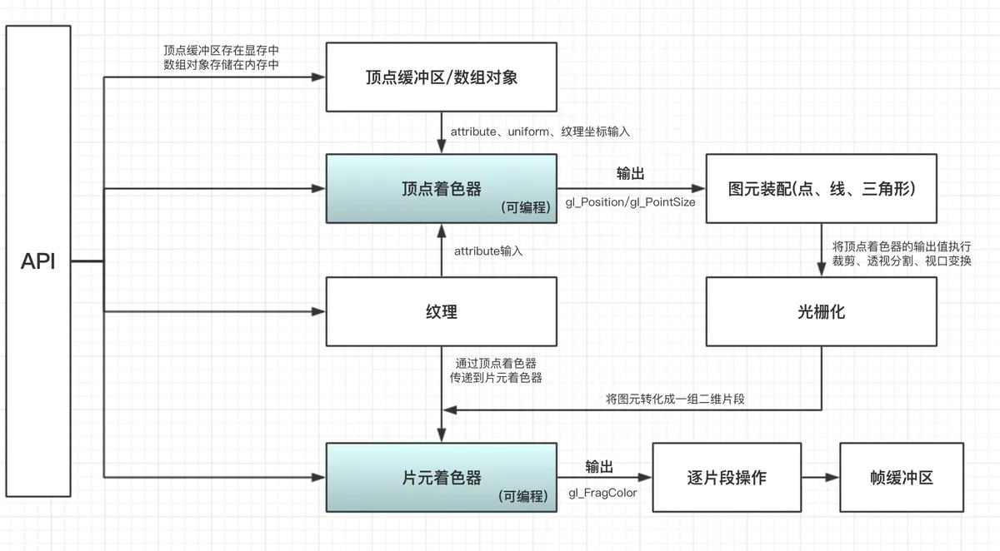

#### 1.结构  

  

#### 2.流程




#### 3.流程中的代码体现

```
sampler2D _MainTex;
v2f vert (appdata v)
{
    v2f o;
    //这里函数输出的是裁剪空间坐标 四维(x,y,z,w) 此时摄像头能看到的区域变成一个范围 -w,w 的立方体
    //带有w分量的吧？
    o.vertex = UnityObjectToClipPos(v.vertex);
    o.uv = v.uv;
    return o;
}
//接上：vert 的输出在进入 frag之前 会
//剪裁坐标: 将 范围 -w,w 外的裁减掉
//透视除法: 将坐标(x,y,z,w) 同时处以w,这时候摄像头看到的区域坐标点都会在归一化在 -1,1 的立方体内
//视口变换: 会将 -1,1 的坐标转换成屏幕坐标(也就是分辨率) 即 原来的x->(x+1)/2*pixelW  y->(y+1)/2*pixelH
//视口变换后： 图元对应关系为上述公式，
//感觉上是移动加拉伸了，但是最后有个处理不明白，就是原来NDC里向上为正方向，经过视口变换后，屏幕向下为正方向了
//难道视口变换后 为了表面显示上不翻转  先将y = _ScreenParams.y - y 然后又将y坐标轴翻转了？

//光栅化: 通过插值一到多？顶点面片插值变成到一个个小片元
//综上：frag输入的顶点坐标并不是我们在顶点着色器赋予的，而是经过视口变换过的坐标
fixed4 frag (v2f i) : SV_Target
{
    return i.color;
}

```

完整代码见[code](code/testNum.shader)

4.unity 中shader文件  

* HLSLSupport.cginc - (自动包含) 为跨平台的着色器编译宏和定义提供帮助。
* UnityShaderVariables.cginc - (自动包含)常用的全局变量。
* UnityCG.cginc - 常用的辅助函数
* AutoLight.cginc - 照明&阴影功能,如表面着色器在内部使用这个文件
* Light.cginc - 标准表面着色器照明模式，当你写surface shaders时自动包含。
* TerrainEngine.cginc - 对地形和植被着色器的辅助函数
这些文件在Unity文件夹  

Windows：({unity install path}/Data/CGIncludes/UnityCG.cginc,           
Mac：/Applications/Unity/Unity.app/Contents/CGIncludes/UnityCG.cginc