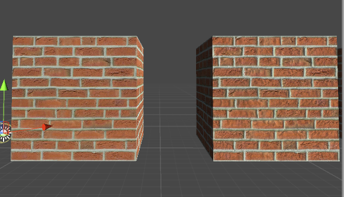

**法线纹理**  
人眼对物体的凹凸感觉，很大程度上取决于表面的光照明暗变化。  
法线纹理的原理就是修改物体表面法线的角度，进而修改光照的计算，达到欺骗眼睛的目的。  
通用的方式是将法线储存在切线空间中。  
法线纹理储存法线方向。  
因为法线方向分量范围在[-1,1],而像素分量的范围是[0,1],所以会做一个映射。  
    
同理  

因为大部分法线方向都是(0,0,1)即模型本身的法线方向(切线空间),所以颜色上大部分显示的都是(0.5,0.5,1) 也就是███这种颜色  

	对应的代码  
	//这里没有平铺和repeat概念，所以直接取偏移拿到纹理颜色
	fixed4 packedNormal = tex2D(_BumpMap,i.uv.zw);
	fixed3 tangentNormal;
	//利用公式解析法线 
	tangentNormal.xy = (packedNormal.xy * 2 -1);
	上面也可以使用自带函数(使用条件Texture应该标记为 Normal Map)
	//tangentNormal.xy = UnpackNormal(packedNormal.xy);
	乘以人为调整的幅度，以影响最后求取的z值(单位向量)
	tangentNormal.xy *=  _BumpScale;
	//求z ，因为x²+y²+z²=1  
	tangentNormal.z = sqrt(1.0-saturate(dot(tangentNormal.xy.tangentNormal.xy)));  
	//dot(tangentNormal.xy.tangentNormal.xy)为x²+y²
用计算结果，代替原法线进行光照渲染就实现了低模表现出高模的效果。  
如图：右边是使用了法线纹理的渲染结果图。  
