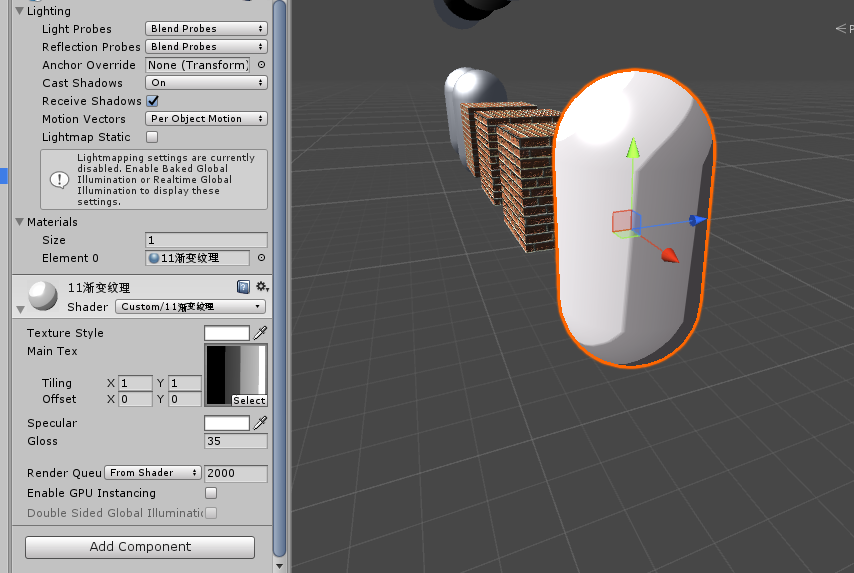

**渐变纹理**  
通过一张梯度变换的纹理，取样赋值。可实现一些卡通风格。   
关键代码：  

	fixed3 diffuseColor = tex2D(_RampTex,fixed2(halfLambert,halfLambert)).rgb * _Color.rgb;
	fixed3 diffuse = _LightColor0.rgb * diffuseColor;  

漫反射按照光照强度取渐变纹理颜色，结果如下图，是不是有种卡通风格呢。  
  
