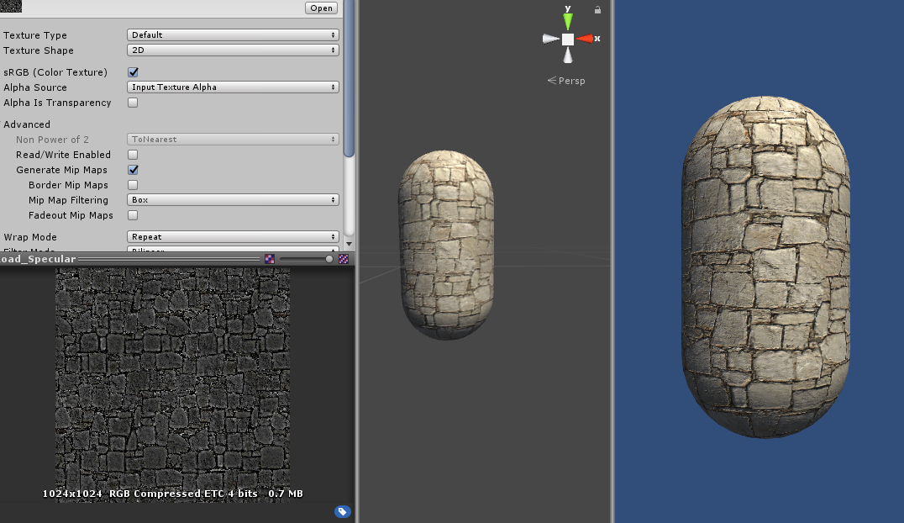
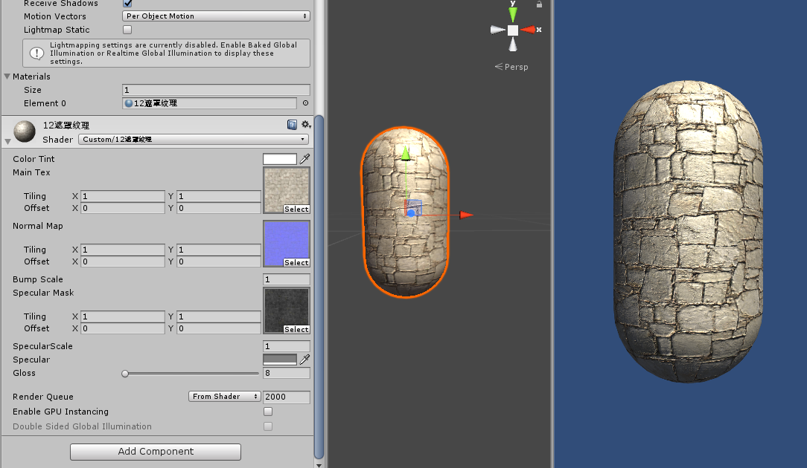

**遮罩纹理**  
这里用r通道作为系数，控制高光反射的值。  
核心代码：  

	//视线和光源(指向光源)  方向是两者平分线，大小是1 Blinn-Phong光照模型
	fixed3 halfDir = normalize(tangentLightDir+tangentViewDir);
	//取遮罩系数(r通道) 
	fixed specularMask = tex2D(_SpecularMask,i.uv).r * _SpecularScale;
	fixed3 specular = _LightColor0.rgb * _Specular.rgb * pow(max(0,dot(tangentNormal,halfDir)),_Gloss) * specularMask;
理论上只用r通道，这样，g，b通道可以用来存放其他东西。  
如下图：因为是灰度图(左下)，所以rgb是一样的，灰度图上亮一点的地方会反射更多的光。(如左下图沟壑的地方颜色就比较深)  
  
放上一张不乘以`specularMask`的图作为对比  
