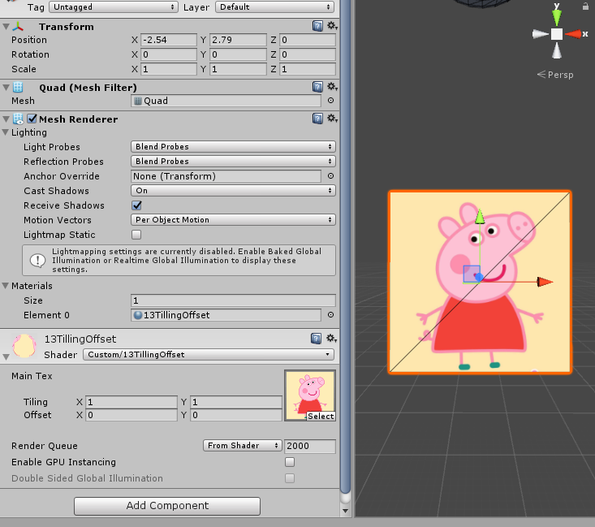
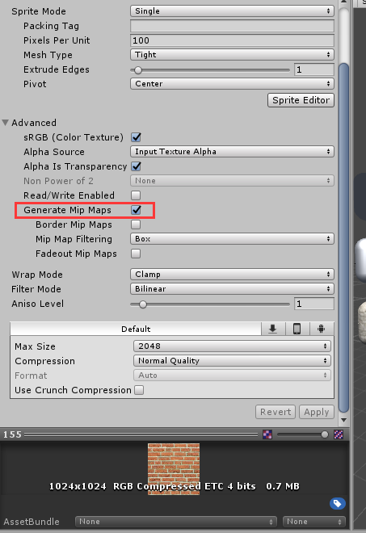
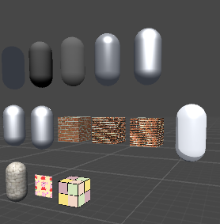

如图  

#### 1. i.uv的计算：

	//v.texcoord.xy顶点坐标，左下(0,0)右上(1,1)
	o.uv.xy = v.texcoord.xy * _MainTex_ST.xy + _MainTex_ST.zw;
	//或者使用公式 TRANSFORM_TEX(v.texcoord,MainTex);  

对于v.texcoord.xy，顶点坐标范围 x∈[0,1] y∈[0,1]

* 两个float2相乘的结果为 (x1\*x2,y1\*y2)，相加的结果为(x1+x2,y1+y2)

* 上面的公式其实是更改顶点坐标与纹理坐标的对应方式。如果不进行处理则$X_顶∈[0,1]$正好映射到$X_纹∈[0,1]$

* 处理后

   $X_纹 = X_顶 * X_T + Z_o$

   $Y_纹 = Y_顶 * Y_T + W_o$

* $X_T,Y_T$对应MainTex的Tiling，$Z_o，W_o$则对应MainTex的Tiling的Offset。

* 如果Tiling 设置为(0.5,0.5),Offset设置为(0,0),则顶点坐标(1,1)取到的纹理坐标为(0.5,0.5),相当于整个只对应纹理的左下角。

* 如果Tiling 设置为(2,2),Offset设置为(0.5,0.5),则顶点坐标(0.8,0.8)取到的纹理坐标为(2.1,2.1)，这个坐标超出了纹理坐标的范围，那要怎么取值呢。

#### 2.tex2D

最终计算的纹理像素坐标，小于1的部分(左下角)还可以按照纹理取，那大于1的部分呢？  
这要看wrap mode的设置了，如果是Repeat，那么它的整数部分就会被舍弃，直接使用小数部分进行采样，这样得到的结果就会不断重复。  
如下图:  
  
另一种是Clamp，这种模式下，大于1的部分会被截取到1，小于0的部分会截取到0。结果就是取到了边界值。  
如下图：  
   

#### 2.片元取纹理的代码

	fixed4 frag(v2f i) : SV_Target{
		//取纹理色
		fixed3 albedo = tex2D(_MainTex,i.uv).rgb;
		fixed3 ambient = albedo;
		return fixed4(ambient,1.0); 
	}  

发散：游戏图标中有很多对称图形，可否用类似shader来仅使用一半图片的资源渲染整张图。(1/4的呢)

