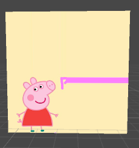

如图  

#### 1.片元取纹理的代码

	fixed4 frag(v2f i) : SV_Target{
		//取纹理色
		fixed3 albedo = tex2D(_MainTex,i.uv).rgb;
		fixed3 ambient = albedo;
		return fixed4(ambient,1.0); 
	}  
如上：纹理为_MainTex，即小猪佩奇图，根据i.uv取纹理颜色。一张图片_MainTex坐标系左下角(0,0)向上y轴向右x轴,所以当i.uv为(0.5,0.5)时，取到的大概是佩奇嘴附近的像素。  
#### 2.i.uv的计算：

	//v.texcoord.xy顶点坐标，左下(0,0)右上(1,1)
	o.uv.xy = v.texcoord.xy * _MainTex_ST.xy + _MainTex_ST.zw;
	//或者使用公式 TRANSFORM_TEX(v.texcoord,MainTex);  
这里Tilling即xy,Offset即zw  

* Tilling  (_MainTex_ST.xy)
试想一下，当Tilling的xy，设置为2,2(即_MainTex_ST.xy为2,2)。最后算出的o.uv是情况呢，  
原本v.texcoord.xy为0.5的坐标变成了1,原本为1的坐标变成了2。如下图：  
  
小于1的部分(左下角)还可以按照纹理取，那大于1的部分呢？  
这要看wrap mode的设置了，如果是Repeat，那么它的整数部分就会被舍弃，直接使用小数部分进行采样，这样得到的结果就会不断重复。  
如下图:  
  
另一种是Clamp，这种模式下，大于1的部分会被截取到1，小于0的部分会截取到0。结果就是取到了边界值。  
如下图：  
   

* Offset (_MainTex_ST.zw)
经过_MainTex_ST.xy比例变换后，再加上一个_MainTex_ST.zw的偏移，最后造成的结果就是原本取0,0的位置取了zw的值  
如图：  
  

发散：游戏图标中有很多对称图形，可否用类似shader来仅使用一半图片的资源渲染整张图。(1/4的呢)

