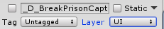
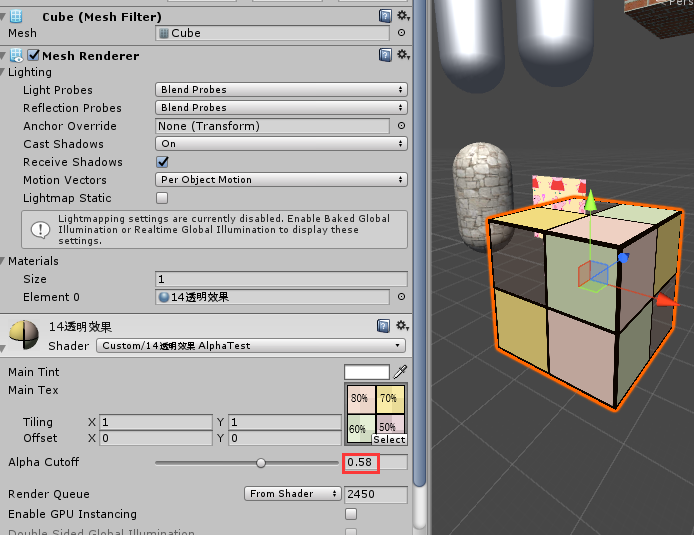
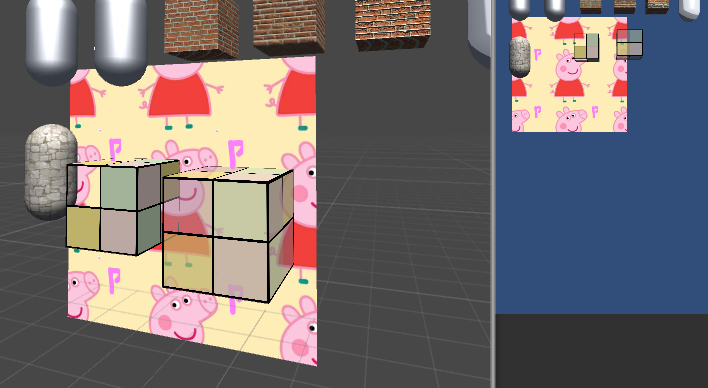
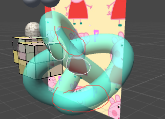
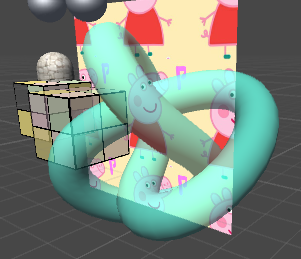
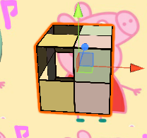
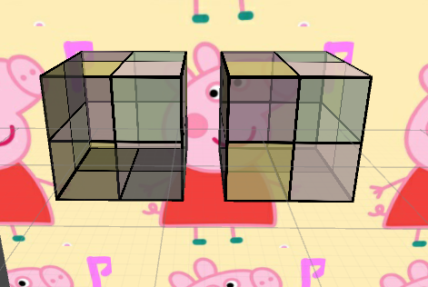

渲染顺序：  
**1.shader的RenderType tag**

 * Background = 1000 
 * Geometry = 2000 
 * AlphaTest = 2450
 * Transparent = 3000
 * Overlay = 4000

**2.Renderer.SortingLayerID**  
**3.Renderer.SortingOrder**  
**4.Material.renderQueue（默认值为Shader里的"Queue"）** 
**5.Transform.z(ViewSpace)（默认为按z值从前到后，但当Queue是“Transparent”的时候，按z值从后到前**

#### 1.透明度测试 Alpha小于xx的都丢掉  
关键代码：  

	fixed4 texColor = tex2D(_MainTex,i.uv);
	//Alpha Test
	clip(texColor.a - _Cutoff);//小于_Cutoff 裁掉(舍弃片元输出)
	// if((texColor.a-_Cutoff)<0.0)
	// 		discard;
如图，这里_Cutoff值为0.58，(纹理图右下角a为0.5)所以模型上对应的的片元部分被剔除了  
    
透明度测试得到的结果很"极端",---要么完全透明，要么完全不透明，而且边缘处往往参差不齐，这是因为在纹理边缘处透明度变化精度的问题。为了得到更加柔和的透明度效果，就可以使用透明度混合。  
#### 2.透明度混合  
关键代码：  

	ZWrite Off
	Blend SrcAlpha OneMinusSrcAlpha
	...
	...
	return fixed4(ambient + diffuse,texColor.a *_AlphaScale);
	//_AlphaScale 是整体透明度的一个系数

**混合模式**  
如果有一个不透明的片元(S)挡在了一个颜色上(颜色缓冲值D)，那么最终的颜色(计算后写入颜色缓冲中的值)是什么样子呢，直觉上： 应该是的	`(S.a\*S.rgba)+(1-S.a)\*D.rgba` 也就是上面这种混合模式`Blend SrcAlpha OneMinusSrcAlpha` 。这个混合将a通道也按照同样的系数混合了，如果想单独设置a通道的混合因子，可以使用四参数的Blend模式

结果如图
  
**开启深度写入的半透明效果**  
根据本文开头渲染顺序。1.不透明的先渲染，2.透明的由远及近渲染 所以下图中的佩奇背板，和立方体都会被先渲染，这没问题。  
但是管道物体的自身的片元渲染顺序是不定的。即对于该物体有如下结果：  
开启深度写入后，虽然片元深度可以准确判断，但是片元渲染的顺序不定。如果近处的片元先渲染，那么远处的未通过深度测试则不显示，如白色圈中的部分。但是如果远处的片元先渲染，那么近处的片元就会按照我们的设置`Blend xxx xxx`进行混合，形成图中红色的奇怪部分。 
如图：  
   
顺着上述思路，我们可以在该物体shader一个pass里写入深度用于判断前后但是不写入颜色，另一个pass进行颜色的混合。
核心代码：  

	SubShader {
		//对SubShader设置tag 对所有pass生效?
		Tags {"Queue" = "Transparent" "IgnoreProjector" = "True" "RenderType" = "Transparent"}
		Pass{
			ZWrite On
			ColorMask 0
		}
		Pass{
			...
		}
	}

函数`ColorMask RGB|A|0|R|G|B|RA|RG|RB....` 将xx颜色写入通道，0表示不写入任何颜色通道，即不输出任何颜色。  
新加的pass里记录了深度，所以自身片元的遮挡有了正确的深度测试，第二个pass里写入**2.透明度混合**里面相同的代码。  
最终效果如图：  
  
还是很别扭对吧，因为使用这种方法，颜色混合的效果是和背景而不是自身(ColorMask),所以模型内部并没有真正的半透明效果。  
#### 3.双面渲染的透明效果  
**1).透明度测试的双面渲染**  
回到本章第一幅图，仔细观察下你会发现，透过被裁减的片元后我们并没有看到立方体的内部结构，这是因为，默认情况下渲染引擎剔除了背面，如果想要双面渲染可以使用Cull指令。   
`Cull Back | Front | Off`  
剔除 背面|正面|关闭剔除    
核心代码：  

	//关闭剔除
	Pass{
		Tags { "LightMode"="ForwardBase"}
		Cull Off

效果如图：  
  
这里可以看到背面了，但是好像很暗，没有光照的样子。  
**2).透明度混合的双面渲染**  
按道理我们可以直接关掉unity默认的背面裁剪`Cull Off`，然后使用`Blend xx xx`就好了。但是，这样会遇到**开启深度写入的半透明效果**一段中分析的问题。片元无法按照正确的顺序渲染. **如下图左立方体**。  
所以这时候要先用一个pass渲染背面，再用一个pass渲染正面**如下图右立方体**。  
如何判断正反面，参见16.深度排序
  
核心代码：  

	SubShader {
	//对SubShader设置tag 对所有pass生效?
	Tags {"Queue" = "Transparent" "IgnoreProjector" = "True" "RenderType" = "Transparent"}
		Pass{
			Tags { "LightMode"="ForwardBase"}
			//剔除正面
			Cull Front
			ZWrite Off
			Blend SrcAlpha OneMinusSrcAlpha
		}
		Pass{
			Tags { "LightMode"="ForwardBase"}
			//剔除背面
			Cull Back
			ZWrite Off
			Blend SrcAlpha OneMinusSrcAlpha
		}
	}