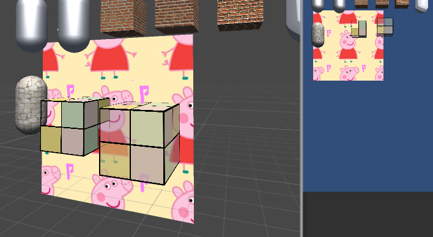

1.因为有深度测试的存在，如果透明物体也写入深度

Transform.z(ViewSpace)（默认为按z值从前到后，但当Queue是“Transparent”的时候，按z值从后到前）。  

#### 1.透明度测试 Alpha小于xx的都丢掉  
关键代码：  

	fixed4 texColor = tex2D(_MainTex,i.uv);
	//Alpha Test
	clip(texColor.a - _Cutoff);//小于_Cutoff 裁掉(舍弃片元输出)
	// if((texColor.a-_Cutoff)<0.0)
	// 		discard;
如图，这里_Cutoff值为0.58，(纹理图右下角a为0.5)所以模型上对应的的片元部分被剔除了  
    
透明度测试得到的结果很"极端",---要么完全透明，要么完全不透明，而且边缘处往往参差不齐，这是因为在纹理边缘处透明度变化精度的问题。为了得到更加柔和的透明度效果，就可以使用透明度混合。  
#### 2.透明度混合  
关键代码：  

	ZWrite Off
	Blend SrcAlpha OneMinusSrcAlpha
	...
	...
	return fixed4(ambient + diffuse,texColor.a *_AlphaScale);
	//_AlphaScale 是整体透明度的一个系数

**混合模式**  
如果有一个不透明的片元(S)挡在了一个颜色上(颜色缓冲值D)，那么最终的颜色(计算后写入颜色缓冲中的值)是什么样子呢，直觉上： 应该是的	`(S.a\*S.rgba)+(1-S.a)\*D.rgba` 也就是上面这种混合模式`Blend SrcAlpha OneMinusSrcAlpha` 。这个混合将a通道也按照同样的系数混合了，如果想单独设置a通道的混合因子，可以使用四参数的Blend模式

结果如图
  
**开启深度写入的半透明效果**  
