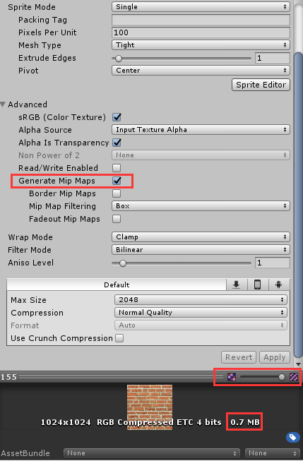

#### 多重采样Generate Mip Maps

Mipmap技术有点类似于LOD技术，但是不同的是，LOD针对的是模型资源，而Mipmap针对的纹理贴图资源

**使用Mipmap后，贴图会根据摄像机距离的远近，选择使用不同精度的贴图。**

缺点：会占用内存，因为mipmap会根据摄像机远近不同而生成对应的八个贴图，所以必然占内存！

优点：会优化显存带宽，用来减少渲染，因为可以根据实际情况，会选择适合的贴图来渲染，距离摄像机越远，显示的贴图像素越低，反之，像素越高。
  

可以滑动红框内的进度条来查看生成的mipmap

勾选前后还可以看到纹理占用内存的大小变化

效果对比：  
