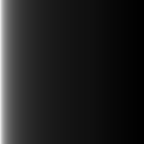
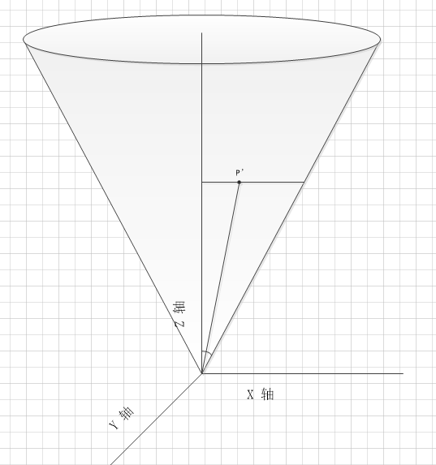

#### 17.更复杂的光照 
unity使用的判断规则如下：   

* 场景中最亮的平行光总是按逐像素处理的。
* 渲染模式被设置成Not Important的光源，会按逐顶点或者SH处理  
* 渲染模式被设置成Important的光源，会按逐像素处理
* 如果根据以上规则得到的逐像素光源数量小于Quality Setting中的逐像素光源数量(Pixel Light Count)，会有更多的光源以逐像素的方式进行渲染。(Edit->Project Setting->Quality->Pixl Light Count)   

对于复杂光照，计算的难点在于衰减atten。
#### 1.点光源：  
计算衰减核心代码：  

    float3 lightCoord = mul(_LightMatrix0, float4(i.worldPos, 1)).xyz;
	//.rr  5->(5,5)
    fixed atten = tex2D(_LightTexture0, dot(lightCoord, lightCoord).rr).UNITY_ATTEN_CHANNEL;  
点光源的衰减只与距离有关，利用光源空间的转换矩阵将要计算的点的位置转换到光源空间(矩阵自带归一化),中心点坐标(0,0,0),边缘处lightCoord模为1。  
将距离的平方拓展成二维uv取_LightTexture0的像素，取预定义通道(一般PC和主机平台的话UNITY_ATTEN_CHANNEL是r通道，移动平台的话是a通道)的值作为衰减。  
_LightTexture0的纹理图：  
  
#### 2.聚光灯：  
聚光灯的衰减不仅与距离有关，还与张角有关。  
核心代码：  

	float4 lightCoord = mul(_LightMatrix0, float4(i.worldPos, 1));
	A = (lightCoord.z > 0);
	B = tex2D(_LightTexture0, lightCoord.xy / lightCoord.w + 0.5).w;
	C = tex2D(_LightTextureB0, dot(lightCoord, lightCoord).rr).UNITY_ATTEN_CHANNEL;
	fixed atten = A * B * C;  

代码中A,B,C的取值过程如下  
**求A**  
1. 将坐标转换至光源空间后z值是不变的  
2. 反方向的坐标是照不到光的  
3. 光源空间下光源照射方向为-z

所以A = (lightCoord.z > 0);  
**求B**  

  
对于张角的处理：  

* 如图，聚光灯上有一点p(Xp,Yp,Zp)，它在xz面的投影为p',假设半张角的度数α。我们将他们tan的比例
	
作为衰减的参考，聚光灯角度范围内的点利用上述公式计算后的范围为[-1,1],为了方便取样，我们将其归一化，则得公式：  
	
对于yz面的处理也用类似处理：   
	。
利用公式求出的uv对_LightTexture0取样即可得到衰减强度。    
* 点P(Xp,Yp,Zp)经过转换到光源空间的lightCoord坐标为(Xp,Yp,Zp,2Zp/Cota)(这里暂时忽略scale),
* 所以代码中的`lightCoord.xy / lightCoord.w + 0.5` 实际就是
	
也就是
	
* 转换到光源空间的核心源码： 
 
		Light::GetMatrix (const Matrix4x4f* __restrict object2light, Matrix4x4f* __restrict outMatrix) const
		{
		    Matrix4x4f temp1, temp2, temp3;
		    float scale;
		
		    switch (m_AttenuationMode) {
		    case kSpotCookie:
		        // we want out.w = 2.0 * in.z / m_CotanHalfSpotAngle
		        // c = m_CotanHalfSpotAngle
		        // 1 0 0 0
		        // 0 1 0 0
		        // 0 0 1 0
		        // 0 0 2/c 0
		        // the "2" will be used to scale .xy for the cookie as in .xy/2 + 0.5 
		        temp3.SetIdentity();
		        temp3.Get(3,2) = 2.0f / m_CotanHalfSpotAngle;
		        temp3.Get(3,3) = 0;
		
		        scale = 1.0f / m_Range;
		        temp1.SetScale (Vector3f(scale,scale,scale));
		
		        // temp3 * temp1 * object2Light
		        MultiplyMatrices4x4 (&temp3, &temp1, &temp2);
		        MultiplyMatrices4x4 (&temp2, object2light, outMatrix);
		        break;

* 取样的纹理图(w分量)  
	  
**求C**  
对于距离的处理可以参考点光源，这里值得注意的是聚光灯的情况下距离衰减纹理被存储在了_LightTextureB0中。