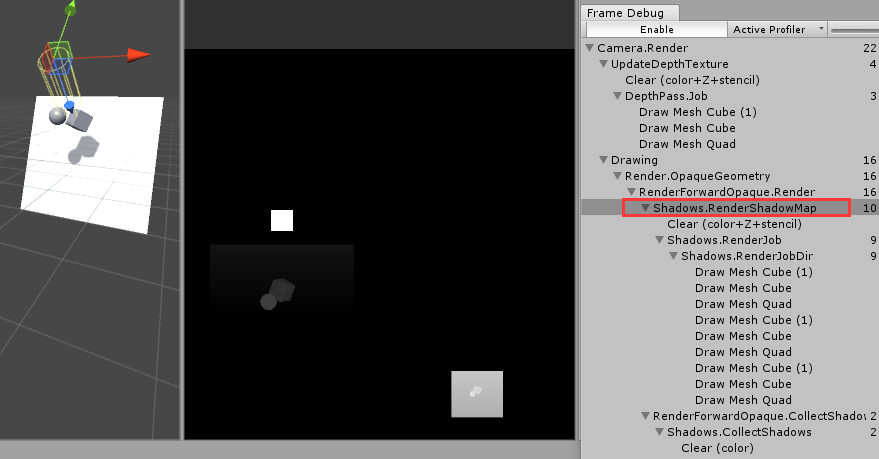
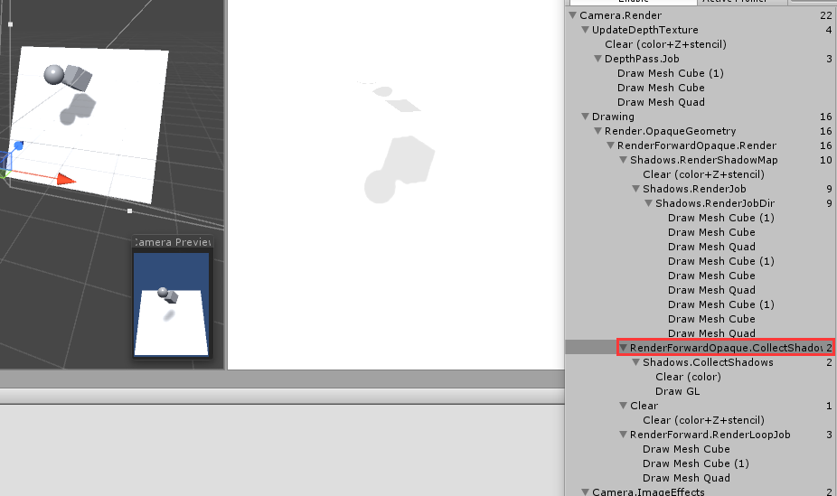

#### 18.阴影

#### 物体开启阴影

如图

* Cast Shadows：是否产生阴影
* Receive Shadows：是否接受阴影

> 当光源也开启阴影效果时，底层渲染引擎会找当前渲染物体的Unity Shader中找到LightMode 为ShadowCast的pass，如果没有就会在Fallback指定的shader里继续寻找。Unity内置的阴影渲染代码为：
>
> ```csharp
> 	Pass {
> 		Name "ShadowCaster"
> 		Tags { "LightMode" = "ShadowCaster" }
> 		
> 		CGPROGRAM
> 		#pragma vertex vert
> 		#pragma fragment frag
> 		#pragma target 2.0
> 		#pragma multi_compile_shadowcaster
> 		#pragma multi_compile_instancing // allow instanced shadow pass for most of the shaders
> 		#include "UnityCG.cginc"
> 
> 		struct v2f { 
> 			V2F_SHADOW_CASTER;
> 			UNITY_VERTEX_OUTPUT_STEREO
> 		};
> 
> 		v2f vert( appdata_base v )
> 		{
> 			v2f o;
> 			UNITY_SETUP_INSTANCE_ID(v);
> 			UNITY_INITIALIZE_VERTEX_OUTPUT_STEREO(o);
> 			TRANSFER_SHADOW_CASTER_NORMALOFFSET(o)
> 			return o;
> 		}
> 
> 		float4 frag( v2f i ) : SV_Target
> 		{
> 			SHADOW_CASTER_FRAGMENT(i)
> 		}
> 		ENDCG
> ```
>
> 

  

##### 1.先更新相机的深度纹理图ShadowMap,如下图： 

>   
> 这里深度图中颜色越深代表z越大  

##### 2.渲染得到平行光的阴影映射纹理(相当于平行光的位置放一个摄像头)  

> 
>
> * 级联阴影(shadow cascades):[阴影默认设置](#阴影默认设置)中可以设置为不使用级联阴影(1张阴影映射纹理)，两级级联和四级级联(即上图的四张)。[什么是级联阴影](./19.级联阴影.md) 

##### 3.根据上面两个纹理得到屏幕空间的阴影图3

>   

如何根据1,2->3 呢，如图1一点通过深度测试片元A,将该点转换到光源空间，得到其光源空间下深度值z，使用其xy分量对平行光的阴影映射纹理进行采样，得到纹理中该方向深度z',如果z > z‘ ,说明该点在阴影中。这样就绘制出了屏幕空间的阴影[图3](#3.根据上面两个纹理得到屏幕空间的阴影图3).

#### 阴影默认设置

 Edit / ProjectSettings / Quality 可以设置阴影默认设置  

