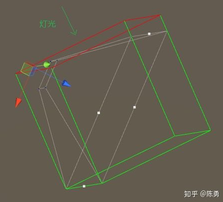
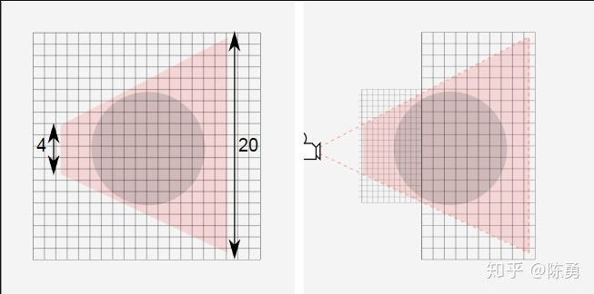
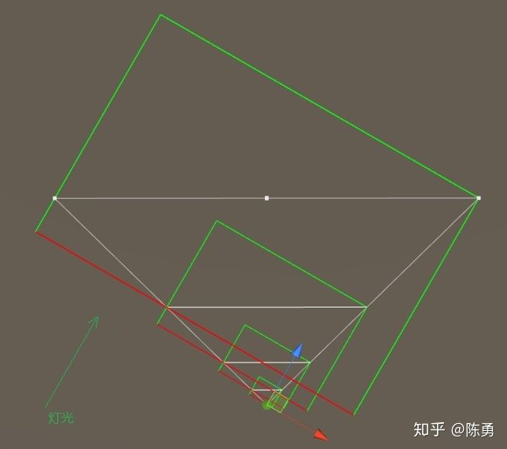
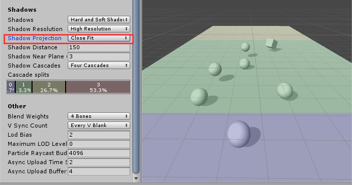
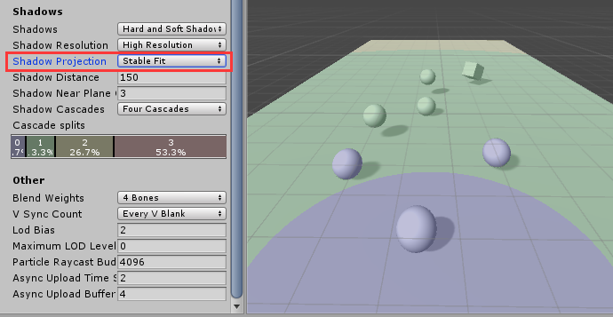

#### 19.级联阴影

转自：<https://zhuanlan.zhihu.com/p/45673049>

参考：http://gad.qq.com/program/translateview/7173984

参考：<https://docs.unity3d.com/Manual/ShadowOverview.html>

unity使用的实时阴影技术是Cascaded Shadow Mapping(简称CSM)。  

unity中可以设置级联阴影并且调节级联比例：  

###### 对于平行光

1.主相机整个视锥产生一张阴影图(可以理解成将一个正交相机放在图中光源位置，并且调节大小使其恰好包括主相机整个视锥。即绿色框，渲染出深度图)  ，单个物体占用阴影图的比例太小，读取阴影图时出现采样精度不够（多个像素采样一个图素），产生锯齿。使用尺寸更大的阴影图可以改善这个问题，但会导致内存使用增加。

2.相机近端和远端物体对阴影图采样精度一样，会导致近端物体采样精度不够，远端物体采样精度浪费。

级联阴影(CSM)就是为了解决上述问题。

CSM通过把相机的视锥体按远近划分为几个级别，处于各个级别下的物体深度信息绘制到各级阴影图中，显示时采样各自对应的阴影图。见下图示意：

设置为四级级联切割成的包围盒如下：  

Unity底层实现是用一张2x2阴影图集来保存4级阴影图

#### Shadow Cascadeds查看模式  

Unity的Scene模式下有一个Shadow Cascadeds查看模式，可以方便查看整个场景的级联阴影图分布。

#### 阴影投影质量设置

阴影投影质量设置(Edit / ProjectSettings / Quality/Shadow Projection)的默认值为“稳定适配”。在这个模式下，可以根据渲染点到相机位置的距离来选择级联区域。另一个选项是“关闭适配”，那么级联区域的形状会使用相机的深度来决定。这会产生在相机的观察方向上的矩形区域带。(即切割视锥使用长方体还是球体)<>

