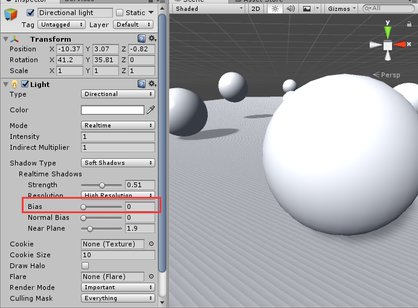
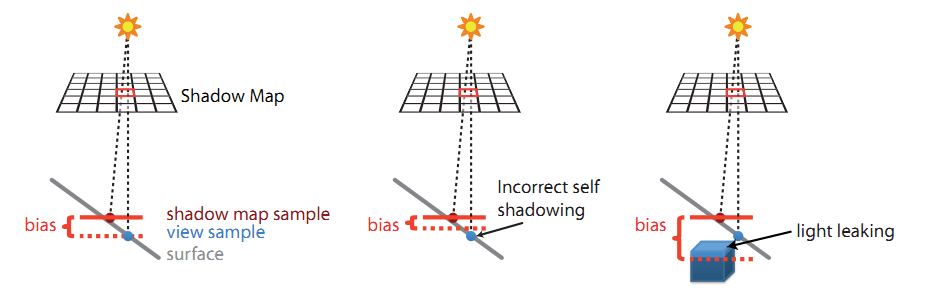
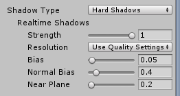
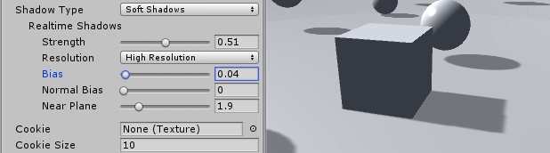
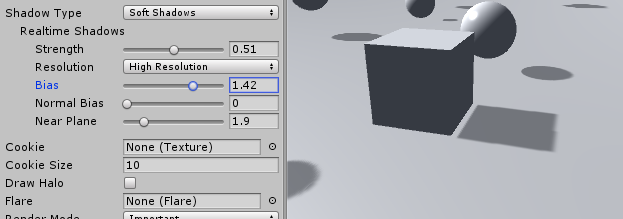

#### 20.阴影瑕疵 shadow acne

参考：<https://zhuanlan.zhihu.com/p/45805097>

有时光照在物体表面会有条纹阴影，如图：

光源照射下遇到的第一个图元的距离会被存入到阴影映射纹理的像素中，因为阴影滤波和像素精度问题，结果应该被照亮的图元反而在阴影中，造成了阴影瑕疵。另一个原因是，阴影映射纹理中的一个像素对应了主相机渲染时的多个图元，当这些图元在一个倾斜表面时，就会造成有的图元大于该像素的深度，而有的小于像素的深度。如图：

Real-Time Shadows Depth bias

  

为了避免这种情况出现，可以在Shadow map 中保存的深度值增加一个偏移值（Depth bias）：

但是，这个偏移值过大又会出现“Peter Pan”现象（物体似乎飘在了空中），也叫漏光（light leaking），如下图右边所示，本该处于阴影的区域反而被照亮了。

