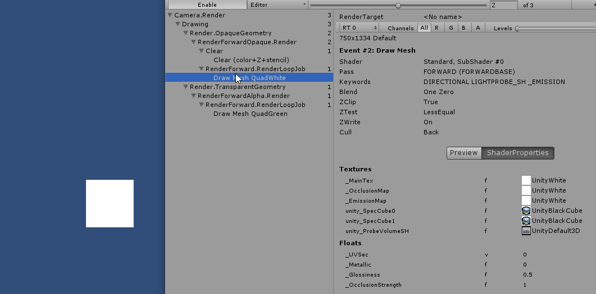
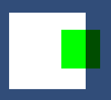

#### 21.Blend 模式

##### 1. 什么是Blend

片元经过fragment处理后，会经过混合处理，最终变为帧缓冲区中的颜色数据。这里的混合，指的是fragment函数处理后的片元颜色与已经存在于帧缓冲区中的颜色进行混合。具体的混合规则使用Blend语句来指定。

##### 3. 参考Frame Debugger理解Blend

Window->Analysis->Frame Debugger 打开帧调试窗口。

可以看到先渲染了OpaqueGeometry(不透明物体QuadWhite)，然后是半透明物体(QuadGreen)

对于绿块上一片元a，对应的帧缓冲区颜色为白色(蓝色)

片元b对应的帧缓冲区颜色则为深蓝色。设置Blend也就是设置片元与帧缓冲区的混合模式

##### 4. Blend x y  的计算公式

vec4 result = x * gl_FragColor + y * pixel_color

* 其中：x，y，gl_FragColor，pixel_color为vec4格式。例 (1.0,1.0,1.0,1.0)
* vec4 \* vec4 为对应分量相乘 [a,b,c,d]\*[e,f,g,h]=[a\*e,b\*f,c\*g,d\*h]
* gl_FragColor 为fragment函数输出的颜色
* pixel_color为帧缓冲区的颜色，gl_FragColor 和pixel_color的颜色混合后的**结果会存储在帧缓冲区**(pixel_color),等待和下一个片元处理出来的gl_FragColor进行混合。
* 上面的 + 号是可以配置的，result 也可以是两者相减的结果 例如：Blend Sub。[参考](https://docs.unity3d.com/Manual/SL-Blend.html)
* 每一个运算，和结果vec4的每个分量都在[0,1]

对于x，和y的取值：

| Code               | Resulting Factor (`SrcFactor` or `DstFactor`) |
| :----------------- | :-------------------------------------------- |
| `One`              | `vec4(1.0)`                                   |
| `Zero`             | `vec4(0.0)`                                   |
| `SrcColor`         | `gl_FragColor`                                |
| `SrcAlpha`         | `vec4(gl_FragColor.a)`                        |
| `DstColor`         | `pixel_color`                                 |
| `DstAlpha`         | `vec4(pixel_color.a)`                         |
| `OneMinusSrcColor` | `vec4(1.0) - gl_FragColor`                    |
| `OneMinusSrcAlpha` | `vec4(1.0 - gl_FragColor.a)`                  |
| `OneMinusDstColor` | `vec4(1.0) - pixel_color`                     |
| `OneMinusDstAlpha` | `vec4(1.0 - pixel_color.a)`                   |

`SrcColor` 对应 gl_FragColor，`DstColor`对应帧缓冲区pixel_color

对于BlendOp的取值

| Code       | Op                                         |
| ---------- | ------------------------------------------ |
| **Add**    | Add source and destination together.       |
| **Sub**    | Subtract destination from source.          |
| **RevSub** | Subtract source from destination.          |
| **Min**    | Use the smaller of source and destination. |
| **Max**    | Use the larger of source and destination.  |

虽然公式简单但是有各种各样的组合，效果也是五花八门，这里捡几个常用的举例。

* Blend SrcAlpha OneMinusSrcAlpha   正常模式(透明度混合)

  即 Blend  片元a\*片元色 +  (1-片元a)\*帧缓冲色

  使用对应的值替换得

  result = vec4(gl_FragColor.a) * gl_FragColor + vec4(1.0 - gl_FragColor.a) * pixel_color
  
  即最终颜色为，片元颜色减淡a后加上剩余透过来的颜色。
  
  
  
  可以看到是比较正常的透明效果
  
* Blend OneMinusDstColor One      柔和相加(soft Additive)

  即 Blend (1-帧缓冲色)*片元色 + 1 * 帧缓冲色

  result = (vec4(1.0) - pixel_color)* gl_FragColor + vec4(1.0) * pixel_color

  

* Blend DstColor Zero   正片叠底 (Multiply)相乘

  即 Blend 帧缓冲色*片元色 + 0 * 帧缓冲色

  result = pixel_color * gl_FragColor + vec4(0.0) * pixel_color

  即最终颜色为片元色与帧缓冲色相乘，与透明度无关

  
  
* Blend DstColor SrcColor     两倍相乘 (2X Multiply)

  即 Blend 帧缓冲色\*片元色 + 片元色\* 帧缓冲色

  result = pixel_color * gl_FragColor + gl_FragColor  * pixel_color

  与上一个类似不过是  片元色与帧缓冲色相乘然后x2，同样与透明度无关

  

* Blend One One                  线性变淡

  即 Blend 1\*片元色 + 1\* 帧缓冲色

  

* BlendOp Min 

  Blend One One  			变暗

  即 Mathf.Min(1\*片元色 ,1\* 帧缓冲色)

  两者取rgb更小的分量

  

* BlendOp Max 

  Blend One One           变亮

  即 Mathf.Max(1\*片元色 ,1\* 帧缓冲色)

  两者取rgb更大的分量

  