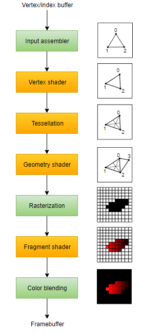
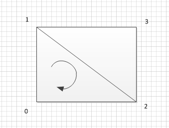

#### 22.geometry shader

##### 1. 什么是geometry shader

几何着色器是处于顶点(/细分曲面)着色器和片元着色器之间的一个可选过程。

可以用于添加或减少顶点(顶点/片元没有这个功能)

##### 2.支持版本

OpenGL 3.2 及以上

##### 3.执行时机是什么时候

>
>
>* 可以看到是放在Tessellation Shader(细分曲面着色器)后面，片元着色器前面
>
>* 因为大部分情况我们不会使用Tessellation Shader，所以一般是 vert->geo->frag 这个顺序。
>
>* 上图中黄色代表我们可以编辑代码，绿色代表GPU自动帮我们完成的。

##### 4.如何使用

1. 定义一个集合着色器函数

   `#pragma geometry geo`

2. 添加一个几何着色器

   `#pragma geometry geo`

3. 添加几何着色器的方法实现

   ```
   [maxvertexcount(9)]
   void geo(triangle v2f patch[3], inout TriangleStream<v2f> stream, uint id:SV_PRIMITIVEID )
   {
       float area = 1/6.0; //显示区域占 NDC的1/12
       v2f o;
       for (uint i = 0; i < 3; i++)
       {
           //坐标转换到裁剪空间
           o.vertex = UnityObjectToClipPos(patch[i].vertex);
           o.uv = patch[i].uv;
           stream.Append(o);
       }
       //重新开始一批顶点 即不与之前append的顶点组成图元
       stream.RestartStrip();
       
       if (id == 0)  // determine quad
       {
           //新建新建四个点 组成两个三角形 顺时针为正面
           //uv偏移 用来判断数字显示
           float2 diff =  float2(10000.0,10000.0);
           //添加4个顶点 坐标是裁剪空间
           // 左下
           o.uv = float2(0,0) + diff;  // UV offset
           //裁剪空间下的坐标
           o.vertex = float4(-1,-1,1,1);
           stream.Append(o);
           //左上
           o.uv = float2(0,1) + diff;  
           o.vertex = float4(-1,-1 + area,1,1);
           stream.Append(o);
           //右下
           o.uv = float2(1,0) + diff;
           o.vertex = float4(1,-1,1,1);
           stream.Append(o);
           //右上
           o.uv = float2(1,1) + diff;
           o.vertex = float4(1,-1 + area,1,1);
           stream.Append(o);
       }
       stream.RestartStrip();
   }
   ```

4. 怎么理解？

   1. void geo(<span style="color:red">triangle</span> <span style="color:green">v2f</span> patch[3], <span style="color:Blue">inout TriangleStream\<v2f\> stream</span>, uint id:SV_PRIMITIVEID)

   2. <span style="color:red">输入点的格式</span>triangle：顶点着色器处理过的顶点按照我们方法定义的点数量依次进入。可以定义为

      1. point：点，一次1个点
      2. line：线，一次2个点
      3. triangle：三角形，也就是上述代码定义的格式，一次3个点
      4. lineadj：邻接线，包含了邻接的线的信息，一次4个点
      5. triangleadj：邻接三角形，包含了邻接三角形的信息，一次6个点
      6. 不同的定义后面要接收对应数组数量的顶点
      7. 具体点的顺序是怎样的请看[官方定义](https://docs.microsoft.com/en-us/windows/win32/direct3dhlsl/dx-graphics-hlsl-geometry-shader)
      8. 如果是triangle，顶点是否会重复进入呢？(因为三角形面片共享顶点)

   3. <span style="color:green">结构体的格式</span>v2f：即从顶点着色器输出的结构，类似：

      ```
      struct v2f
      {
          float2 uv : TEXCOORD0;
          float4 vertex : SV_POSITION;
      };
      ```

   4. <span style="color:Blue">输出格式</span>inout TriangleStream\<v2f\> stream：是一个以v2f为结构的三角形带。参考上述方法实现的代码，我们添加了两个三角形，但是只用了四个顶点。要完成这个首先要明白

      1. 添加顶点的顺序决定了面片的朝向，定义和[Mesh](../Mesh/2.Mesh Learn.md)差不多，都是顺时针为正。所以我们添加的顺序是

         0,1,2,3

         

      2. [0,1,2]是正面没问题，但是[1,2,3]是逆时针不就变反面了吗。几何着色器三角带一个重要特性就是当遇到第奇数个([0,1,2]算第0个)三角形时会翻转一下顺序变成[2,1,3],又变回顺时针了。

      3. 那我们连续添加顶点岂不是所有三角面都连在一起了吗。可以使用`stream.RestartStrip()`，方法重启三角形带，意味着我们下一个新添加的顶点不与前面顶点组成三角形，而是作为新三角形的第一个顶点。

   5. 输出顶点的个数：我们用`[maxvertexcount(xx)]`来告诉几个着色器本次最多输出xx个顶点

完整代码见[code](code/testNum.shader)