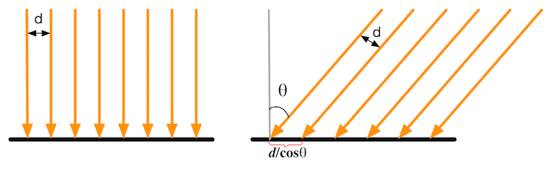
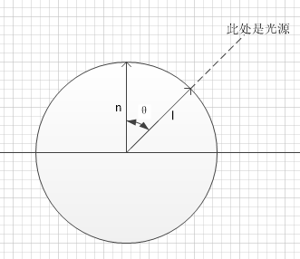
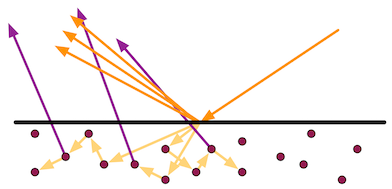

#### 24.环境光漫反射高光反射

图片来源：https://github.com/candycat1992/Unity_Shaders_Book

内容来源：《Unity Shader入门精要》

* 首先，光线从光源(light source)中被发射出来
* 然后，光线和场景中的物体相交，一些光线被物体吸收了，而另一些光线被散射到其他方向
* 最后，摄像机吸收了一些光，产生了图像

#### 光源

在光学里，我们使用辐照度(irradiance)来量化光。在实时渲染中，我们通常把光源当成一个没有体积的点，用$l$表示光的方向。

对于平行光，他的辐照度可通过计算在垂直于$l$的单位面积上单位时间内穿过的能量来得到。

在计算光照模型时，我们需要知道一个物体表面的辐照度，而物体表面往往是和$l$不垂直的，那么如何计算这样表面的辐照度呢？

我们可以使用光源方向$l$和表面法线$n$之间的夹角的余弦值来得到。

在左图中，光是垂直照射到物体表面，因此光线之间的垂直距离保持不变；而在右图中，光是斜着照射到物体表面，在物体表面光线之间的距离是$d/cosθ$，因此单位面积上接收到的光线数目要少于左图

因为辐照度是和照射到物体表面时光线之间的距离$d/cosθ$成反比的，简单理解就是光线之间的距离越大，辐照度越小。因此辐照度是和$cosθ$成正比。

$\vec{n} \cdot \vec{l} = |\vec{n}| \, |\vec{l}| \cos \theta \;$

假设法线向量$\vec{n}$和光向量$\vec{l}$的模为1，那么$cosθ$可以使用指向光源方向的向量$\vec{l}$和表面法线向量的点积$\vec{n}$来得到。**这就是使用点积来计算辐照度的由来。**0°-90°的范围内，$θ$值越大，辐照度越小。

#### 吸收和散射

光线由光源发射出来后，就会与一些物体相交。通常，相交的结果有两个：散射(**scattering**)和吸收(**absorption**)

散射只改变光线的方向，但不改变光线的密度和颜色，而吸收只改变光线的密度和颜色，但不改变光线的方向。

光线在物体表面经过散射后，有两种方向：一种将会散射到物体内部，这种现象被称为折射(**refraction**)或透射(**transmission**)；另一种将会散射到外部，这种现象被称为反射(**reflection**)。**对于不透明物体，折射进入物体内部的光线还会继续与内部的颗粒进行相交，其中一些光线最后会重新发射出物体表面，而另一些则被物体吸收**。那些从物体表面重新发射出的光线将具有和入射光线不同的方向分布和颜色。如图

散射时，光线会发生**折射**和**反射**现象。对于不透明物体，折射的光线会在物体内部继续传播，最终有一部分光线会重新从物体表面被发射出去。

为了区分这两种不同的散射方向，我们在光照模型中使用了不同的部分来计算它们：**高光反射(specular)**部分表示物体表面是如何反射光线的，而**漫反射(diffuse)**部分则表示有多少光线会被折射、吸收和散射出表面。根据入射光线的数量和方向，我们可以计算出射光线的数量和方向，我们通常使用**出射度(exitance)**来描述它。辐照度和出射度是满足线性关系的，而它们之间的比值就是材质的漫反射和高光反射属性。

定义漫反射和高光反射也只是对实际物理现象的简单建模？？

**为了简单，我们假设漫反射部分是没有方向性的，也就是说，光线在所有方向上是平均分布的。同时，我们也只考虑某一个特定方向上的高光反射**

极其简化的建模。。。。

#### 着色

先了解一下几个名词：

flux：光通量，

intensity：光强

irradiance：辐照度

radiance：辐照率

人如何看到周围的物体呢

1. 首先要要物体
2. 其次要有光
3. 最后还要有眼睛

什么决定了我们看到的物体的样子

1. 物体的颜色，物体的形状
2. 光的颜色，光的强度，光的角度
3. 眼睛的位置，眼睛的近视度数，是不是色盲，眼睛瞪得大不大

##### 1.环境光