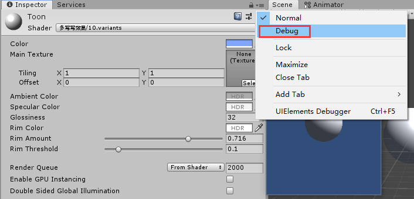
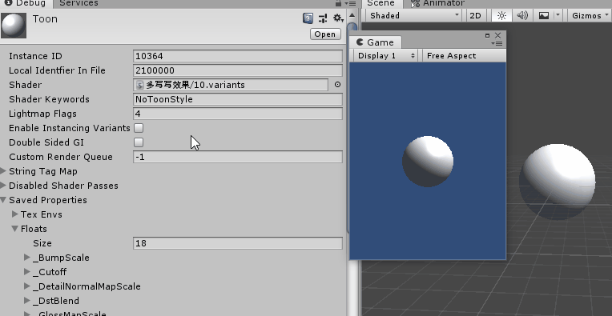

#### 25.shader变体

[官网参考](https://docs.unity3d.com/Manual/SL-MultipleProgramVariants.html#KeywordLimits)

#### 1.什么是shader变体

>类似于[unity宏定义](../Manual/13.宏.md)，使用不同的宏命令会编译成不同的可执行文件。
>
>但是不同于unity打包时所有宏已经确定，只生成一个可执行文件。对于shader，不同的材质(Material)，不同的 PassType，可能会使用不同的宏定义，这就导致shader会有很多变体(Variant)
>
>在写shader时，往往会在shader中定义多个宏，并在shader代码中控制开启宏或关闭宏时物体的渲染过程。最终编译的时候也是根据这些不同的宏来编译生成多种组合形式的shader源码。其中每一种组合就是这个shader的一个变体(Variant)。
>
>通过添加`#pragma multi_compile`或 `#pragma shader_feature`
>
>在运行时，unity通过Material keywords和Shader keywords来选取合适的shader变体

#### 2.multi_compile是怎么工作的

* 如`#pragma multi_compile FANCY_STUFF_OFF FANCY_STUFF_ON`这行指令生成两个变体，一个是定义了`FANCY_STUFF_OFF`，另一个是定义了`FANCY_STUFF_ON`，在运行时，unity基于Material或者全局shader keywords来确定使用哪一个。**如果两个都没有预定义，shader默认使用第一个即`FANCY_STUFF_OFF`。**

* 当然也可以一次使用多个宏定义如

  `#pragma multi_compile SIMPLE_SHADING BETTER_SHADING GOOD_SHADING BEST_SHADING`

* 如下面例子的代码，我们在判断中只用了`#ifdef ToonStyle`，那我们就没必要定义NoToonStyle，

  `#pragma multi_compile ToonStyle NoToonStyle`

  可以替换为`#pragma multi_compile __ ToonStyle`

  这样可以节省预定义的数量(少定义了NoToonStyle)，因为这个预定义的数量是有限制的。但是并没有减少变体生成的数量，同样是定义了ToonStyle的变体，和没有定义ToonStyle的变体

* 值得注意的是，即使后面没有使用`#ifdef ToonStyle`,变体也会生成

##### 下面是例子

例如我们有如下代码

```
Pass
{
	...
	//是否开启卡通风格渲染
	#pragma multi_compile ToonStyle NoToonStyle
	...
	
	float4 frag (v2f i) : SV_Target
    {
    	#ifdef ToonStyle
    		...
    		return 卡通风对应颜色
        #else
        	...
        	return 正常渲染的颜色
        #endif
    }
}
```

这时我们将使用了该shader的Material的Inspector面板改成Debug的模式



* 然后将Shader Keywords 改成卡通风。**当多个材质引用的是同一个shader，通过修改材质的keywords可以让材质分别使用不同的变体从而达到不同的渲染效果**。也可以使用代码`Material.EnableKeyword("ToonStyle")`

如图：


#### 3.shader_feature 和 multi_compile有什么不同

两者非常相似，唯一不同是，打包时unity不会将`shader_feature`中没有使用的变体打进包体。

基于这个原因，应该使用`shader_feature`设置材质， `multi_compile` 设置全局代码 ???

另外，`shader_feature`还有个简写形式

```
//Material的Inspector面板Debug的模式下修改Shader Keywords同样会生效
#pragma shader_feature FANCY_STUFF
```

这个是 `#pragma shader_feature _ FANCY_STUFF`的简写，解释成两个变体，一个是没有定义`FANCY_STUFF`，一个是定义了`FANCY_STUFF`

#### 4.组合每一行的multi_compile 

如果有以下预定义

```
#pragma multi_compile A B C
#pragma multi_compile D E
```

最终会有六个变体(A+D，B+D，C+D，A+E，B+E，C+E)

#### 5.预定义的Keyword数量限制

上限是256个keywords，有unity内部使用了大概60个。

* Local keywords：shader_feature和multi_compile的keywords数量限制是全局的(256个全局关键字，加上64个本地关键字)。为了避免这种情况，你可以使用本地的变体指令。shader_feature_local and multi_compile_local.

  * **shader_feature_local**：和**shader_feature**相似但是keywords是本地的
  * **multi_compile_local**：和**multi_compile**相似但是keywords是本地的

  如果全局的keyword和本地的冲突，优先使用本地的

  **限制**

  * 不能使用全局的api改变本地的关键字如        Shader.EnableKeyword("XXX");或CommandBuffer.EnableShaderKeyword("XXX");
  * Shader.EnableKeyword 是所有引用该shader的材质都开启宏定义，Material.EnableKeyword是仅某一材质开启宏定义？？？
  * 每个shader最多64个本地关键字
* 如果Material启用了本地关键字，但是关键字该shader不再声明，则Unity将创建一个新的全局关键字。？？
  
**例子**
  
  ```
  #pragma multi_compile_local __ ToonStyle
```
  
  ```
  public Material mat;
  Private void Start()
  {
      mat.EnableKeyword("ToonStyle");
  }
```
  
  2019之前版本是不支持local keyword

#### 6.内置的multi_compile 简写

对于编译多个shader变体，unity有几个简写形式。大部分是处理不同的光照，阴影和光照贴图。

* `multi_compile_fwdbase`为基本前向渲染通道编译多个变体，不同的变体可能需要处理不同的光照贴图类型，或者一些使用了主平行光的阴影，而另一些禁用了
* `multi_compile_fwdadd`为附加前向渲染通道编译多个变体，不同的变体可能需要处理不同类型的光源——平行光、聚光灯或者点光源，亦或者它们附带cookie纹理的版本。
* `multi_compile_fwdadd_fullshadows`同multi_compile_fwdadd，不过包含了可以让光源拥有实时阴影的功能。
* `multi_compile_fog`为处理不同的雾效类型（off/linear/exp/exp2）扩展了多个变体。

大部分内建快捷写法会导致许多shader变体，如果某些不需要使用，那么可以使用`#pragma skip_variants`来忽略它们。

```
#pragma multi_compile_fwdadd
#pragma skip_variants POINT POINT_COOKIE
```

该指令跳过包含POINT或POINT_COOKIE的所有变体。

#### 7.渲染平台

| **Statement** | **Renderer**                                                 |
| :------------ | :----------------------------------------------------------- |
| `d3d11`       | Direct3D 11/12                                               |
| `glcore`      | OpenGL 3.x/4.x                                               |
| `gles`        | OpenGL ES 2.0                                                |
| `gles3`       | OpenGL ES 3.x                                                |
| `metal`       | **iOS** /Mac Metal                                           |
| `vulkan`      | Vulkan                                                       |
| `d3d11_9x`    | Direct3D 11 9.x feature level, as commonly used on WSA platforms |
| `xboxone`     | **Xbox One**                                                 |
| `ps4`         | **PlayStation 4**                                            |
| `n3ds`        | Nintendo 3DS                                                 |
| `wiiu`        | Nintendo **Wii U**                                           |

如

```
#pragma only_renderers d3d11
```

[参考链接](https://docs.unity3d.com/Manual/SL-ShaderPrograms.html)

#### 8.硬件平台

使用multi_compile的目的一般是为了创建一些fallback或者简化shader，它们在同一个目标平台（例如OpenGL ES）的高端硬件和低端硬件上都可以高效地运行。这种时候，我们可以使用shader硬件变体来为不同性能等级的硬件创建一个特殊优化的变体集合。

为了生成shader硬件变体，需要添加#pragma hardware_tier_variantsrenderer，这里renderer表示某个可运行的渲染平台。使用这个指令，Unity会对每个shader生成3个shader变体（其他关键字会不起作用），而对应的关键字是：

UNITY_HARDWARE_TIER1

UNITY_HARDWARE_TIER2

UNITY_HARDWARE_TIER3

在编辑器里，可以通过Graphics Emulation菜单来测试他们。

[原文链接](https://blog.csdn.net/ecidevilin/article/details/52882400)