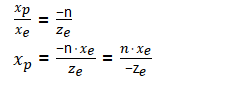

### 

**从观察空间到裁剪空间的变换**叫做**投影变换**。

首先观察空间是右手坐标系，所以对于世界空间的坐标，z值要取个反。  

为了便于视锥剔除(即判断某个点是否能被摄像机看到),openGL的做法是将视锥体变换成NDC，如图。  
  
在unity默认视锥体中，l=-r,b=-t。n = -Near(摄像头与近裁剪面的距离) f = -Far(摄像头与远裁剪面的距离)  

要进行这个变换需要1.先将视锥体的远裁剪面等比例压缩，使视锥体变成一个长方体，在2.将其压缩成边长为2的正方体，最后3.平移至原点即可  

对于1的操作，其实就是将视锥体内部的点投影至近裁面上，此时x,y的坐标都变成投影坐标，而z坐标暂时保留。  

如下图：  
下图是一个三视图，将点投影后可以的到如下关系，
  

(Xe,Ye,Ze)表示观察空间中即视锥体的点(e代表eye)  
(Xp,Yp,Zp)表示投影后的点(p代表projection)  

根据三角形的相似性，由右视图得：  
  
俯视图得：  
  

这里 Xp 和Yp 都依赖于Ze,他们与 -Ze成反比。  
  
上图，右侧是观察空间里的点,所以We=1
假设Wc = -Ze，则Mp的第四行为(0, 0, -1, 0)  
  

这里我们相当于完成了变换1，变换2要求将边长变为2，对照上述三视图，其实就是将Yp/L Xp/r
这样变换2就完成了。  
此时  
  

  

所以裁剪矩阵又有了新进展：  

  

这里第一行第二行都确定了，因为Zc的值与XcYc无关所以第三行一二列为0。  
A和B分别代表了缩放和平移的操作。  

这里A，B的计算我们换个思路：  
We=1  
  
Ze 在区间[-f,-n] 对应 Zndc 在区间[-1,1] 这里-f对应1 -n对应-1，因为坐标系变回了左手坐标系。  

根据公式求出A,B并带入得  
  

unity中用Field of view(FOV) 控制视锥大小.  
这里  
L = n*tan(Fov/2)  
Aspect = r/L  

简单做下替换得矩阵  

  
