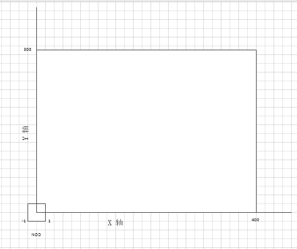

### 
unity中，裁剪空间->屏幕空间 的转换是由底层帮我们完成的，我们的顶点着色器只要把顶点转换到裁剪空间即可。  

也就是说，我们写的shader不影响这部分处理。  
如下图：  
  
这部分转换其实就是一个线性变换，将x轴(-1,1)的区间变为(0,400)，y轴的(-1,1)变为(0,300).  
假如我们要将归一化的NOD转换成屏幕坐标可以作如下简单计算：  
将NDC的坐标+1,/2 归一化 再*屏幕的宽/高  
即：  
  
