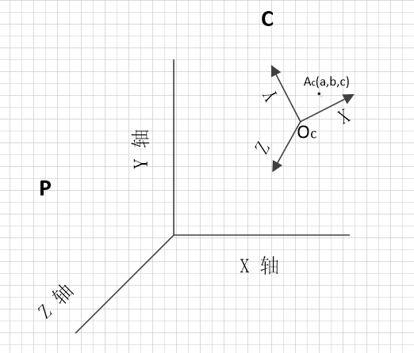
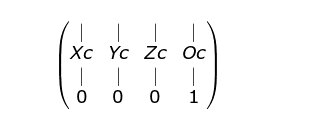
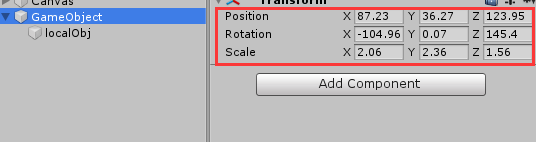

### 坐标系的切换

如图，坐标系P，与坐标系C。  
已知:

C坐标系的x轴正方向单位向量在P坐标系下的表示Xc=$\begin{bmatrix}
a_{00}
\\
a_{10}
\\
a_{20}
\end{bmatrix}$

同理Yc：$\begin{bmatrix}
a_{01}
\\
a_{11}
\\
a_{21}
\end{bmatrix}$

Zc:$\begin{bmatrix}
a_{02}
\\
a_{12}
\\
a_{22}
\end{bmatrix}$


以及C坐标系原点Oc在P坐标下的坐标表示：  $\begin{bmatrix}
a_{03}
\\
a_{13}
\\
a_{23}
\end{bmatrix}$

点Ac在C坐标系下表示为(a,b,c)

求： Ac点在P坐标系下表示(当然点的位置是不变的)

根据坐标系的定义，C坐标系下的点a,b,c即向x轴正方向移动a,向y轴正方向移动b，向z轴正方向移动c，

则其在P坐标系下的表示为： 
$Ap = Oc + a\begin{bmatrix}
a_{00}
\\
a_{10}
\\
a_{20}
\end{bmatrix}+b\begin{bmatrix}
a_{01}
\\
a_{11}
\\
a_{21}
\end{bmatrix}+c \begin{bmatrix}
a_{02}
\\
a_{12}
\\
a_{22}
\end{bmatrix}$

即：$\begin{bmatrix}
x_p
\\
y_p
\\
z_p
\end{bmatrix}=\begin{bmatrix}
a_{00}&a_{01}&a_{02}&a_{03}
\\
a_{10}&a_{11}&a_{12}&a_{13}
\\
a_{20}&a_{21}&a_{22}&a_{23}
\end{bmatrix}
\begin{bmatrix}
a
\\
b
\\
c
\\
1
\end{bmatrix}$

点A在P坐标系下的表示为


 


当然如果已知的是点在P坐标系下的表示，求点在C坐标系下的表示就是用矩阵的逆。


##### Unity中的情况。

unity中会有世界坐标和本地坐标两种。

一般情况下，我们挂在其他GameObject下的物体都是使用的本地坐标，那么如何求它的世界坐标呢。



如上图，我们localObj的坐标假如是a,b,c。父节点经过了缩放，旋转和平移的操作，那么localObj的世界坐标是什么呢。

这个可以类比我们上面的坐标系转换。

父节点的一系列变换可以通过unity自带的方法求出变换矩阵。

`Matrix4x4.TRS(n.localPosition, n.localRotation, n.localScale)`

假设为$\begin{bmatrix}
a_{00}&a_{01}&a_{02}&a_{03}
\\
a_{10}&a_{11}&a_{12}&a_{13}
\\
a_{20}&a_{21}&a_{22}&a_{23}
\\
&&&1
\end{bmatrix}$

即:世界空间坐标系执行该变换会变为GameObject下的坐标系，

GameObject坐标系下Xc表示为：$\begin{bmatrix}
a_{00}&a_{01}&a_{02}&a_{03}
\\
a_{10}&a_{11}&a_{12}&a_{13}
\\
a_{20}&a_{21}&a_{22}&a_{23}
\end{bmatrix}\begin{bmatrix}
1
\\
0
\\
0\\0
\end{bmatrix} = \begin{bmatrix}
a_{00}
\\
a_{10}
\\
a_{20}
\end{bmatrix}$

GameObject坐标系下Yc表示为：$\begin{bmatrix}
a_{00}&a_{01}&a_{02}&a_{03}
\\
a_{10}&a_{11}&a_{12}&a_{13}
\\
a_{20}&a_{21}&a_{22}&a_{23}
\end{bmatrix}\begin{bmatrix}
0
\\
1
\\
0\\0
\end{bmatrix} = \begin{bmatrix}
a_{01}
\\
a_{11}
\\
a_{21}
\end{bmatrix}$

GameObject坐标系下Zc表示为：$\begin{bmatrix}
a_{00}&a_{01}&a_{02}&a_{03}
\\
a_{10}&a_{11}&a_{12}&a_{13}
\\
a_{20}&a_{21}&a_{22}&a_{23}
\end{bmatrix}\begin{bmatrix}
0
\\
0
\\
1
\\
0
\end{bmatrix} = \begin{bmatrix}
a_{02}
\\
a_{12}
\\
a_{22}
\end{bmatrix}$

GameObject坐标系下原点Oc表示为：$\begin{bmatrix}
a_{00}&a_{01}&a_{02}&a_{03}
\\
a_{10}&a_{11}&a_{12}&a_{13}
\\
a_{20}&a_{21}&a_{22}&a_{23}
\end{bmatrix}\begin{bmatrix}
0
\\
0
\\
0\\1
\end{bmatrix} = \begin{bmatrix}
a_{03}
\\
a_{13}
\\
a_{23}
\end{bmatrix}$

则其在世界坐标系下的表示为： 
$Ap = Oc + a\begin{bmatrix}
a_{00}
\\
a_{10}
\\
a_{20}
\end{bmatrix}+b\begin{bmatrix}
a_{01}
\\
a_{11}
\\
a_{21}
\end{bmatrix}+c \begin{bmatrix}
a_{02}
\\
a_{12}
\\
a_{22}
\end{bmatrix}$

即：$\begin{bmatrix}
x_p
\\
y_p
\\
z_p
\end{bmatrix}=\begin{bmatrix}
a_{00}&a_{01}&a_{02}&a_{03}
\\
a_{10}&a_{11}&a_{12}&a_{13}
\\
a_{20}&a_{21}&a_{22}&a_{23}
\end{bmatrix}
\begin{bmatrix}
a
\\
b
\\
c
\\
1
\end{bmatrix}$

所以知道世界空间坐标或者本地坐标都可以通过矩阵算出另一个了。

$WorldPos = M*LocalPos$

$LocalPos = M^{-1}*WorldPos$

多层嵌套的

$WorldPos = M_{外层}*M_{内层}*LocalPos$

$LocalPos= (M_{外层}*M_{内层})^{-1}*WorldPos $


可用以下代码验证正确性

```
    private Stack<Transform> parents = new Stack<Transform>();
    void Start()
    {
        Vector3 wordPos = new Vector3(100,100,100);
        Vector3 localPos= new Vector3(100,100,100);

        Matrix4x4 worldToLocal = Matrix4x4.identity;//坐标空间的矩阵变换

        //计算世界坐标到本地坐标的过程

        //先将父节点递归进栈
        var p = transform.parent;
        while (p)
        {
            parents.Push(p);
            p = p.parent;
        }

        //由最外层依次递归求变换矩阵
        while (parents.Count>0)
        {
            var n = parents.Pop();
            var m = Matrix4x4.TRS(n.localPosition, n.localRotation, n.localScale);
            worldToLocal = worldToLocal * m;//顺序不可变
        }

        Matrix4x4 localToWorld = worldToLocal;


        //坐标点的矩阵变换
        worldToLocal = worldToLocal.inverse;

        localPos = worldToLocal.MultiplyPoint(wordPos);
        transform.position = wordPos;
        Debug.Log(worldToLocal);
        Debug.Log(localPos);


        
//        transform.localPosition = localPos;
//        wordPos = localToWorld.MultiplyPoint(localPos);
//        Debug.Log(localToWorld);
//        Debug.Log(wordPos);
    }
```

