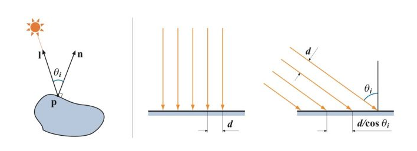
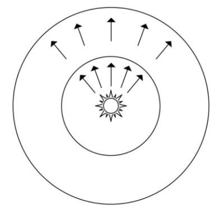
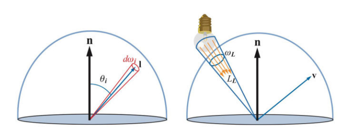
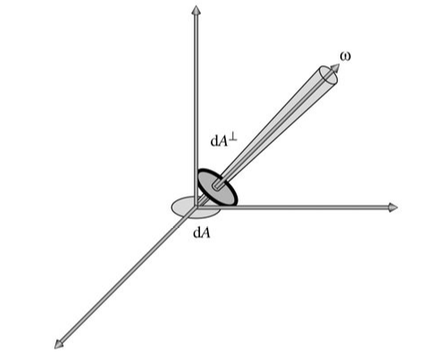
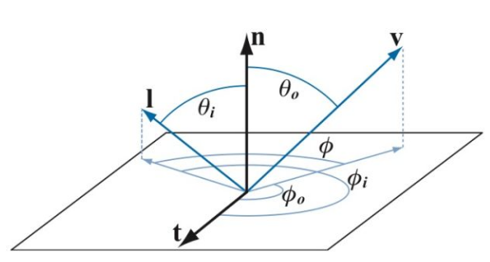
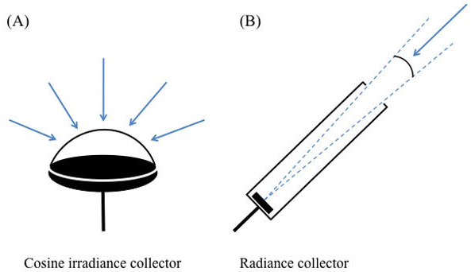
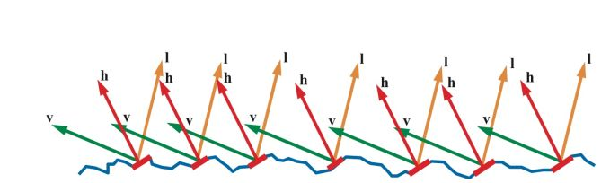
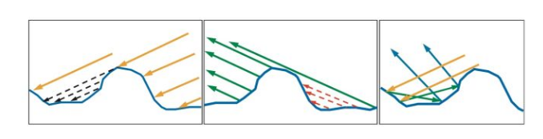

转载自：https://zhuanlan.zhihu.com/p/21376124

辐射度学中的基本量

#### 1.能量

能量(Energy)，用符号$Q$表示，单位焦耳($J$)，每个光子都具有一定的能量，和频率相关，频率越高，能量也就越高。

#### 2.功率

功率（Power），单位瓦特（Watts），或者焦耳/秒（$J/s$）。辐射度学中，辐射功率也被称为辐射通量（Radiant Flux）或者通量（Flux），指**单位时间内通过表面或者空间区域的能量的总量**，用符号$\Phi$表示，

定义$\Phi = \frac{ dQ}{dt}$

#### 3.辐照度和辐出度

辐照度（Irradiance），指单位时间内到达单位面积的辐射能量，或到达单位面积的辐射通量，也就是通量对于面积的密度。用$E$表示，单位$W / m^{2} $。定义为$E = \frac{d\Phi }{dA}$。

辐出度（Radiant Existance），也称为辐射出射度，辐射度（Radiosity），用符号M表示。辐出度与辐照度类似，唯一的区别在辐出度衡量的是离开表面的通量密度，辐照度衡量的是到达表面的通量密度。辐照度和辐出度都可以称为辐射通量密度（Radiant Flux Density）。

处理通量密度时，我们需要注意表面朝向和光线方向的角度，读下图所示，当光线垂直表面照射时，照射到表面上时的间距为d；而当光线倾斜照射表面时（光照向量l和表面法线n的夹角为$\theta_{i} $）,间距为$d / cos \theta_i$，光线间距相对垂直照射时变大了，也就是说倾斜照射时通量密度降低了。

光照角度影响通量密度在我们日常生活中有很多实际例子，地球的季节变化就是因为光照角度变化，导致通量密度发生了变化。

假定不垂直于光线传播方向的表面面积为$A$，将它投影到垂直于光线方向得到一个虚拟表面，这个虚拟表面的面积为$A^{\bot} = A cos \theta_i$，通过这两个面积的通量是相同的，均为$\Phi$，则表面接收到的辐照度$E = \frac{\Phi }{A}$。虚拟表面上的辐照度$E_L = \frac{\Phi }{A^{\bot}}  = \frac{\Phi }{A cos \theta _i}$，于是$E = E_L cos \theta_i$。

点光源向四周辐射能量，假想以点光源为中心不同半径的球包围着点光源，穿过这些球的辐射通量是相同的，均为$\Phi$，而球的表面积为$4 \pi r^2$，可得通量密度$E = \frac{\Phi }{4 \pi  r^{2} } $，也就是说通量密度与距离的平方成反比，离光源越远，通量密度越低，这也是为什么光的衰减与距离的平方成反比。

#### 辐射强度

讲辐射强度前，我们需要先知道立体角（Solid Angle）的概念，立体角可以看成是弧度的三维扩展。我们知道弧度是度量二维角度的量，等于角度在单位圆上对应的弧长，单位远的周长是$2\pi $，所以整个圆对应的弧度也是$2\pi $。立体角则是度量三维角度的量，用符号$\omega $表示，单位为立体弧度（也叫球面度，Steradian，简写为sr），等于立体角在单位球上对应的区域的面积（实际上也就是在任意半径的球上的面积除以半径的平方$\omega = \frac{s}{r^{2} } $），单位球的表面积是$$4\pi $$所以整个球面的立体角也是$4\pi $。

我们可以用一个向量和一个立体角来表示一束光线，向量表示这束光线的指向，立体角表示这束光线投射在单位球上的面积，也就是光束的粗细。如下图左边，向量l表示光源方向，微分立体角$d \omega _{i} $表示光束的粗细是无穷小。右边则表示面积光照到平面上的一点，立体角$\omega _{L} $不再是无穷小。

辐射强度（Radiant Intensity），指通过单位立体角的辐射通量。用符号$I$表示，单位$W / sr$，定义为$I = \frac{d \Phi }{d \omega } $。

之所以引入辐射强度，是因为有时候要**度量通过一个点的通量的密度**，但因为点的面积是0，无法使用辐照度，所以引入辐射强度。辐射强度不会随距离变化而变化，不像点光源的辐照度会随距离增大而衰减，这是因为立体角不会随距离变化而变化。

#### 辐射率

我们常需要度量从一个微小面积表面出发，射向某个微小方向的通量(或者来自某个微小方向，照射到微小面积表面的通量)，辐射率就是度量这种情况的量。

辐射率(Radiance)，指每单位面积每单位立体角的辐射通量密度。用符号$L$表示，单位$W/m^{2} sr $，定义为$L = \frac{d \Phi }{d\omega d A^{\bot } } $。其中$ d A^{\bot } $是微分面积$d A$在垂直于光线方向的投影，如下图所示。

辐射率实际上可以看成是我们眼睛看到(或者相机拍到)的物体上**一点的颜色**。**在基于物理着色时，计算表面一点的颜色就是计算它的辐射率。**

辐射率不会随距离变化而衰减，这和我们日常感受一直，在没有雾霾的干扰时，我们看到的物体表面上一点的颜色并不会随距离变化而变化。为什么辐照度会随着距离增大而衰减，但是我们看到的颜色却不会衰减呢？这是因为随着距离变大，我们看到的物体上的一块区域到达视网膜的通量密度会变小，同时这块区域在视网膜表面上的立体角也会变小，正好抵消了通量密度的变化。

#### BRDF

我们看到一个表面，实际上是周围环境的光照射到表面上，然后表面将一部分光反射到我们眼睛里。双向反射分布函数的BRDF（Bidirectional Reflectance Distribution Function）就是描述表面入射光和反射光关系的。

对于一个方向的入射光，表面会将光反射到表面上半球的各个方向，不同方向反射的比例是不同的，我们用BRDF来表示指定方向的反射光和入射光的比例关系，BRDF定义为：

$f(l, v) = \frac{d L_{o} (v) }{d E(l)} $

> 其中$f$就是BRDF，$l$是入射光方向,$v$是观察方向，也就是我们关心的反射光方向。
>
> $d L_{o} (v)$是表面反射到$v$方向的反射光的微分辐射率。表面反射到$v$方向的反射光的辐射率为$L_{o} (v)$，来自于表面上半球所有方向的入射光线的贡献，而微分辐射率$d L_{o} (v)$特指来自方向$l$的入射光贡献的反射辐射率。
>
> $d E(l)$是表面上来自入射光方向$l$的微分辐照度。表面接收到的辐照度为$E$，来自上半球所有方向的入射光线的贡献，而微分辐照度$d E(l)$特指来自于方向$l$的入射光。
>
> 所以这个公式的解释就是，光线$l$反射光的辐照率 = 比例f * 光线$l$入射光的辐照度   物品材质决定这个比例f

表面对不同频率的光反射率可能不一样，因此BRDF和光的频率有关。在图形学中，将BRDF表示为RGB向量，三个分量各自有自己的$f$函数。

BRDF需要处理表面上半球的各个方向，如下图使用[球坐标系](https://en.wikipedia.org/wiki/Spherical_coordinate_system)定义方向更加方便。球坐标系使用两个角度来确定一个方向：

1.方向相对法线的角度$\theta $，称为极角（Polar Angle）或者天顶角（Zenith Angle）

2.方向在平面上的投影相对于平面上一个坐标轴的角度$\phi $，称为方位角（Azimuthal Angle）

所以BRDF也可以表示成$f(\theta_i, \phi_i, \theta_o, \phi_o)$。对于各项同性材质，当$l$和$v$同时绕法线 $n$旋转时，$f$值保持不变，此时可以用$l$和$v$在平面投影的夹角$\phi$来代替$\phi_i$和$\phi_o$：$f(\theta_i, \theta_o, \phi)$。

注意：这里的$v$可以是任意方向。因为各项同性材质，知道了夹角$\phi$，和$\theta_i \theta_o$，就算当$l$和$v$同时绕法线 $n$旋转时（即改变了$\phi_i$和$\phi_o$），最终$f$值也会保持不变。这里$f$包含RGB三个分量（即对于RGB不同的反射比例）

至于为什么BRDF要定义成辐射率和辐照度的比值，而不是直接定义为辐射率和辐射率的比值，有两种解释。

**第一种解释**可以参看[brdf为什么要定义为一个单位是sr-1的量？](https://www.zhihu.com/question/28476602/answer/41003204)

我们结合下面辐照度（A）和辐射率（B）测量仪的示意图来看看。辐射度测量仪（A）接受平面上半球的所有光线，可以测量一个较小面积来自四面八方的所有光通量，光通量$\Phi $除以传感器面积$A$就可以得到辐照度$E$。辐射度测量仪（B），则有一个长筒控制光线只能从一个很小的立体角进入测量仪，光通量$\Phi $除以传感器面积$A$和立体角$\omega $就可以得到辐射率$L$。

测平面上一点在某一个方向的出射辐射率很简单，只需要用仪器（B）从该方向对准该点就可以了。而测平面一点入射的辐射率则没有那么简单，必须保证光源正好覆盖测量仪开口立体角，大了该点会接受到比测量值更多的光照，导致测量值比实际小，小了则与仪器设计立体角不一致，可在实际中是基本做不到光源大小正好覆盖测量仪开口立体角的。而测表面的辐照度则简单得多，只要保证光源很小，而且没有来自其他方向的光干扰，这时候测到的辐照度就是平面上来自光源方向的微分辐照度$dE$。

**第二种解释**从数学角度出发，对于现实世界中非光学平面，一束光线射到表面上后，被表面反射到各个方向，其中一个出射方向的光通量只是整个反射光通量极小的一部分，当出射方向立体角趋于0时，$\lim_{\omega _{o}   \rightarrow 0}{\frac{dL_{o} }{Li} } = 0$（$\omega$表示出射方向立体角，$dL_{o}$其中一个出射方向辐射率 ,$Li$表示入射方向辐射率），所以在实际计算中使用辐射率和辐射率的比值是没有意义的。而如果分母改成表面上接收到的来自光源方向的微分辐射度，我们知道$dE = L_i(l) d\omega _{i} cos \theta _{i} $（根据公式$L = \frac{d \Phi }{d\omega d A^{\bot } } $，$E = \frac{\Phi }{A}$，$A^{\bot} = A cos \theta_i$，$\theta_i$为入射光与法线的夹角），由于给入射辐射率乘了一个趋于零的微分立体角，$dE$的值会小很多，比值$\frac{dL_o}{dE} $是有意义的，而不是0。

#### 怎么用BRDF来计算表面辐射率。

我们考虑来自方向$l$的入射辐射率$L_i(l) $，有辐射率和辐照度的定义：

$L_i(l) = \frac{d \Phi }{d\omega_i d A^{\bot } }  =  \frac{d \Phi }{d\omega_i dA cos \theta_i } = \frac{dE(l) }{d\omega_i cos \theta_i }$

则照射到表面来自于方向$l$的入射光贡献的微分辐射度：

$dE(l) = L_i(l) d\omega_i cos \theta_i$

表面反射到$v$方向的由来自于$l$的入射光贡献的微分辐射率：

$dL_o(v) = f(l, v) \otimes  dE(l) = f(l, v) \otimes L_i(l) d\omega_i cos \theta_i$

> 符号$\otimes $表示按向量的分量相乘，因为$f$和$Li$都包含RGB三个分量。

要计算表面反射到$v$方向的来自上半球所有方向入射光线贡献的辐射率，可以将上式**对半球所有方向的光线积分**：

$L_o(v) = \int_{\Omega }^{} f(l, v) \otimes L_i(l) cos \theta_i d\omega_i$

上式称为**反射方程（Reflectance Equation）**，用来计算表面反射辐射率。

**对于点光源、方向光等理想化的精确光源（Punctual Light），**计算过程可以大大简化。我们考察单个精确光源照射表面，此时表面上的一点只会被来自一个方向的一条光线照射到（而面积光源照射表面时，表面上一点会被来自多个方向的多条光线照射到），则辐射率：

$L_o(v) = f(l, v) \otimes E_L cos \theta_i$

对于多个精确光源，只需简单累加就可以了：

$L_o(v) = \sum_{k = 1}^{n}{f(l_k, v) \otimes E_{L_k} cos \theta_{i_k}} $

这里使用光源的辐射度，对于阳光等全局方向光，可以认为整个场景的辐照度是一个常数，对于点光源，辐照度随距离的平方衰减，用公式$E_{L} = \frac{\Phi }{4\pi r^2} $就可以求出到达表面的辐照度，$\Phi$是光源的功率，比如100瓦的灯泡，$r$是表面离光源的距离。

回头看看反射方程，是对表面上半球所有方向的入射光线积分，这里面包含了来自精确光源的光线，也包括周围环境反射的光线。处理来自周围环境的光线可以大幅提高光照的真实程度，在实时图形学中，这部分光照可以用基于图像的光照（Image Based Lighting）来模拟。

上面给出了BRDF的定义和使用BRDF计算表面反射辐射率的公式。但这个定义实际上是无法直接用于计算表面反射辐射率的，我们还要建立一个能模拟真实光照的模型，使得输入入射方向和出射方向，$f(l_k, v)$能输出表面反射微分辐射率和入射微分辐照度的比率。

1967年Torrance-Sparrow在Theory for Off-Specular Reflection From Roughened Surfaces中使用辐射度学和微表面理论建立了模拟真实光照的BRDF模型，1981年Cook-Torrance在A Reflectance Model for Computer Graphics中把这个模型引入到计算机图形学领域，现在这个模型已经成为基于物理着色的标准，被称为Cook-Torrance模型。下面我们来看看微表面理论和Cook-Torrance模型的推导过程。

#### 微表面理论

微表面理论（Microfacet Theory）认为我们看到的表面上的一点是由很多朝向各异且光学平的微小表面组成。当光线从$l$方向照射到这点，而我们在$v$方向观察时，由于光学平面只会将光线$l$反射到关于法线对称的$v$方向，而$l$和$v$已经确定，所以只有法线朝向正好是$l$和$v$的半角向量$h$的微表面才会将光线发射到$v$方向（如下图），从而被我们看见。

这里就是（光路可逆 入射角等于反射角啦）

我们用**法线分布函数（Normal Distribution Function，简写为NDF）**$D(h)$来描述组成表面一点的所有微表面的法线分布概率，现在可以这样理解：想NDF输入一个朝向$h$，NDF会返回朝向是$h$的微表面数占微表面总数的比例（虽然实际并不是这样，这点我们在讲推导过程的时候再将），比如有1%的微表面朝向是$h$，那么就有1%的微表面可能将光线反射到$v$方向。（所以反射方程肯定与这个NDF有关）

这样我们根据这个法线分布概率就可以计算$v$方向的辐射率了，但是实际上并不是。

实际上并不是所有微表面都能接受到光线，如下面左边的图有一部分入射光线被遮挡住，这种现象称为Shadowing，也不是所有反射光线都能到达眼睛，下面中线的图，一部分反射光线被遮挡住了，这种现象称为Masking。光线在微表面之间还会互相反射，如下面左边的图，这可能也是一部分漫射光的来源，在建模高光时忽略掉这部分光线。

Shadowing和Masking用**几何衰减因子（Geometrical Attenuation Factor）** $G(l,v)$来建模，输入入射和出射光线方向，输出值表示光线未被遮蔽而能从$l$反射到$v$方向的比例。

光学平面并不会将所有光线都反射掉，而是一部分被发射，一部分被折射，反射比例符合**菲涅耳方程（Fresnel Equations）** $F(l,h)$。

Torrance-Sparrow基于微表面理论，用上述三个函数建立了高光BRDF模型：

$f(l, v) = \frac{F(l, h) G(l, v) D(h)}{4 cos \theta_i cos \theta_o}  = \frac{F(l, h) G(l, v) D(h)}{4 (n \cdot l) (n \cdot v)} $

> 其中$n$是宏观表面法线，$h$是微表面法线

这个模型后来由Cook-Torrance引入计算机图形学，也被称为Cook-Torrance。不过Cook-Torrance的论文里上式分母里的系数由4改成了$\pi$ ，但现在大家公认应该用4，下面我们来看看这个公式的推导过程。

* 可见，出射光的辐射度与入射光的辐照度比例与很多参数有关
  * 1.入射角度$l$和观察角度$v$
  * 2.法线分布函数$D(h)$ 即法线$h$为$l$与$v$角平分线的微表面的面积占比
  * 3.几何衰减因子$G(l,v)$ 即入射角度$l$照不到的微表面面积占比+出射角度$v$光线出不去的微表面面积占比
  * 4.菲涅耳方程 $F(l,h)$ 即光被折射(吸收)的比例，与入射角度$l$和法线$h$有关

----

#### Cook-Torrance模型公式推导

我们考察一束光照射到一组为表面上，入射光方向$\omega _i$，观察方向$\omega_o$，对反射到$\omega_o$方向的反射光有贡献的微表面法线为半角向量$\omega_h$，则这束光的微分通量

$d \Phi_h = L_i(\omega_i) d \omega_i dA^{\bot}(\omega_h)  =  L_i(\omega_i) d \omega_i cos \theta_h dA(\omega_h) $

> 其中$dA(\omega_h)$是法线为半角向量$\omega_h$的微分微表面面积，$dA^{\bot}(\omega_h)$为$dA(\omega_h)$在入射光线方向的投影，$\theta_h$为入射光线$\omega_i$和微表面法线$\omega_h$的夹角

Torrance-Sparrow将微分微表面面积$dA(\omega_h)$定义为$dA(\omega_h) = D(\omega_h) d \omega_h dA$

Torrance-Sparrow将前两项解释为单位面积微表面中朝向为$\omega_h$的微分面积。不过这里塞一个$d\omega_h$略诡异，我的理解乘以$d\omega_h$并没有明确的数学或物理上的意义。要从一组微表面面积$d A$中得到朝向为$\omega_h$的微表面面积$d A(\omega_h)$，只需要将$D(\omega_h)$定义为$d A$中朝向为$\omega_h$的比例，取值范围在[0,1]就可以了。这里引入$d \omega_h$的实际用途我们稍后再讨论。

由上两式可得

$d \Phi_h =  L_i(\omega_i) d \omega_i cos \theta_h D(\omega_h) d \omega_h dA$

设定微表面反射光线遵循菲涅尔定理，则反射通量

$d \Phi_o = F_r(\omega_o) d \Phi_h$

由上两式可得反射辐射率

$dL_o(\omega_o) = \frac{d \Phi_o}{d \omega_o cos \theta_o dA} = \frac{F_r(\omega_o) L_i(\omega_i) d \omega_i cos \theta_h D(\omega_h) d \omega_h dA}{d \omega_o cos \theta_o dA}$

由BRDF的定义可得

$f_r(\omega_i, \omega_o) = \frac{d L_o(\omega_o)}{d E_i(\omega_i)} = \frac{d L_o(\omega_o)}{L_i(\omega_i) cos \theta_i d \omega_i} = \frac{F_r(\omega_o) cos \theta_h D(\omega_h) d \omega_h}{cos \theta_o cos \theta_i d \omega_o}$

>这里需要特别

