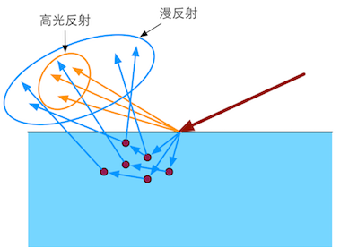
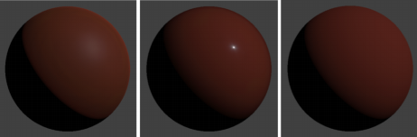

#### 第 18 章：基于物理的渲染技术（Physically Based Shading, PBS）

转自：http://candycat1992.github.io/unity_shaders_book/unity_shaders_book_chapter_18.pdf

内容来源《Unity Shader入门精要》

这里只提炼部分重要内容

## 18.1 PBS的理论和数学基础

### 18.1.1 光是什么

* 菲涅耳方程是由法国物理学家奥古斯丁·菲涅耳推导出的一组光学方程，用于描述光在两种不同折射率的介质中传播时的反射和折射。方程中所描述的反射因此还被称作“菲涅耳反射”。

  方程成立的条件是：**界面是光滑平面**，入射光是平面波，边际效应可被忽略。

  

  

  ▲图 18.1 在理想的边界处，折射率的突变 会把光线分成两个方向

* 但是，这些与光线的交界处真的是像镜子一样平坦吗？

  不是！

  他们有许许多多凹凸不平的小表面组成，但是有的物体小表面角度变化不大，有的物体小表面们角度变化很大

  这种建立在**微表面的模型**更容易解释为什么有些物体看起来粗糙，而有些看起来就平滑，如图 18.2 所示。

  

  ▲图 18.2 左边：光滑表面的微平面的法线变化较小，反射光线的方向变化也更小。 右边：粗糙表面的微平面的法线变化较大，反射光线的方向变化也更大

* 反射的光我们看到了，那折射的呢？

  有些光被折射到了物体的内部，一部分被吸收，一部分又被散射到了外部。

  * 金属材质具有很高的吸收系数，所以光如果没有直接反射出去而是被折射到了物体内部，基本就被金属吸收转换成其他能量了。

  * 非金属材质会吸收一部分散射一部分，散射出去的光叫**次表面散射光（subsurface-scattered light）**。

    如图蓝色表示的光

    

    ▲图 18.3 微表面对光的折射。这些被折射的光中 一部分被吸收，一部分又被散射到外部

    如果这个散射出去的光的出射点和入射点不在同一像素，那就要考虑相邻像素的散射，按像素渲染的shader岂不是要失效了？

    是的，这样就需要特殊的渲染模型，也就是所谓的**次表面散射渲染技术**。

    

    ▲图 18.4 次表面散射。左边：次表面散射的光线会从不同于入射点的位置射出。如果这些距离值小于需要被着色的像 素大小，那么渲染就可以完全在局部完成（右边）。否则，就需要使用次表面散射渲染技术

  我们下面的内容均建立在不考虑次表面散射的距离，而完全使用局部着色渲染的前提下。

### 18.1.2 渲染方程

渲染方程涉及到的一些物理量见[1.辐射度学基本量](1.辐射度学基本量.md)

我们用**辐射度（radiance）**来量化光。辐射率是单位面积、单位方向上光源的辐射通量，通常用$L$来表示，被认为是对单一光线的亮度和颜色评估。

**辐射度既能代表亮度，又能代表颜色？**

使用入射光线的入射辐射率$L_i$来计算出射辐射率$L_0$，这个过程也往往被称为**着色（shading）**过程。

怎么计算呢，大名鼎鼎的渲染方程：

$L_o(v) = L_e(v) + \int_{\Omega}f(\omega_i,v)L_i(\omega_i)(n\cdot \omega_i)d \omega_i$

怎么理解，即给定观察视角$v$，该方向的出射辐射率$L_o(v)$等于该点向观察方向发出的**自发光**辐射率$L_e(v)$加上所有有效的入射光$L_i(\omega_i)$**到达观察点**的辐射率积分和。

* $\omega_i$:光线入射方向
* $d\omega_i$:入射光线的立体角微元面积
* $(n \cdot \omega_i) $$= \cos(\theta_i) $入射光线垂直方向上的投影
* $L_i(\omega_i)$:入射光线的单位面积光通量(辐射率的定义是垂直于光线投影面积的单位面积光通量)

去掉自发光项$L_e(v)$后，剩余的部分就是**反射等式（Reflectance Equation）**，可以这样理解微表面的**法线分布**、光被**折射(吸收)**、微表面凹凸不平的**shadow，mask**效应、这些光照衰减$f(\omega_i,v)$影响了有多少光照被反射到观察方向，一束光的辐射率$L_i(\omega_i)$ 乘以反射后的衰减$f(\omega_i,v)$，再乘以它们在该表面的投影结果$(n \cdot \omega_i)$，最后再把这些值加起来（即做积分）就是最后的出射辐射率。

为什么要做投影？

难道是因为$L = \frac{d \Phi }{d\omega d A^{\bot } } $，所以要乘以一个$(n \cdot \omega_i) = cos \theta _{i}$?

实时渲染中，**自发光项通常就是直接加上某个自发光值**，环境光吗。除此之外，积分累加部分在实时渲染中也基本无法实现，因此积分部分通常使用**若干精确光源的叠加来代替**，不需要计算所有入射光线在半球面上的积分。

### 18.1.3 精确光源(Punctual Light Sources)

图形学中常见的精确光源类型有点光源、平行光和聚光灯等，这些精确光源被认为是**大小为无限小且方向确定的**，尽管这并不符合真实的物理定义，但它们在大多数情况下都能得到令人满意的渲染效果。

使用$l_{c}$来表示它的方向，使用$c_{light}$表示它的颜色。使用了精确光源，我们可以简化上面的反射等式。

[推导](3.精确光源反射方程简化推导)，

$L_o(v) = \pi f(l_c,v)c_{light}(n \cdot l_c)$

这样有多个光源我们就可以把它们的结果相加即可。

即 $L_o(v) = \sum_{i=0}^{n}  L_{o}^{i} = \sum_{i=0}^{n} \pi f(l_c^{i},v)c_{light} (n \cdot l_c^i)$

$f (l_c, v)$怎么算呢？$f (l_c, v)$实际上是描述了当前点事如何与入射光线进行交互的：当给定某个入射方向的入射光后，有多少百分比的光照被反射到了观察方向上。在图形学上，这一项有一个专门的名字，那就是双向反射分布函数，即**BRDF**。

### 18.1.4 双向反射分布函数（BRDF）

* 什么是**BRDF(Bidirectional Reflectance Distribution Function)**:
  1. 当给定 入射角度后，BRDF 可以给出所有出射方向上的反射和散射光线的相对分布情况
  2. 当给定观察方向（即出射方向）后，BRDF 可以给出从所有入射方向到该出射方向的光线分布。
  3. 当一束光线沿着入射方向$l$ 到达表面某点时，$f (l, v)$表示了有多少部分的能 量被反射到了观察方向 $v $上。

* **BRDF**满足两个特性

  * 交换律(reciprocity)

    当交换$l$和$v$的值后，**BRDF**的值不变，即

    $f (l, v)$ = $f (v, l)$

  * 能量守恒(energy conservation)

    能量守恒要求表面反射的能量不能超过入射的光能，即：

    $\forall l,\int_{\Omega}{ f(l,v) (n \cdot l) d\omega_o } \leq 1 $

* 基于这些理论，**BRDF**可以用于描述两种不同的物理现象：表面反射和次表面散射。

  * 用于描述表面反射的部分被称为**高光反射项（specular term）**
  * 用于描述次表面散射的**漫反射项（diffuse term）**

  如图：

  

* 如何得到不同材质的 **BRDF** 呢？

  一种完全真实的方法是使用精确的光学仪器在真实的物理世界中对这些材质进行测量，通过不断改变光照入射方向和观察方向并对当前材质的反射光照进行采样，我们就可以得到他的**BRDF**图像切片。一些机构和组织向公众公开了他们测量出来的**BRDF**数据库，以便供研究人员进行分析和研究。

  例如：

  * MERL BRDF 数据库 （ http://www.merl.com/brdf/ ）

  * MIT CSAIL 数据库（http://people.csail.mit.edu/addy/research/brdf/）

  在学术界，学者们也基于复杂的物理和光学理论分析归纳的通用的**BRDF**数学模型，来对BRDF 分析模型中的**高光反射项**和**漫反射项**进行数学建模。但是真实世界的光照和材质都非常复杂，因此很难有一种可以满足所有真实材质特性的**BRDF**模型。

  **Disney**向公众开源了一个名为**BRDF Explorer**（http://github.com/wdas/brdf）的软件，来让用户可以直观的对比各种分析性**BRDF**模型与真实测量得到的**BRDF**值之间的差异。

### 18.1.5 漫反射项

Lambert模型就是最简单、也是应用最广泛的漫反射 **BRDF**。准确的**Lambertian BRDF**的表示为：

$f_{Lambert}(l,v) =\frac{c_{diff}}{\pi}$

其中$c_{diff}$表示漫反射光线所占的比例，它也通常被称为是漫反射颜色（diffuse color）。和材质的颜色有关？

上面的式子实际上是一个定值，**(注意)** 我们常见到的余弦因子部分（即$(n \cdot l)$）实际是反射等式的一部分，而不是BRDF的部分。$(n \cdot l)$是光照角度影响的光强？

结合18.1.3 精确光源(Punctual Light Sources)的推导公式和上述公式，给定入射方向$l$的光源在表面某点的出射漫反射辐射率为：

$L_o(v) = \pi f(l,v)c_{light}(n \cdot l) = c_{diff} \times c_{light}(n \cdot l) $ 

尽管Lambert 模型简单且易于实现，但真实世界中很少有材质符合上述述 Lambert 的数学描述,即具有完美均匀的散射。不过，一些游戏引擎和实时渲染器出于性能的考虑会使用Lambert 模型作为它们 PBS 模型中的漫反射项。

通过对真实材质的**BRDF**数据进行分析，研究人员发现许多材质在掠射角表现出明显的高光反射峰值，而且还与表面的粗糙度有着强烈的联系。粗糙表面在掠射角容易形成一条亮边，而相反的光滑表面则容易在掠射角形成一条阴影边。这些都是Lambert模型所无法描述的。如图

▲图 18.7 从左到右：粗糙材质和光滑材质的真实漫反射结果，以及 Lambert 漫反射结果

因此，许多基于物理的渲染选择使用更加复杂的漫反射项来模拟更加真实次表面散射的结果。 例如，在 [Disney BRDF](Burley B, Studios W D A. Physically-based shading at disney[C]//ACM SIGGRAPH. 2012: 1-7.)中，它的漫反射项为：

$f_{diff}(l,v)= \frac{baseColor}{\pi} (1 + (F_{D90} - 1)(1- n \cdot l)^5)(1+(F_{D90} - 1)(1- n \cdot v)^5)$

其中，$F_{D90} = 0.5 + 2roughness(h \cdot l)^2$

其中，baseColor 是表面颜色，通常由纹理采样得到，roughness是表面的粗糙度。

h是半角度矢量，（half-angle vector） 即矢量$l$(光线与物体碰撞点指向光源方向) 和矢量$v$(光线与物体碰撞点指向视线方向)的中间夹角方向。

### 18.1.6 高光反射项

BDRF 中的高光反射项大多数都是建立在**微面元理论（microfacet theory）**的假设上的。[参考](1.辐射度学基本量.md)

当然，仍有一些材质是无法使用微面元理论来描述的。

最后公式为：

$f(l, v) = \frac{F(l, h) G(l, v) D(h)}{4 cos \theta_i cos \theta_o}  = \frac{F(l, h) G(l, v) D(h)}{4 (n \cdot l) (n \cdot v)} $

#### 18.1.6.1 菲涅耳反射函数

菲涅尔反射函数计算了光学表面反射光线所占的部分，它表明了当光照方向和观察方向夹角逐渐增大时高光反射强度增大的现象。完整的菲涅耳等式非常复杂，包含了诸如复杂的折射率等与材质相关的参数。为了给美术人员提供更加直观且方便调节的参数，大多数PBS实现选择使用[Schlick菲涅尔近似等式](Blinn J F. Models of light reflection for computer synthesized pictures[C]//ACM SIGGRAPH Computer Graphics. ACM, 1977, 11(2): 192-198.)来得到近似的菲涅尔反射效果：

$F_{Schlick}(l,h) = c_{spec} + (1-c_{spec})(1-{(l \cdot h)})^5$

其中，$c_{spec}$是材质的高光反射颜色。金属的$c_{spec}$往往比较大

#### 18.1.6.2 法线分布函数

法线分布函数$D(h)$表示了有多少比例的微面元法线$m$满足$m = h$$(h = \frac{l + v}{2})$，即只有这些面元会把光线从$l$方向反射到$v$上。表面越光滑这个比例越大。

* **Blinn-Phong**模型就是一种非常简单的模型。这个模型的法线分布函数部分表达式为

  $D_{blinn}(h) = \frac{gloss+2}{2\pi}(n \cdot h)^{gloss}$

  gloss代表粗糙度 ，值为任意非负数。

  上面是归一化的**Phong**法线分布函数。因为法线分布函数必须满足一个条件，即**所有微面元的投影面积必须等于该区域宏观表面的投影面积**

  但实际上，**Blinn-Phong** 模型并不能真实地反映很多真实世界中物体的微面元法线方向分布， 它其实完全是一种经验型模型，因此，很多复杂的分布函数被提了出来，如[GGX](Walter B, Marschner S R, Li H, et al. Microfacet models for refraction through rough surfaces[C]//Proceedings of the 18th Eurographics conference on Rendering Techniques. Eurographics Association, 2007: 195-206. http://www.cs.cornell.edu/~srm/publications/EGSR07-btdf.html)、[Beckmann]( Beckmann P, Spizzichino A. The scattering of electromagnetic waves from rough surfaces[J]. Norwood, MA, Artech House, Inc., 1987, 511 p., 1987, 1.)等。Beckmann 分布来源于**高斯粗糙分布**的一种假设，而且在表现上和 Phong 分布非 常类似，但它的计算却要复杂很多。

* **GGX** 分布（也被称为 Trowbridge-Reitz 法线分布函数）是一种更新的法线分布函数，它的公式如下：

  $D_{GGX}(h) = \frac{\alpha^2}{\pi((\alpha^2 -1)(n \cdot h)^2 + 1)^2}$

  其中参数$\alpha$是与表面粗糙度相关的参数，比如可以设置$\alpha = roughness^2$。比**Blinn-Phong**的法线分布模型具有更明亮、更狭窄且拖尾更长的高光区域，更接近于一些测量得到的真实材质的值。

* **GTR**分布Generalized-Trowbridge-Reitz，**Disney**认为，GGX的高光拖尾仍然不够长，他们选择使用一种更加广义的法线分布模型，即**GTR**分布，他和**GGX**分布很类似，但它的分母部分指数不是2，而是一个可调参数。

#### 18.1.6.3 阴影-遮挡函数

阴影-遮挡函数$G(l,v,h)$也被称为**几何函数（geometry function）**,它表明了具有给定面法线$m$的微面元在沿着入射方向$ l $和观察方向 $v $上不会被其他微面元挡住的概率。

$G(l, v, h)$表示的是一个概率值，因此它的值是一个范围在 0 到 1 之间的标量。

许多已发表的微面元 **BRDF** 模型习惯把 $G(l, v, h)$和高光反射项的分母$(n ⋅ l)(n ⋅ v)$部分结合起来，即把 $G(l, v, h)$除以$(n ⋅ l)(n ⋅ v)$的部分合在一起讨论，这是因为**这两个部分都和微面元的可见性有关**，因此 Naty Hoffman 在[他的演讲]( Hoffman N. Background: physics and math of shading[C]//Fourth International Conference and Exhibition on Computer Graphics and Interactive Techniques, Anaheim, USA. 2013: 21-25.)中称这个合项为**可见性项（visibility term）**。

一些**BRDF**模型选择完全省略可见性项，即把该项的值设为1。即：

* $G_{implicit}(l,v,h) = (n \cdot l_c)(n \cdot v)$

  这样就直接和高光反射项公式的分母抵消了，并且在一些程度上可以反映正确的变化趋势。

  比如，当从掠射角进行观察或光线从掠射角射入时，该项会趋近于0，这是符合我们的认知的，因为在掠射角时微面元被其他微面元遮挡的概率会非常大。

  但是这种$G_{implicit}$的实现忽略了材质粗糙度的影响，缺乏一定的物理真实性。因为我们希望粗糙的表面具有更高阴影和遮挡概率。可以看到上面公式中并没有与粗糙度相关的参数。

  通常，阴影-遮挡函数$G(l, v, h)$依赖于法线分布函数$D(h)$，因为它需要结合$D(h)$来保持**BRDF**能量守恒的规定。

* [Cook-Torrance 阴影遮挡函数]( Cook, Robert L., and Kenneth E. Torrance, "A Reflectance Model for Computer Graphics," ACM Trans- actions on Graphics, vol. 1, no. 1, pp. 7–24, January 1982. http://graphics.pixar.com/library/ ReflectanceModel/)（Cook 和 Torrance 来源于两个作者的姓名）(早期)：

  $G_{ct}(l,v,h) = min(1,\frac {2(n \cdot h)(n \cdot v)}{(v \cdot h)},\frac {2(n \cdot h)(n \cdot l)}{v \cdot h})$

  Cook-Torrance 阴影遮挡函数在电影行业被应用了很长时间，但它实际上是基于一个非真实的微几何模型，而且同样不受材质粗糙度的影响。

* 后来，[Kelemen](Kelemen, Csaba, and L ́azl ́o Szirmay-Kalos, "A Microfacet Based Coupled Specular-Matte BRDF Model with Importance Sampling," Eurographics 2001, short presentation, pp. 25–34, September 2001. http: //www.fsz.bme.hu/~szirmay/scook_link.htm)等人提出了一个对于 Cook-Torrance 阴影遮挡函数非常快速且有效的近似实现：

  $\frac {G_{ct}(l,v,h)}{(n \cdot l)(n \cdot v)}\approx \frac {1}{(l \cdot h)^2}$

* 目前广受推崇的是[Smith 阴影-遮掩函数](Smith B G. Geometrical shadowing of a random rough surface[J]. Antennas and Propagation, IEEE Transactions on, 1967, 15(5): 668-671)。**Smith**函数比**Cook-Torrance** 函数更加精确，并且考虑进了表面粗糙度和法线分布的影响。

  刚刚说了$G(l, v, h)$通常需要结合$D(h)$来保持**BRDF**能量守恒的规定。

  所以这个是为**GGX**设计的**Smith**模型：

  $G(l,v,h) =  \frac {2}{1 + \sqrt{1 + \alpha_g^2 {\tan \theta_v}^2}}$

  其中，$\alpha_g = (0.5 + \frac {roughness}{2})^2$

  $\theta_v$表示观察方向$v$和表面法线$n$之间的夹角。

#### 18.1.7 PBS 中的光照

想要画面出色的渲染效果，还要为这些**PBS**材质搭配以出色的光照。

* 比如实时面光源，可以在 Unity Labs 的[相关文章](https://blogs.unity3d.com/2016/05/26/real-time-polygonal-light-shading-with-linearly-transformed-cosines/)中找到相关内容和源码实现。

* **基于图像的光照（image-based lighting, IBL）**同样是非常重要的光照来源。

  Sébastien Lagarde 在他的[博文](https://seblagarde.wordpress.com/2012/09/29/image-based-lighting-approaches-and-parallax-corrected-cubemap/)里详细介绍了 IBL 的一些实现方法以及如何 得到视差正确的局部环境贴图的方法，非常值得一看。

## 18.2 动手：PBS实践

回顾使用了精确光源简化后的渲染方程：

 $L_o(v) =L_e(v) + \sum_{i=0}^{n}  L_{o}^{i} = L_e(v) + \sum_{i=0}^{n} \pi f(l_c^{i},v)c_{light} (n \cdot l_c^i)$

其中，$L_e(v)$是自发光部分，$f(l_c^{i},v)$是最为关键的**BRDF**部分。**BRDF**的高光反射项用下面通用形式来表示：

$f_{spec}(l, v) = \frac{F(l, h) G(l, v) D(h)}{4 cos \theta_i cos \theta_o}  = \frac{F(l, h) G(l, v) D(h)}{4 (n \cdot l) (n \cdot v)} $

函数各个部分使用上面说的一些公式。

