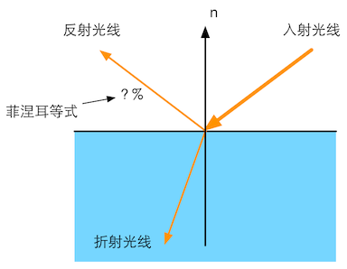
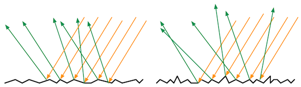
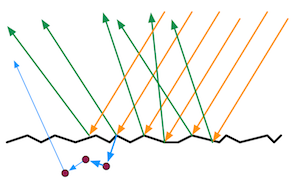
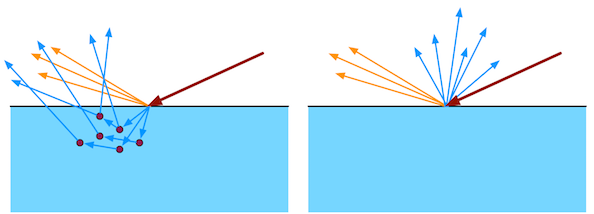
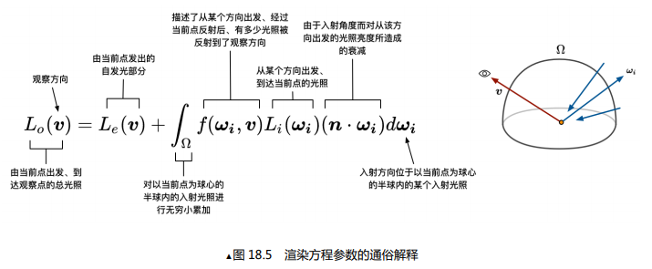

#### 第 18 章：基于物理的渲染技术（Physically Based Shading, PBS）

转自：http://candycat1992.github.io/unity_shaders_book/unity_shaders_book_chapter_18.pdf

内容来源《Unity Shader入门精要》

这里只提炼部分重要内容

### 18.1.1 光是什么

* 菲涅耳方程是由法国物理学家奥古斯丁·菲涅耳推导出的一组光学方程，用于描述光在两种不同折射率的介质中传播时的反射和折射。方程中所描述的反射因此还被称作“菲涅耳反射”。

  方程成立的条件是：**界面是光滑平面**，入射光是平面波，边际效应可被忽略。

  

  

  ▲图 18.1 在理想的边界处，折射率的突变 会把光线分成两个方向

* 但是，这些与光线的交界处真的是像镜子一样平坦吗？

  不是！

  他们有许许多多凹凸不平的小表面组成，但是有的物体小表面角度变化不大，有的物体小表面们角度变化很大

  这种建立在**微表面的模型**更容易解释为什么有些物体看起来粗糙，而有些看起来就平滑，如图 18.2 所示。

  

  ▲图 18.2 左边：光滑表面的微平面的法线变化较小，反射光线的方向变化也更小。 右边：粗糙表面的微平面的法线变化较大，反射光线的方向变化也更大

* 反射的光我们看到了，那折射的呢？

  有些光被折射到了物体的内部，一部分被吸收，一部分又被散射到了外部。

  * 金属材质具有很高的吸收系数，所以光如果没有直接反射出去而是被折射到了物体内部，基本就被金属吸收转换成其他能量了。

  * 非金属材质会吸收一部分散射一部分，散射出去的光叫**次表面散射光（subsurface-scattered light）**。

    如图蓝色表示的光

    

    ▲图 18.3 微表面对光的折射。这些被折射的光中 一部分被吸收，一部分又被散射到外部

    如果这个散射出去的光的出射点和入射点不在同一像素，那就要考虑相邻像素的散射，按像素渲染的shader岂不是要失效了？

    是的，这样就需要特殊的渲染模型，也就是所谓的**次表面散射渲染技术**。

    

    ▲图 18.4 次表面散射。左边：次表面散射的光线会从不同于入射点的位置射出。如果这些距离值小于需要被着色的像 素大小，那么渲染就可以完全在局部完成（右边）。否则，就需要使用次表面散射渲染技术

  我们下面的内容均建立在不考虑次表面散射的距离，而完全使用局部着色渲染的前提下。

#### 18.1.2 渲染方程

渲染方程涉及到的一些物理量见[1.辐射度学基本量](1.辐射度学基本量.md)

我们用**辐射度（radiance）**来量化光。辐射率是单位面积、单位方向上光源的辐射通量，通常用$L$来表示，被认为是对单一光线的亮度和颜色评估。

**辐射度既能代表亮度，又能代表颜色？**

使用入射光线的入射辐射率$L_i$来计算出射辐射率$L_0$，这个过程也往往被称为**着色（shading）**过程。

怎么计算呢，大名鼎鼎的渲染方程：

$L_o(v) = L_e(v) + \int_{\Omega}f(\omega_i,v)L_i(\omega_i)(n\cdot \omega_i)d \omega_i$

怎么理解，即给定观察视角$v$，该方向的出射辐射率$L_o(v)$等于该点向观察方向发出的**自发光**辐射率$L_e(v)$加上所有有效的入射光$L_i(\omega_i)$**到达观察点**的辐射率积分和。

去掉自发光项$L_e(v)$后，剩余的部分就是**反射等式（Reflectance Equation）**，可以这样理解微表面的**法线分布**、光被**折射(吸收)**、微表面凹凸不平的**shadow，mask**效应、这些光照衰减$f(\omega_i,v)$影响了有多少光照被反射到观察方向，一束光的辐射率$L_i(\omega_i)$ 乘以反射后的衰减$f(\omega_i,v)$，再乘以它们在该表面的投影结果$(n \cdot \omega_i)$，最后再把这些值加起来（即做积分）就是最后的出射辐射率。

为什么要做投影？

难道是因为$L = \frac{d \Phi }{d\omega d A^{\bot } } $，所以要乘以一个$(n \cdot \omega_i) = cos \theta _{i}$?

实时渲染中，**自发光项通常就是直接加上某个自发光值**，环境光吗。除此之外，积分累加部分在实时渲染中也基本无法实现，因此积分部分通常使用**若干精确光源的叠加来代替**，不需要计算所有入射光线在半球面上的积分。

#### 18.1.3 精确光源

图形学中常见的精确光源类型有点光源、平行光和聚光灯等，这些精确光源被认为是**大小为无限小且方向确定的**，尽管这并不符合真实的物理定义，但它们在大多数情况下都能得到令人满意的渲染效果。

使用$l_{c}$来表示它的方向，使用$c_{light}$表示它的颜色。使用了精确光源，我们可以简化上面的反射等式。