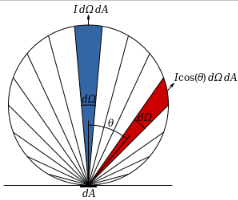
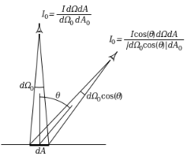

### 3.精确光源反射方程简化推导

[参考](http://renderwonk.com/publications/s2010-shading-course/hoffman/s2010_physically_based_shading_hoffman_a_notes.pdf)

#### 朗伯体(Lambertian)，朗伯面(Lambert surface)

* 指的是**发光强度的空间分布符合余弦定律的发光体**（不论是自发光或是反射光），其在不同角度的辐射度会依余弦公式变化，角度越大强度越弱。但是**辐射率不变**，所以人眼在不同角度观察时的亮度感觉是一样的

* 入射角围绕法线旋转不会改变它的反射光线，但是如果入射角的倾角变大，那么反射光的辐射率也会变化，因为入射点接收到的光强分量变小了。

* 现实中未经加工的原木，未踩踏的积雪，木炭还有大部分的粗糙物品的表面可以近似认为是朗伯表面，

* 计算方式：$I_{D}=\mathbf {L} \cdot \mathbf {N} CI_{L}$

  * $I_D$是反射的光强
  * $C$是颜色
  * $N$是朗伯表面归一化的法线方向
  * $L$是指向光源的归一化的光线方向
  * $I_L$是光强
  * 可以注意到[0-90°]范围内光源方向和法线方向的**夹角越大**，造成表面**接收到的光强分量变小**，所以**反射的光强越小。**（所以反射的光强比例没变，只是因为接收到的光强分量变小了，所以反射的光强才会变小）

  

* 为什么辐射率没变

  * 因为朗伯体是**辐射强度的空间分布符合余弦定律的发光体/反射体**，根据这个定义
  
    
  
    角度为$\theta$的辐射强度：$I_\theta = I \cos (\theta)$
  
    
  
    
  
    根据辐射率公式$L = \frac{d \Phi }{d\omega d A^{\bot } } = \frac{I}{d A^{\bot}}$
  
    $L_\theta = \frac{I \cos (\theta)}{d A \cos(\theta)} = \frac{I}{d A}$
  
    **所以人眼观察的朗伯体各个区域亮度都是一样的**
  
    $d\Omega$是立体角，$d A$是这个发光体或反射体的一小片微表面面积

首先我们有[1.辐射度学基本量](1.辐射度学基本量)里的反射方程

$L_o(v) = \int_{\Omega }^{} f(l, v) \otimes L_i(l) cos \theta_i d\omega_i$

而朗伯面的$ f(l, v)$我们定义为

$f_{Lambert}(l,v) =\frac{c_{diff}}{\pi}$

$\forall l|\angle(l,l_c) > \varepsilon$ , $L_{tiny}(l)=0$

如果$lc=n$ , $c_{light}=\frac{c_{white}}{\pi}\int_\Omega L_{tiny}(n\cdot l)d\omega_i$

第一个属性表示如果给定入射方向 ![[公式]](https://www.zhihu.com/equation?tex=l) ，并且 ![[公式]](https://www.zhihu.com/equation?tex=l) 和 ![[公式]](https://www.zhihu.com/equation?tex=l_c) 的夹角大于 ![[公式]](https://www.zhihu.com/equation?tex=%5Cvarepsilon)， 那么亮度为0，换句话说，光源不会在其角度 ![[公式]](https://www.zhihu.com/equation?tex=%5Cpm%5Cvarepsilon) 范围外产生任何光线。第二个性质是从 ![[公式]](https://www.zhihu.com/equation?tex=c_%7Blight%7D) 的定义而来，通过反射方程和漫反射方程 $f_{lambert}(l,v)=\frac{c_{diff}}{\pi}$ (并设置  $c_{diff}=1$).当$\varepsilon$趋于0时:

$lc=n$ , $c_{light}=\lim_{\varepsilon \rightarrow 0}\left({\frac{1}{\pi}\int_\Omega L_{tiny}(n\cdot l)d\omega_i}\right)$
由于  并$lc=n$且$\varepsilon = 0$  ,我们可以认为 $(n\cdot l)=1$,可以得到:

$c_{light}=\lim_{\varepsilon \rightarrow 0}\left({\frac{1}{\pi}\int_\Omega L_{tiny}d\omega_i}\right)$
请注意，该等式与 $l_c$ 入射方向无关，所以对于任何精确光源方向都是如此，不只是  $lc=n$ 。简单的重排将极限值的积分分离出来：
$\lim_{\varepsilon \rightarrow 0}\left({\int_\Omega L_{tiny}d\omega_i}\right)=\pi c_{light}$
现在我们可以把得到的微面光源等式带入BRDF( $l$ 方向任意)中，并观察当$\varepsilon$趋近于0 时,极限的行为, 注意这个公式的$n$是被照亮表面上点的法线。
$L_o(v)=\int_\Omega f(l,v)\otimes L_{tiny}(l)(n\cdot l)d\omega_i$

$=f(l,v)\otimes\lim_{\varepsilon \rightarrow 0}{\int_{\Omega}L_{tiny}(l)d\omega_i}(n\cdot l)$ （因为$\varepsilon\rightarrow0$,可提出没有变化的项）

$=\pi f(l,v)\otimes c_{light}(n\cdot l)$

