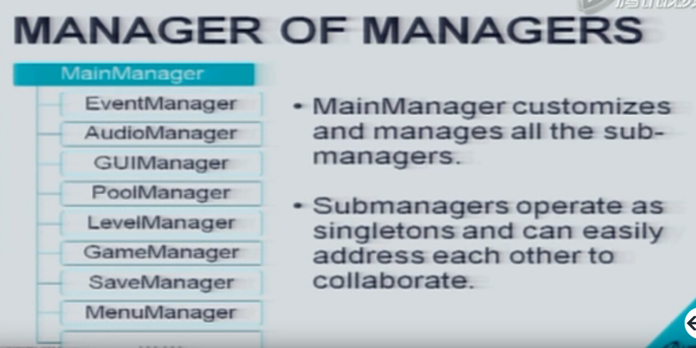
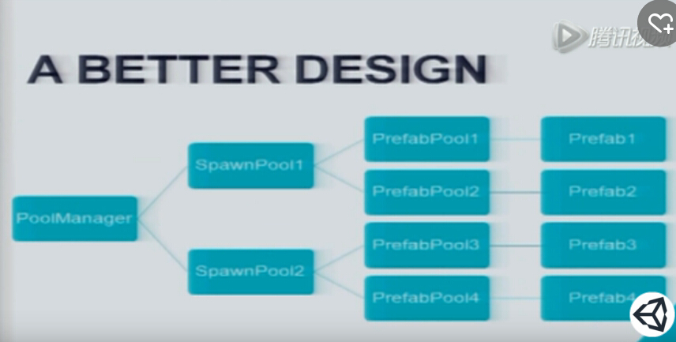
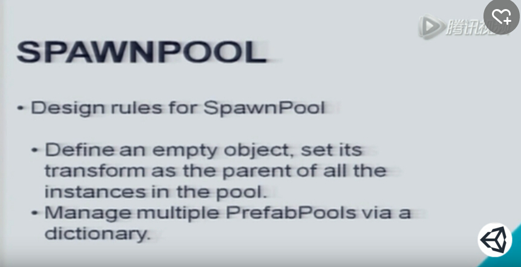

  
写成这样的manager后期游戏复用的话会很方便。  
>EventManager:管理所有UI到各个模块之间消息，各个模块相互访问  
>GUIManager:所有UI发出的Click事件等  
>PoolManager:保留内存中已经初始化的对象，下次用的时候直接拿出来而不必再去载入。  
>SaveManager:保存配置,游戏等。  
>MenuManager:管理所有menu动画，外观等  

>## 比较重要的三个
>### 1.LeveManager:
>1.可以将level写入配置表(加入参数等，asset store <mad levelmanager>)，可以设置多个配置表，比如没有怪物的10个关卡配置表用来测试，有怪物的10个关卡配置表用来上线，载入关卡可以直接写一个API:`LevelManager.LoadNext()` 当需要变更关卡时仅需要修改配置表，测试时可以切换配置表。    
2.管理关卡之间切换的效果动画颜色等
>### 2.PoolManager  
频繁的新建和销毁Gameobject是十分消耗性能的  
因此可以把一些暂时不用的GameObject放至对象池中  
1.具体可表现为  
`private List<GameObject> dormantObjects = new List<GameObject>()`  
里面包含一些GameObj/Prefabs  
2.应有Spawn(),Despawn()方法。  
3.Load/Unload of prefab  
4.可以管理dormant objects，还应考虑管理 active objects  
所以:  
   
 

>### 3.SaveManager  
>1.是否要load preference 和achievement  
>2.除了JSON/XML   
>3.较好的方案是asset store的一个二进制存储方案Easy Save 2。  
>优点：存储很快(移动设备也很快)，可以加密Encrypt save data，截屏snap a screen，混淆 Obfuscation data 等  

# StrangeIoC #  
#### UI和逻辑分开