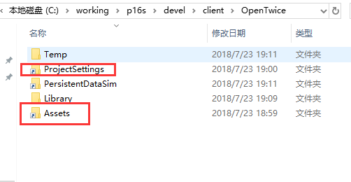

### 换行符
>Unix和Win的文本行结尾符不一样，Unix只有一个LF换行符，Win有CR LF两个符号（回车+换行），Unity默认是用的LF，VS会提示和win的默认不一致.  
替换一下Unity的新建脚本模板，让Unity后续新建脚本都是用CRLF。  下面的文件覆盖到Unity安装目录: C:\Program Files\Unity\Editor\Data\Resources\ScriptTemplates
参考：[http://www.cnblogs.com/zhaoqingqing/p/5883005.html](http://www.cnblogs.com/zhaoqingqing/p/5883005.html)
### 破解版 ###
[http://www.ceeger.com/forum/read.php?tid=23396](http://www.ceeger.com/forum/read.php?tid=23396)

### unity 双开同一工程  
有时候，测试通讯，聊天之类的需要多开unity  
方法是创建一个快捷连接然后打开。  
打开cmd ，命令为：  

	mklink /J "C:\Link To Folder" "C:\Users\Name\Original Folder"  
最后效果：  
  
打开即可。  
注意：`mklink /J "C:\Link To Folder" "C:\Users\Name\Original Folder"`中Link To Folder这个文件夹应该是不存在然后执行命令后创建的。