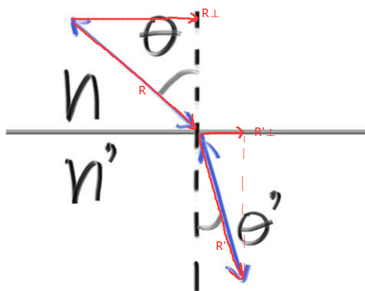
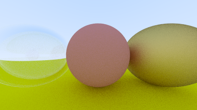

### 10.电介质

透明的材质，如水，玻璃，宝石，是电介质。

一束光照射在它们上面会发生反射和折射，为了处理这种情况，当一条射线与透明材质物体交互我们随机生成一条反射或折射射线

#### 10.1 折射

#### 10.2 斯涅耳定律

折射定律：$η⋅sinθ=η′⋅sinθ′$

η and η′(pronounced “eta” and “eta prime”) ：折射系数，通常空气是1.0，玻璃1.3-1.7，钻石是2.4

现有单位入射射线$R$，单位法线$N$，求折射射线$R'$

分别计算，将$R' $分解为垂直于$N$的$R′_⊥$  和 平行于$N$ 的 $R′_∥$

$\because R_\perp=R +  \cos \theta \cdot n$

​	$R'_\perp=\frac{\eta }{\eta '}R_\perp$

$\therefore R'_\perp=\frac{\eta }{\eta '}(R + \cos \theta \cdot n)$

$\therefore R'_\parallel  = - \sqrt{1 - {\lvert R'_\perp \rvert}^{2}}  n$  （注意n在根号外面是个向量）

$\because \cos \theta = - R \cdot n$

$\therefore R'_\perp=\frac{\eta }{\eta '}(R +(- R \cdot n) \cdot n)$

然后将计算公式用代码表述：

见：[新增折射计算和电介质类](code/10.电介质材质/1.新增电介质类)

结果如图：

#### 10.3 完全的内部反射 (全反射)

 当光线从折射系数高的介质出射到折射系数低的介质有可能会发生全反射。(如玻璃到空气)

即η/η' * sin_theta 大于1，这时求不出解 即发生全发射

见：[电介质新增全反射](code/10.电介质材质/2.电介质全反射)

最后的 渲染结果好像没有什么不同，就不放图了。

#### 10.4 Schlick Approximation

真正的玻璃随着角度不同有不同的反射率，比如在掠射角的时候会反射的更多。(水面的波光粼粼)

使用[Schlick Approximation](../pbrt/2.基于物理的渲染.md)来模拟这种现象

见：[倾角越大反射越强](code/10.电介质材质/3.倾角越大反射越强)

效果如图：

可以看到球边缘的效果模糊了一点，这是因为边缘的反射多了一点。

#### 10.5 一个中空的玻璃球

一个有趣的小把戏是把球的半径设置为负数。这时候表面法线指向内部。

我们用这个技巧做一个中空的玻璃球

添加一行

`world.add(make_shared<sphere>(point3(-1.0,    0.0, -1.0),   -0.4, material_left));`

效果如图：

