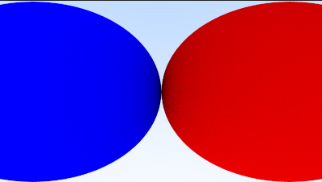

### 11.可调节的相机

fov(field of view)：相机的可视区域

使用垂直方向的弧度来控制视野大小

#### 11.1 相机视野形成的几何体

用$h$和$z$在控制$\theta$的大小，继而控制视野的大小

$h = \tan(\frac{\theta}{2})$

这部分就是将原来的写死的viewport_height为2，和aspect_ratio为16.0/9.0

改为：通过视锥的**张角**，和**宽高的比**例进行传参控制视锥。

见：[张角和宽高比控制视锥](code/11.可调节相机/1.张角和宽高比控制视锥)

如图：

视锥的高是1*2，球的半径是$\frac{\sqrt{2}}{2}$，在透视的情况下，正好与视锥边缘相切。

#### 11.2 相机的位置和角度

相机的位置好处理，直接替换origin就行了。

对于角度的处理。

我们通过设置一个lookat点(决定摄像机的朝向)，和一个vup参考(决定相机的自旋的指向)，这样就能唯一确定相机的角度。

具体的计算逻辑是：

1. 通过lookat和lookfrom确定w，注意w和vup和v在同一平面
2. 通过vup和w确定u
3. 通过w，u确定v
4. 这样相机的角度就确定了

另外："屏幕"的角度倾斜是跟随相机变的。

见：[相机位置和角度](code/11.可调节相机/2.相机位置和角度)

调整机位后的效果如图：

将角度变得小一点：

