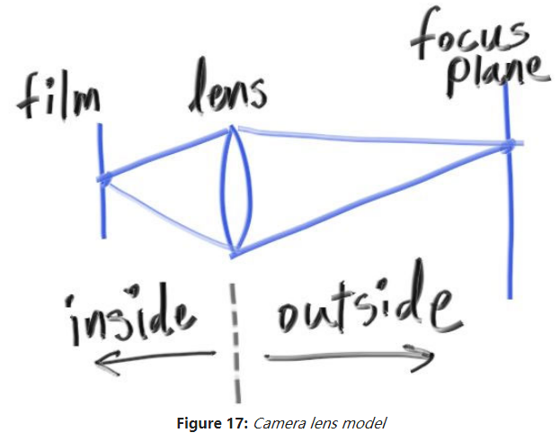

### 12. 散焦模糊

最后一个特性，散焦模糊，摄影师会叫做"景深"。

小孔成像，景物距离远近都会很清晰。

但是孔大一点的话，聚焦的平面外的景物会散焦变模糊。离得越聚焦平面越远越模糊

现实中，相机中的孔越大采入的光线越多，但是在程序中渲染虚拟场景时，我们有完美的"感光元件"，不需要更多的光，所以只有在需要模拟散焦的情况时才会需要孔。

#### 12.1  薄镜头的近似

简单模拟相机成像。

focus plane是外部我们聚焦的平面。光线经过镜头折射进入相机内部在感光器件上成像。

因为镜头是有大小的，在focus plane平面前面或者后面的景物在折射后的聚焦点如果不在感光器件，就会造成散射。

为了模拟这一现象，我们将从相机旁边发出射线。

#### 12.2 生成采样射线

代码见：[生成采样射线](code/12.散焦模糊/1.生成采样射线)

效果如图:

 