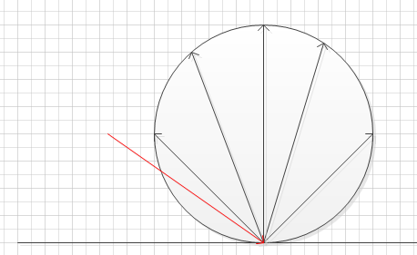
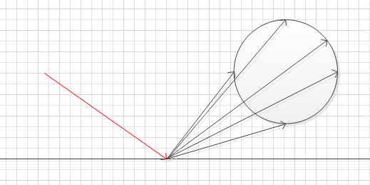

#### 1.光线

好像没有涉及到光源和颜色，射线是从相机发出，每次碰撞叠加颜色，直至无碰撞然后用y向量插值天空色。

#### 2.相机

配置比较简陋，没有unity里的从视锥空间到裁剪空间转换的复杂处理，这样也就没有了类似对转换矩阵的编辑。

#### 4.关于材质

代码中举了3个，在这个教程里，不同的材质只设置了不同的**attenuation颜色衰减**(可以理解为自身颜色)，和对**射线反射处理**


**例图中虽然有多个方向，但是本教程一条射线的反射，随机出来的方向只有一个。**

* 朗伯体：均匀散射，无论射线从何种方向入射，都均匀散射

  反射方向：击中点指向 击中点上方相切单位球面上一点

  

* 金属：高光反射

  反射方向：计算出反射射线(入射角等于反射角)，然后在单位反射射线终点添加一个半径为fuzz的球用来偏移反射射线。当然球过大导致反射到平面下的部分会被程序滤除。(相当于光线被吸收了)

  

* 电介质：玻璃钻石之类的，比较麻烦。

  一般倾斜角度越大，发生反射的概率越大。这个我们用Schlick's 近似来实现

  两种情况：发生**全反射**，我们将射线反射，**倾角较大**(掠射角)时按照Schlick's 近似的**概率进行反射**。其他情况进行折射

  反射反向：入射角等于反射角

  折射方向：[斯涅耳定律](10.电介质)，$η⋅sinθ=η′⋅sinθ′$，求出折射角。

  

#### 5.射线颜色的计算

按照顺序

1. 判断是否击中

   * 每个像素发射的100条射线中(抗锯齿，可以不是100条)，每条都会和world判断是否hit

   * 每条射线都会触发hittable_list类(即world)遍历自己存储的所有继承hittable的list，判断击中

   * 如果击中，记录信息到`hit_record`，突然注意到少个逻辑(射线应该只击中最近的物体)

     加个判断`hit && temp_rec.t < closest_so_far)`

     但是结果好像没什么不一样(可以说是完全相同)

2. 判断击中后反射的射线时候有效，例如是否反射到了平面以下，这个与材质和入射角度有关

3. 根据材质颜色**衰减**射线颜色分量，其实就是材质反射与自己颜色波段相同(相近)的光。

   `attenuation * ray_color(scattered,world,depth-1);`

   注意这里是递归

4. 最后depth超过我们设置的数值就退出递归。

5. 将最后得到的射线的y分量插值天空色。根据光线可逆，可以认为是天空包围盒的蓝白光经过多层反射照到了相机里。

   但是，点光源可就不能这样办了。所以本教程其实没有涉及到其他复杂光源的照射情况。

#### 6.抗锯齿

用多条射线照射每个像素不同区域并取平均值，

```
//u x轴方向 从0到1    
auto u = double(i + random_double()) / (image_width - 1);
//v y轴负方向 从1到0  1在上y轴↑
auto v = double(j + random_double()) / (image_height - 1);

//重复取samples_per_pixel次射线
ray r = cam.get_ray(u,v);
//pixel_color 叠加上次取样结果
pixel_color += ray_color(r, world, max_depth);
```

for循环偏移取samples_per_pixel次

最后将叠加后的pixel_color除以samples_per_pixel。