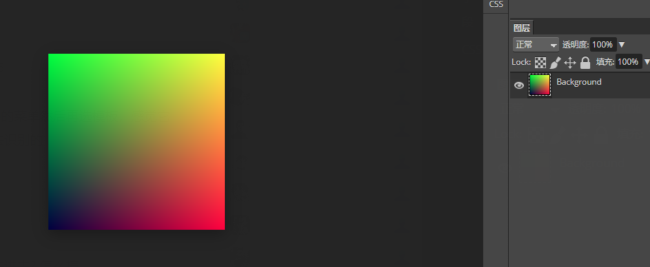
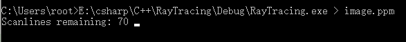

### 2.输出一个图片

#### 2.1 PPM格式的图片

PPM格式存储了像素点颜色。

用代码输出一个长256像素，宽256像素，PPM格式文本

代码见[PPM(256*256)](code/2.输出一个图片)

1. 像素点从左到右

   `int i = 0; i < image_width; ++i`

2. 行按照从上到下

   `int j = image_height-1; j >= 0; --j`

   即文件的第一个像素是图片的左上角

3. r通道从左到右 从0变到1，g通道从上到下从1变到0，b通道恒定为0.25

   r+g是黄色，所以右上角应该是黄色。

用txt打开大概这样

```
P3
256 256
255
0 255 63
1 255 63
2 255 63
3 255 63
4 255 63
```

P3  //颜色使用ASCII编码

256 256  //256行 * 256行

255  		//颜色最大值255

0 255 63 //第一个像素点 r:0 g:255 b:63  **左上**

1 255 63 //第二个像素点 r:1 g:255 b:63


**可见第一个像素点放的是图片的左上角。**

#### 2.2 创建图片文件

使用 `>`重定向操作符

```
E:\csharp\C++\RayTracing\Debug\RayTracing.exe > image.ppm
```

就可以输出[image.ppm](code/2.输出一个图片)文件了

在ps中打开如下



好耶！这就是图形上的"Hello world"。


#### 2.3 添加一个进度条

即加了`std::cerr << "\rScanlines remaining: " << j << ' ' << std::flush;`

使用 `>`重定向操作符

```
E:\csharp\C++\RayTracing\Debug\RayTracing.exe > image.ppm
```

时会显示进度



