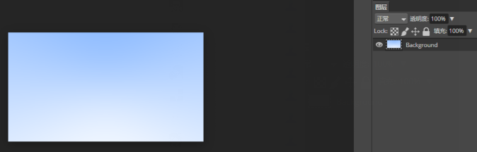
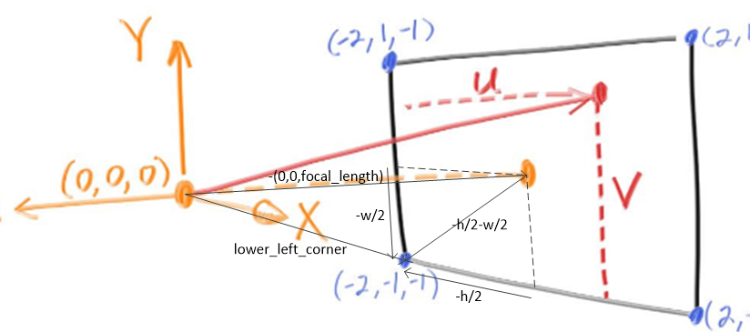

### 4.射线，简单相机，和背景.md

#### 4.1 射线类

所有的射线追踪都有一个射线类和沿着射线看到的颜色的计算。

我们使用

$P(t)=A+tb$

来表示射线

A：表示射线发出的点，如(0,1,2)

b：表示方向，如(3,5,6)

t是一个标量，范围($- \infty$,$+ \infty$)

每一个t对应射线上的一个点。如t为1，则表示射线上的点(0+3,1+5,2+6)。

**t在一定程度上代表从A点出发往b方向走的距离**(t*(b-A).Length)

t为负则是反向的距离

代码[射线类](code/4.射线，简单相机，和背景)

初始化时设置起始点 origin，和方向 direction

并提供一个接口，参数t，返回射线终点。

#### 4.2 在场景中发出射线

1. 计算眼睛到像素的射线
2. 决定射线相交的物体
3. 计算相交点的颜色

先做个相机，再做个背景色

先使用个16:9 的屏幕

 代码:[PPMFormat.cpp](code/4.射线，简单相机，和背景) 输出一个ppm格式的文本，并以y轴方向，从起始的白色到终止的蓝色进行插值。

如图:

代码中，原点(摄像机)到屏幕左下角的射线向量计算可参考下图

有一段代码` auto t = 0.5*(unit_direction.y() + 1.0);`

是将y从 [-1,1] 映射到 [0,1]，

这样就能使用线性混合(linear blend)或者叫线性插值(linear interpolation)或者简称插值(lerp) ，通用格式如下

$blendedValue=(1−t)⋅startValue+t⋅endValue,$