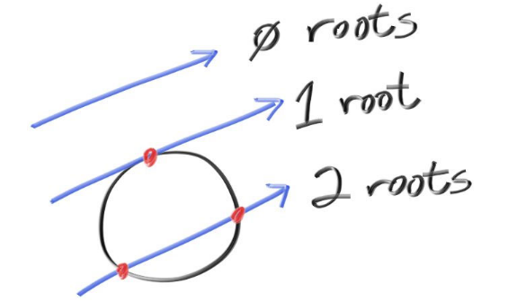
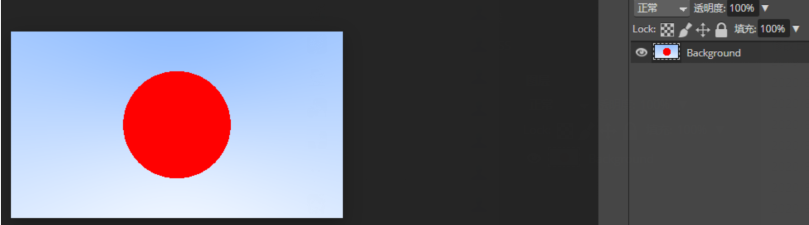

### 5.添加一个球.md

让我们添加一个球

#### 5.1 射线和球相交

球的方程

$x^2+y^2+z^2=R^2$

点是否在球内看$x^2+y^2+z^2$与$R^2$的大小关系

如果球心不在原点

$(x−C_x)^2+(y−C_y)^2+(z−C_z)^2=r^2$

球心坐标$C$，球上一点坐标$P$则有

**即球心C指向球面一点P的向量大小为$r^2$**

$(\mathbf{P} - \mathbf{C}) \cdot (\mathbf{P} - \mathbf{C})     = r^2$

**之前说的射线方程起点为A方向为b，大小为t**

$\mathbf{P}(t) = \mathbf{A} + t\mathbf{b}$

**两者联立即表示球面上一点同时也在射线上**求出射线与球面的交点

$(\mathbf{P}(t) - \mathbf{C}) \cdot (\mathbf{P}(t) - \mathbf{C}) = r^2$

即

$t^2 \mathbf{b} \cdot \mathbf{b}     + 2t \mathbf{b} \cdot (\mathbf{A}-\mathbf{C})     + (\mathbf{A}-\mathbf{C}) \cdot (\mathbf{A}-\mathbf{C}) - r^2 = 0$

(这里$ \mathbf{b} \cdot \mathbf{b}$ 和$\mathbf{b} \cdot (\mathbf{A}-\mathbf{C})$ 和 $ (\mathbf{A}-\mathbf{C}) \cdot (\mathbf{A}-\mathbf{C})$都是标量，所以是可以求解的)

可能的结果

#### 5.2 创建我们第一个射线图片

碰到球的射线是红色

见代码：

首先`ray r(origin, lower_left_corner + u*horizontal + v*vertical - origin);`

u从0到1，v从0到1，外面套两层for循环也就是从相机**发出400*225 条射线覆盖**了整张图片。

ray_color方法我们知道了是显示一个**从起始的白色到终止的蓝色进行插值。**

**最后的颜色就是射线的颜色**

**屏幕的距离也就是focal_length**//摄像机与图片的距离

而hit_sphere方法则是**联立球和射线公式判断是否有解**，有解返回红色。

输出的ppm格式文件在ps中打开如下图。

现在这个球缺少很多东西，比如着色和反射射线等等。

但是我们已经快完成一半了。

还有一个问题，如果将圆的圆心移到z=+1，输出的竟然是同样的结果(这是因为z=+1也有解，只不过解是负的，即射线射向了负方向)，这意味着你看到了后面的东西，我们接下来会修复它。