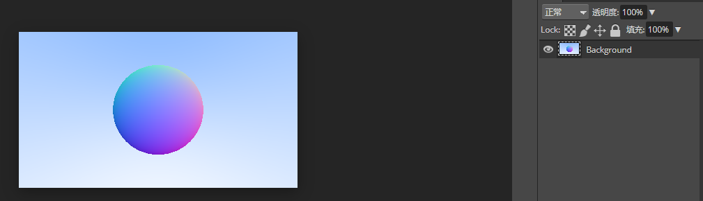
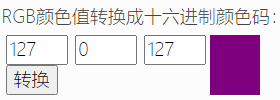
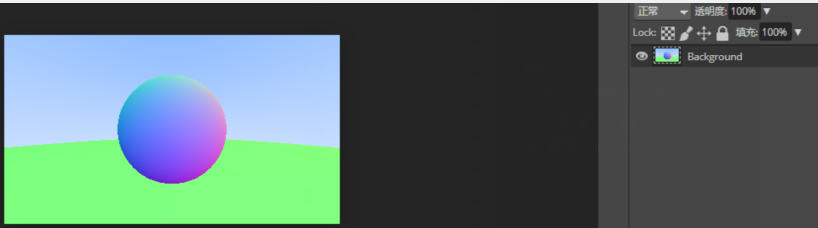

### 6.表面法线和多物体

#### 6.1 根据表面法线着色

球面某一点P的法线就是由该点起始，方向为球心C指该点的方向 $P-C$，大小一般都是归一化的，但是我们先不考虑。

为了能看到法线，我们将表面某一点的法线向量(三个分量范围 -1,1)映射成颜色(范围0,1)。

这时候我们就要计算出交点的位置，而且还要是距离相机最近的交点。

代码：[球形法线转颜色](code/6.表面法线和多物体)

即，最上面法线(0,1,0)  映射完毕为  (0.5,1,0.5)

最右面法线(1,0,0)  映射完毕为  (1,0.5,0.5)

最左面法线(-1,0,0)  映射完毕为  (0,0.5,0.5)

最下面法线(0,-1,0)  映射完毕为  (0.5,0,0.5)

嗯，大致符合

#### 6.2 简化射线的球的相交检测代码

首先`dot(r.direction(), r.direction())`表示向量`r.direction()`长度的平方

还有，令$b = 2h$

则可以简化：

​	$\frac{-b \pm \sqrt{b^2 - 4ac}}{2a}$

$= \frac{-2h \pm \sqrt{(2h)^2 - 4ac}}{2a}$

$= \frac{-2h \pm 2\sqrt{h^2 - ac}}{2a}$

$= \frac{-h \pm \sqrt{h^2 - ac}}{a}$

对应把代码中的也改了：[简化相交检测](code/6.表面法线和多物体/2.简化相交检测)

#### 6.3 抽象与射线相交的物体

给射线方程的t一个范围，这样更好计算。

然后还要一个与射线相交点的法线的计算

射线碰撞到最近的物体就停止

先抽象出可以被射线击中的类[hittable.h](code/6.表面法线和多物体/1.原始)

然后让sphere实现射线相交检测[sphere.h](code/6.表面法线和多物体/1.原始)

#### 6.4 正面和反面

正面反面由模型决定，表现在法线上。

dot(射线,法线)  小于0则击中的正面。

正面反面也可以动态决定，比如，dot(射线,法线) 如果为正，则是击中反面，这是我们将法线翻转，这时候就是击中的正面了，这样光线照到的地方都是正面。

见[hitRecord和sphere](code/6.表面法线和多物体/3.添加法线翻转)

hitRecord中添加了判断物体与光线交点并且翻转法线的方法`set_face_normal`

在sphere中使用该方法。

hit_record中记录了相交点和相交点的法线。

#### 6.5 集合用于判断射线是否击中

一个hittable_list缓存所有物体(可被射线击中)，并且for循环判断是否有至少一个物体被射线击中(hit方法延迟执行子类(sphere)的具体实现)。

见[hittable_list](code/6.表面法线和多物体/4.物体集合用于判断射线是否击中)

#### 6.6 C++里的特性

上面`hittable_list`类里引入了两个新特性，`vector`和`shared_ptr`

`shared_ptr<>`一个系统帮忙处理计数的引用指针。

`vector<>` 类似于c#的`list<>`。

#### 6.7 常用的常量和工具类方法

见[rtweekend.h](code/6.表面法线和多物体/5.常量和工具方法)

里面有常量pi，还定义了一个无穷大。还一个工具方法是角度转弧度。

新的[PPMFormat.cpp](code/6.表面法线和多物体/6.最新的PPMFormat)文件。

大概改动：

替换了之前只能检测一个击中物体的`ray_color`方法

添加了`hittable_list world; `用以存储所有可被射线击中的物体。

如下图：

下面的绿色就是代码中那个代码中半径为100的圆。

上图只是把法线以颜色的形式表现出来，这种方式也可以作为一个查看模型法线是否错误的调试方法。