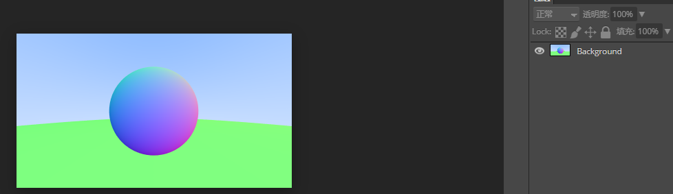

### 7.抗锯齿

一个真的摄像机拍照时是不会有锯齿的，因为边缘会混合前景和背景色。

我们可以将用多条射线照射每个像素不同区域并取平均值，

#### 7.1 一些随机数工具方法

我们需要一个生成随机数的方法。

生成[0,1) 区间的数，左闭右开

添加两个生成随机数方法到工具类[rtweekend.h](code/7.抗锯齿/1.工具类)中

#### 7.2 多点取样生成像素

对于一个像素使用多条射线采样，并将结果的颜色取均值。

先创建一个虚拟的相机类，

见[camera.h](code/7.抗锯齿/2.相机类)

在[rtweekend.h](code/7.抗锯齿/1.工具类)中增加一个`clamp(x,min,max)`方法

[color.h](code/7.抗锯齿/1.工具类)也要除以取样数。

[PPMFormat.cpp](code/7.抗锯齿/3.主函数)里也要对应添加采样代码

* 用随机数在一像素内随机偏移，取100个采样点，最后叠加颜色后再除以100
* 这样一个像素的颜色可以近似认为是该立体角颜色的均值
* 比起随机，为什么不固定在1x1的像素面积内取样呢？

输出的结果如下图

 

可以对比下没有抗锯齿时的效果

 

