### 8. 漫反射材质

#### 8.1 一个简单的漫反射材质

不发光的漫反射材质颜色 = 环境光  blend  自己的颜色

光的反射和吸收比较复杂，我们可以先把物体看成是[朗伯体](../pbrt/3.精确光源反射方程简化推导.md)

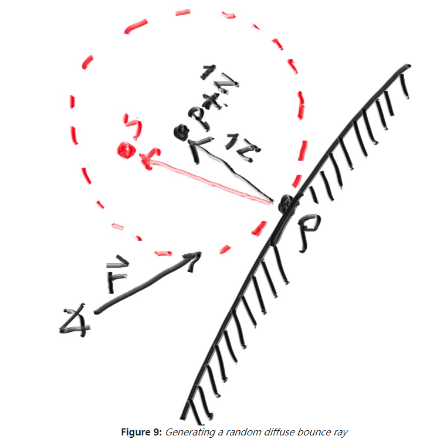

如上图，结合朗伯体介绍，即一束光照在物体表面一点，光的能量会以符合余弦定律的强度反射出去。

可能有人说，入射角=反射角，夹角相同的另一个方向应该更亮才对，这部分计算我们放到高光反射里，这里暂时不考虑。

但是本例中的代码计算比较奇怪，射线并没有以余弦定律散射出去，而是以余弦定律光的能量分布作为概率，取了一个方向，作为射线的反射方向。

相关代码：

> [vec3.h](code/8.漫反射材质/1.射线递归反射)中

* 添加一个方法`random_in_unit_sphere`，该方法随机生成一个**球心指向球内一点**的向量

> [PPMFormat.cpp](code/8.漫反射材质/1.射线递归反射)里

* `ray_color`方法使用递归方式使射线**每击中物体时反射**
* 反射的计算方式如上图
  * 取击中点
  * 击中点法线方向相切的单位球内取一点S
  * $PS$即为射线反射方向。
* 反射一次颜色(能量)就*0.5，所以经过多次反射的区域的颜色会变暗。
* 最后一条射线反射后没有击中任何物体，这时取y分量作为白蓝的插值，递归回去。
* 反射最多50次，再多也没有意义。徒耗性能。

> 为什么没有集中任何物体要取该射线的y分量在白蓝区间插值？
>
> 看了天空包围盒突然理解了，可以想象成是射线反射后击中了无限远的天空，那么这时射线是什么颜色呢，当然是越往上越蓝(蓝蓝的天空)。
>
> 代码测试下，为了效果将插值改为白(1,1,1)和纯蓝(0,0,1)
>
> 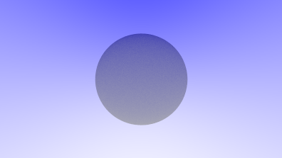
>
> 可以看到，球的上面是蓝灰的，下面是白灰
>
> **另外**：图片上中部会比上左和上右颜色浅一点，这是因为unit_vector将从相机发出到背景的射线给归一化了，这就造成了y分量变小了(示意图太难画了，单位球，切平面，圆锥，切屏幕)

> **又想明白了一件事**：之前好像记得一束光照到朗伯体一点，会按照反射方向以余弦公式的大小衰减，可是这里为什么只有一条射线按照余弦公式随机取了一个方向。
>
> 难道是之前抗锯齿的发出的100条射线，按照概率进行了100次反射，就近似上面说的结果？

**小球中间部分**

先反射时不使颜色*0.5，那么此时y的分量在按照概率应大部分集中于0左右。由[-1,1]映射到[0,1]应该是0.5。

即按照t = 0.5 进行白color(1.0,1.0,1.0) 蓝color(0.5,0.7,1.0) 插值得  color(0.75,0.85,1) 

颜色值对应到[0,255]约为 (191,216,255)。

如图：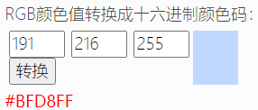

**底部大球上边缘部分**

此时y的分量在按照概率应大部分接近于1，由[-1,1]映射到[0,1]应该是1。

即按照t = 1 进行白color(1.0,1.0,1.0) 蓝color(0.5,0.7,1.0) 插值得 color(0.5,0.7,1.0)

颜色值对应到[0,255]约为 (127,178,255)。

如图：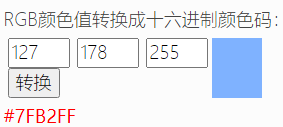

与输出结果大致相同。如图。

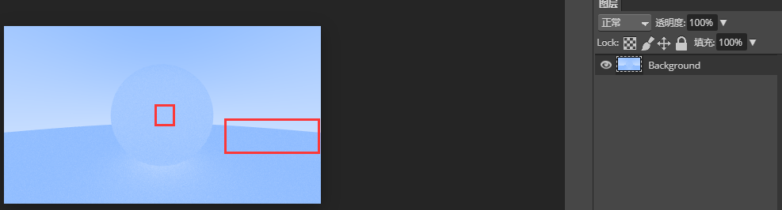

两球相切的部分因为叠加太多次趋近于白色。

如果反射一次颜色(能量)就*0.5。则输出为

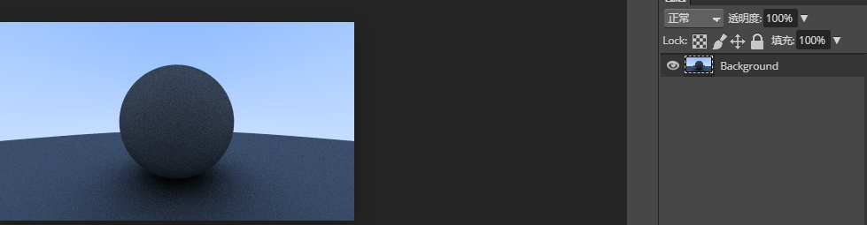

按反射一次来算，则原来计算的**小球中间部分**颜色 (191,216,255)。要乘以0.5，即(95,108,127)

如图：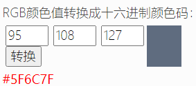

两球相切的部分因为叠加太多次趋近于黑色。

#### 8.3 使用伽马校正来获取准确的颜色强度

可以看到这个球的着色很黑，但是我们的球在每次反射只吸收了一般的能量。

为什么这么黑，因为没有伽马校正，因为人眼对亮度的感受不是线性的，color(1,1,1)对color(0.5,0.5,0.5)在人眼看来亮度可能是成倍的关系。

我们使用"gamma 2"来近似。

代码：在[color.h](code/8.漫反射材质/3.gamma校正)中输出的最终颜色前取√。

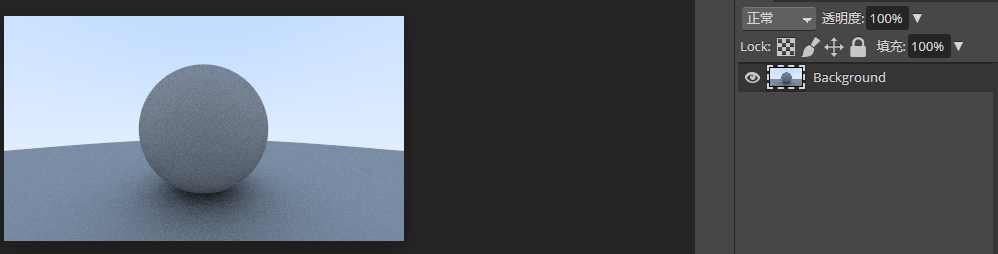

可以看到所有颜色都变浅了(包括背景色)

亮度的对应关系大概是：

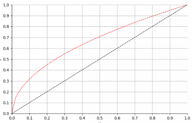

相当于提亮了。

#### 8.4 修复阴影瑕疵

* 如果射线反射后立即就击中了物体，这时候t为非常小的值比如t=0.00000001。这个时候极有可能是精度值不够导致的和自己相交，我们滤除这种状况

* 或者是两球相切处的射线反射

使用如下代码避免。

`if (world.hit(r, 0.001, infinity, rec)) {`

相交距离需>0.001。

微观的小变化给出的宏观结果有点难以理解了。

结果如图：

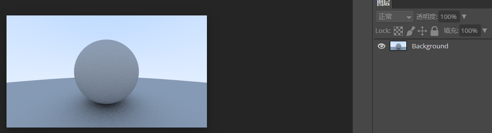

#### 8.5 真正的朗伯体反射

[vec3.h](code/8.漫反射材质/5.单位球面上取点优化)里的取单位球球心指向球面的向量的计算方法`random_unit_vector`优化

* 先在z轴取[-1,1)的范围 内一平面
* 平面与球体的切面是一个圆半径是`sqrt(1 - z*z) = r`，这个圆取一个角度a [0,2pi)  与球面交点为`(r*cos(a), r*sin(a),z)`

这个方法比起原来的会使光散射的更厉害些。

因为z轴取[-1,1)的范围是随机取的。而原来的方式明显取在0附近的概率会大一点。

#### 8.6 另一个漫反射公式

最开始的散射计算是使用射线击中点为球心，上面半球均匀散射。

[vec3.h](code/8.漫反射材质/6.上半球均匀散射)添加一个上半球均匀取点的方法`random_in_hemisphere`

结果：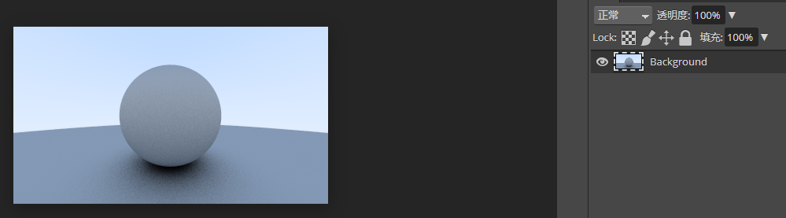

底部更黑一点，因为更多底部的射线跑不出去了

