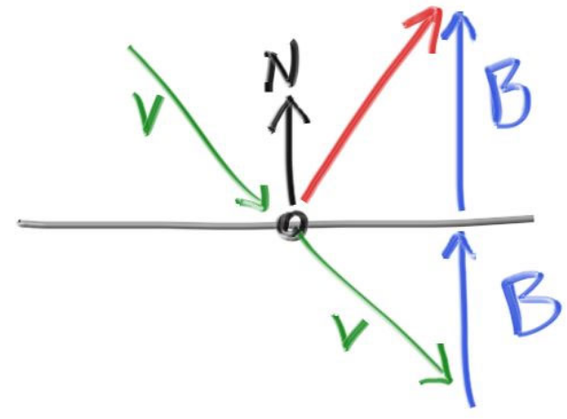
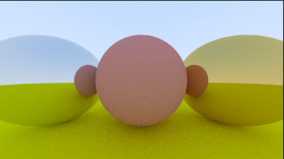
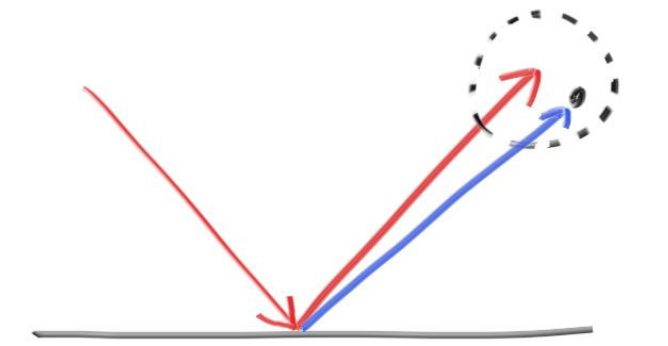
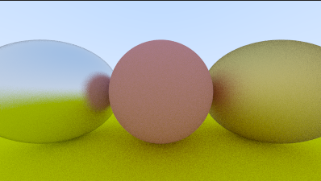

### 9.金属

#### 9.1 金属材质的抽象类

我们想要新建一个类代表物体的材质，通过设置一些参数或类型来改变这个材质。

首先需要两个东西：

1. 产生一些散射射线(或者说吸收一些入射射线)
2. 如果散射，射线会减弱多少

见:[material.h](code/9.金属/1.一个材质的抽象类)

#### 9.2 一个可以描述射线和物体相交的数据结构

射线信息里记录碰撞球的材质，用来加入射线颜色的计算。

这就需要

1. sphere类添加材质类
2. hit_record里记录击中的材质

见:[material.h](code/9.金属/2.击中时记录材质)

#### 9.3 朗伯体的散射和反射

和之前不同的是，光线散射的计算放到了lambertian里

而且加入了一个

* 反射率albedo，(attenuation，衰减率)

* 也可以代表材质的颜色，如颜色为(0.8, 0.6, 0.2)，黄绿色。即吸收大部分蓝色光

* 因为最后射线进行反射时会使用该颜色进行衰减`attenuation * ray_color(scattered,world,depth-1)`
* 即白色(1,1,1)会变成  (1\*0.8，1\*0.6，1\*0.2) 色

见:[material.h](code/9.金属/3.朗伯体的散射)

#### 9.4 镜面反射

一些光滑的材质不会随机散射。

红色的反射射线为$V+2B$，$N$是单位向量，但是$V$不是，$V\cdot N = |V|\cdot |N|\cos \theta = |V|\cos \theta = -|B|$

这里的`dot(v,n)`是一个负值，所以`-dot(v,n)*n`是向量`B`

所以$V+2B$为` v - 2*dot(v,n)*n`

对应的添加金属类`metal`其中只有散射换成了反射，且多了个判定(出射射线与法线夹角小于90度)

主函数的反射光线的计算更改

见：[material.h](code/9.金属/4.金属的镜面反射)

#### 9.5 一个带金属球的场景

见：[PPMFormat.cpp](code/9.金属/5.一个带金属球的场景)

结果如图：

中间和地面的球都是朗伯体，而两侧的球是金属材质(左边的是白灰，右边的是黄绿)

#### 9.6 模糊渲染

如图：

使用一个参考球选择一个大致的随机方向作为反射的终点。

这个球越大，那么材质的表面会显得越模糊。

这就需要添加一个参数用来控制球的半径来控制模糊程度，半径为0时就是我们上面的例子，即完全光滑。

由此引发的一个问题，这个球过大或者，入射射线为掠射角，反射的射线有可能会在物体表面之下，这部分反射射线我们就认为是被物体表面吸收了。

见：[material.h](code/9.金属/6.毛糙点的金属)

可以看到，与上一节的图相比，

左边的球变得毛糙了一点，反射参考球的半径设置的是0.3，

右边的球非常的毛糙，反射参考球的半径设置的是1。

因为最后会对最终反射的射线进行过滤`(dot(scattered.direction(), rec.normal) > 0)`，所以散射在表面以下的射线都被滤除了(吸收了)

