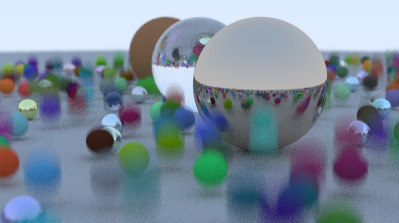

### 2.动态模糊

相机按下快门后，相机会在快门开启与闭合的时间内，让通过镜头的光线使相机内的感光元件感光。

在开启和闭合中间这段时间，拍摄物体如果运动，就会产生模糊的重影。

#### 2.1 时空射线追踪介绍

让射线有存在时间

见:[ray.h](code/2.动态模糊/1.让射线有存在时间)

#### 2.2 更新相机类来模拟动态模糊

我们需要让相机类在time1和time2间隔中间生成射线。

见:[camera.h](code/2.动态模糊/2.相机生成有时间戳的射线)

#### 2.3 添加一个移动的球

* 我们需要一个移动的物体，创建一个球，在time0到time1的时间内，线性的从center0移动到center1。

*  还需要一个方法判断射线是否击中球这个和sphere.h中的判断很相似，只不过**取的center**要**以时间为参数**

见[moving_sphere.h](code/2.动态模糊/3.添加一个运动的球)

#### 2.4 追踪射线相交的时间

现在射线有了时间属性，我们需要更新材质里的散射方法 `material::scatter()`去记录射线与物体相交的时间

见:[4.材质散射出的新射线也同步时间标记](code/2.动态模糊/4.材质散射出的新射线也同步时间标记)

#### 2.5 把所有东西整合一下

见:[5.PPMFormat里调用](code/2.动态模糊/5.PPMFormat里调用)

为什么会出现动态模糊的效果呢？

1. 对于球

   * 添加了一个移动的球，通过参数time获取球的位置

2. 对于射线

   * 记录自己的时间戳
   * 射线击中物体发射散射生成新的射线时，依然沿用时间戳

   * 判断是否击中物体时将**自己的时间**戳作为参数**获取物体位置**

3. 对于材质

   * 散射射线沿用时间戳
   * 所以所有的材质都可以动态模糊了

4. 对于相机

   至此好像还没看到可以动态模糊的东西

   * `get_ray(u,v)`获取射线时会给射线一个随机的生成时间
   * 没了

5. 如何组合成模糊的效果？

   * 一个像素用了100条射线，这100条射线每条时间都是随机的
   * 即每条射线"看到"的球的位置是不同的
   * 叠加这100条射线的颜色然后除以100
   * 这个像素的模糊效果出来了
   * (一个像素用了100条射线说是抗锯齿，不过总感觉起到了平均颜色，和积分光线的效果)

效果如图：

