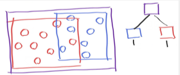
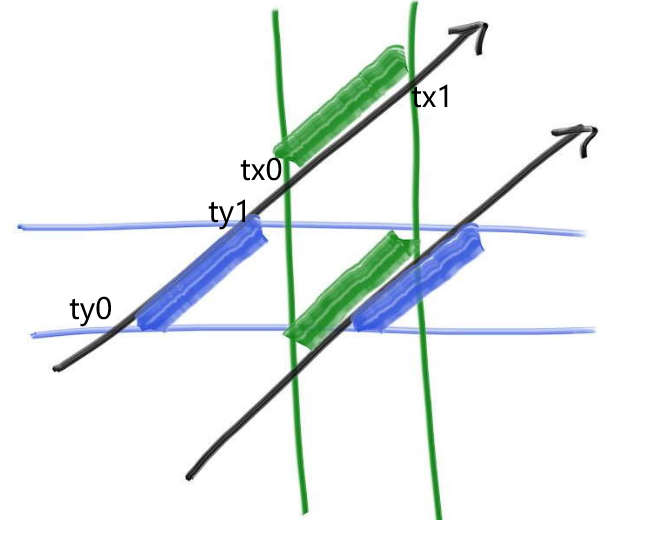
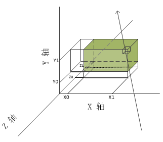
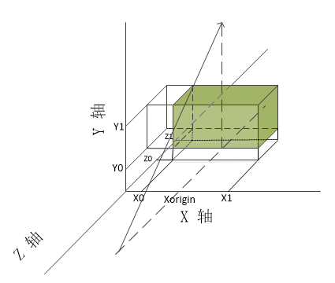

### 3.包围盒层次

这部分是做了一个射线-物体 相交判断的优化

#### 3.1 核心思想

* 一个包围盒包围了了10个物体，如果射线没有击中包围盒，那么射线也肯定和这10个物体没有相交。
* 如果射线击中了包围盒，那么有可能与其中一个或多个相交，也可能不相交
* 一个物体只属于一个包围盒
* 包围盒可以相交

大概代码：

```
if (ray hits bounding object)
    return whether ray hits bounded objects
else
    return false
```


#### 3.2 包围盒层次结构

如图，红蓝包围盒在紫包围盒内，而且红蓝包围盒有交叉



大概代码：

```
if (hits purple)
    hit0 = hits blue enclosed objects
    hit1 = hits red enclosed objects
    if (hit0 or hit1)
        return true and info of closer hit
return false
```


#### 3.3 轴对齐包围盒  Axis-Aligned Bounding Boxes (AABBs)

如何划分包围盒，

* 射线和包围盒的相交应该是可以迅速判断的
* 包围盒应该是紧凑的

实际上对于大部分模型使用轴对齐包围盒比其他替代方案都好

之前我们用$P(t)=A+tb$表示射线

A：表示射线发出的点，如(0,1,2)

b：表示方向，如(3,5,6)

t是一个标量，范围($- \infty$,$+ \infty$)

每一个t对应射线上的一个点。如t为1，则表示射线上的点(3,6,8)。

**t在一定程度上代表从A点出发往b方向走的距离**(t*(b-A).Length)

所以
$Px,Py,Pz $都满足这个公式

即：

* $P_x = A_x + t b_x$

* $P_y = A_y + t b_y$

* $P_z = A_z + t b_z$


回到包围盒：



2D空间下，一个射线怎么判断包围盒相交？

如上图，当绿色区域和蓝色区域有重合的时候。

即

* 用绿色边界和射线方程联立求出射线t的范围 ($tx_0,tx_1$)

* 用蓝色边界和射线方程联立求出射线t的范围($ty_0,ty_1$)

当这两个区域有**交叠**时，说明射线**击中了**矩形包围盒。


扩展到3维空间。



可以理解为，分别

* 求射线与截面$x = x_0$与截面$x= x_1$ 的交点$tx_0$，$tx_1$。

  则$t\in (tx_0,tx_1)$ 的部分在两个截面中间。

同理求：

* 射线与截面$y = y_0$与截面$y= y_1$ 的交点$ty_0$，$ty_1$。

* 射线与截面$z = z_0$与截面$z= z_1$ 的交点$tz_0$，$tz_1$。

这样

* **当 $(tx_0,tx_1)$， $(ty_0,ty_1)$， $(tz_0,tz_1)$ 三个区间有重叠区域时，说明这段重叠区域在6个截面内部，即包围盒内，也就是射线与包围盒相交了。**
* 并且求出的是一个长方体，而且对角线就是这个射线的与包围盒相交的部分。

#### 3.4 射线和轴对齐包围盒相交

伪代码：

2d空间

```
compute (tx0, tx1)
compute (ty0, ty1)
return overlap?( (tx0, tx1), (ty0, ty1))
```

3d空间

```
compute (tx0, tx1)
compute (ty0, ty1)
compute (tz0, tz1)
return overlap?( (tx0, tx1), (ty0, ty1), (tz0, tz1))
```

接下来也有两个部分需要解决

*  tx0和tx1怎么求
* overlap函数怎么写

#####  tx0和tx1怎么求

代入$P_x = A_x + t b_x$

$t_x0 =\frac{ P_x - A_x}{b_x} $

对应到我们代码：

* 起点$Ax$就是"ray.h"文件里`ray.origin.x` 
* 方向$b_x$是`ray.dir.x`
* 交点的x值$P_x$当然就是 $x_0$ 和$x_1$

当分母$bx$为0，即射线投影后方向垂直于x，理论上求不出解。

对于投影后与坐标抽平行的射线的判断

如图：



* c++中 分母为0时 分子为正数，得到正无穷  分子为负数，得到负无穷  分子为0 不知道
* 这时求得的$tx_0 = \frac { X_0 - X_{origin}} {0} $为负无穷  同理$tx_1$为正无穷，得到的区间是    ($-\infty$,$+ \infty$)，可以理解为t取任意值投影都在区间$(X_0,X_1)$内，即满足条件。当然，如果$X_{origin}$在$(X_0,X_1)$两侧时，结果为 ($-\infty$,$-\ \infty$) 或  ($+\infty$,$+ \infty$)则t取任意值投影都不在区间$(X_0,X_1)$内
* x轴取到的区间继续和y轴方向取到的区间叠加，再和z的区间叠加
* 注意这里没有考虑$X_{origin} == X_0 || X_1 $的情况，这种边界情况怎么处理？

##### overlap函数怎么写

如图，以 $tx_0$和$tx_1$为例。如果射线的方向在xz平面的投影与x轴的夹角大于90°，

那么虽然$x_0 < x_1$但是结果 $tx_0 > tx_1$

假设overlap函数传输的参数区间是整理好的。比如传入(a,b)  则满足a<=b

则：我们传入区间 (d,D) (e,E)  计算交叠区间(f,F)

```
bool overlap(d, D, e, E, f, F)
    f = max(d, e)
    F = min(D, E)
    return (f < F)
```

见:[aabb.h](code/3.包围盒层次/1.包围盒与射线相交判断)

#### 3.5  优化一下包围盒与射线的碰撞判断

见:[aabb.h](code/3.包围盒层次/2.优化包围盒与射线相交判断)

#### 3.6 构建物体的包围盒

我们需要添加一个函数用来计算碰撞体的包围盒。

最后会做成一个类似二叉树的包围盒层次，每一个独立的物体如球体就会是二叉树的叶节点。

这个构建包围盒的函数返回一个bool值，因为并不是每个物体都能构造包围盒(比如无边界的平面)。另外，移动物体的包围盒应该覆盖他所有时间的位置[time0,time1]。

定义创建包围盒的抽象函数：[hittable.h](code/3.包围盒层次/3.创建包围盒的函数)

球物体实现创建包围盒[sphere.h](code/3.包围盒层次/3.创建包围盒的函数)

运动的球，计算$t_0$时球的包围盒，计算$t_1$时球的包围盒。计算包围两个包围盒的大包围盒。

[moving_sphere.h](code/3.包围盒层次/3.创建包围盒的函数)

#### 3.7 创建一堆物体的包围盒

* 单个物体创建自己的包围盒 o->bounding_box
* 包围两个包围盒的大包围盒 surrounding_box(box1,box2)
* 循环即可拿到包围list的大包围盒

[hittable_list.h](code/3.包围盒层次/4.一堆物体的包围盒)

#### 3.8 BVH的节点类

[bvh_node.h](code/3.包围盒层次/5.BVH节点)

一个二叉树结构的层次包围盒

#### 3.9 分割BVH体积

任何增加效率的结构，最难的部分就是构建它，BVH也是。

比较酷的是只要`bvh_node`里的objects的list被分成两个子list，碰撞函数就能使用(二叉树的结构)。


