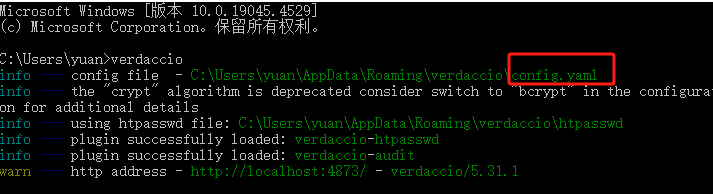

我们可以在内网制作一个npm包服务器

具体步骤如下

#### 安装nodejs

下载 nodejs.msi 

#### 安装verdaccio

默认的verdaccio配置的路径是http://localhost:4873/

我们需要更改配置绑定到本机ip地址并供内网访问

配置路径在"~/.config/verdaccio/config.yaml"

`~`：代表当前用户的主目录。在不同的操作系统中，这个路径有所不同 在 Windows 上，`~` 通常指 `C:\Users\username`。

我们也可以启动下verdaccio，上面会显示配置路径

在配置最后一行添加

```
# Network settings
listen: 0.0.0.0:4873
```

重新启动，这样内网里其他电脑也可以访问到了

按照verdaccio指引，将自己的包发布在上面

参考命令

```
npm adduser --registry http://localhost:4873 创建用户
npm publish --registry http://localhost:4873 发布包 需要cd到包路径下
C:\Users\yuan\AppData\Roaming\verdaccio\storage 删除包
```


#### unity中配置Scoped Registries

即可在package manager面板看到my registries 选项

