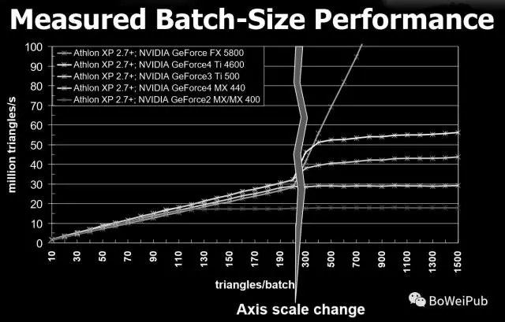
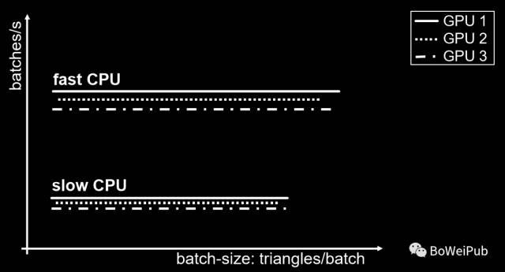
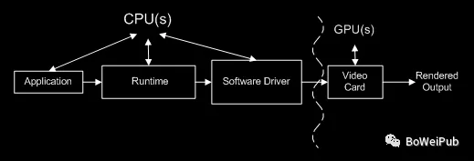
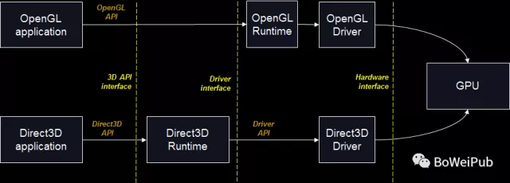
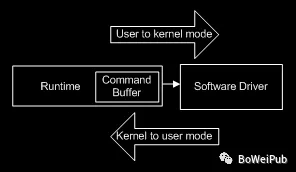
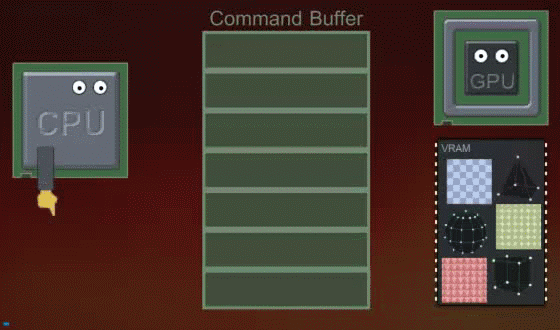
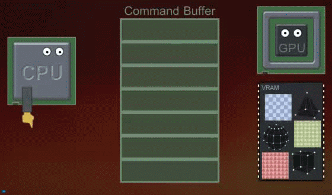

转自：https://gameinstitute.qq.com/community/detail/113040

#### 1.什么是Batch

Batch翻译成中文一般我们称之为"批次"。我们经常用引擎每帧提交的批次数量来作为衡量渲染压力的指标。

即，**CPU每帧向GPU提交多少次三角形/顶点**(这里三角形/顶点的数量并不敏感但是应该要相同的渲染状态(即材质球一样，不同材质球的三角形会分批次提交，即CPU每次想GPU提交的三角形必须材质相同？))

更具体的话可以认为调用一次渲染API的绘制接口（如：Direct3D的DrawPrimitive/DrawIndexedPrimitive，OpenGL的glDrawArrays/glDrawElements）来**向GPU提交使用**一定数量的三角形(相同渲染状态)的行为为一个渲染批次。

从API调用的角度来看，Batch和Draw Call是等价的，但是在游戏引擎中他们的实际意义是不一样的。所以Batch一般指代经过打包后的Draw Call。

**Draw Call就是CPU调用图形编程接口，比如DirectX或OpenGL，来命令GPU进行渲染的操作。**

#### 2.Batch的特点

我们举一个例子：

A.游戏绘制1百万个物体，而每一个物体具有10个三角形

B.绘制10个物体，每个物体有1百万个三角形

哪个效率更高？

从实践经验中我们了解到，后面一种实际效率更高。(因为一次提交小于300个三角形时，每秒绘制的三角形数量是与每次提交的三角形数目正相关的，是这样吗)

我们可以编写一个测试程序，仅仅绘制一些非常简单的三角形数据，没有光照，没有纹理，去掉任何不必要的开销，仅仅做一些简单的渲染状态的切换和Draw Call。**这里为什么要做渲染状态的切换而不是直接连续调用Draw Call的原因后面会给大家解释。**

下面的图表出自Nvdia的一次内部分享会的PPT。虽然测试数据使用的硬件配置比较老，但是还是具有很大的参考意义的。表中的横轴是Triangles/Batch，表示每一个Batch中容纳的Triangles数量。纵轴是Million Triangles/s ，表示一秒能够绘制的百万级三角形数量。在不同的GPU，相同的CPU的环境下，测试不同大小的Batch所表现出的执行效率的不同。

我们通过图表可以看出：

1. 随着每个Batch提交的三角形的数量增多，每秒钟能够渲染的三角形数量也在不断增加。(可以看到每次提交70个三角形，那么可以渲染大概10 百万个三角形，也就是一秒提交了14万次，如果每次提交140个三角形，那么可以渲染大概20 百万个三角形，也就是一秒提交了14万次。不同的Batch大小(提交三角形的数量多少)，CPU性能消耗不会差太多)

2. 在130个Triangles/Batch之前，虽然每个测试环境配置的GPU性能不同，但是随着每个Batch提交的三角形数量增多，每秒能够渲染的三角形数量基本保持一致。(不同的GPU在CPU每次提交**小于130个三角形时**拉不开性能差距，即**GPU性能都是富余的**，即等待CPU给渲染命令)

3. 在130个Triangles/Batch之后，随着每个Batch提交的三角形的数量的增多，配置高性能的GPU的环境每秒钟能够渲染的三角形数量继续线性增长，但是配置低性能GPU的环境处理能力明显降低。(**即一次提交大于300个顶点**，**CPU要等**GPU渲染完成才能提交下一批次)

在130个Triangles/Batch附近的这个位置数据发生了变化，130个Triangles/Batch之前的效率瓶颈在CPU，GPU有足够的时间来处理提交的三角形。而130个Triangles/Batch之后，配置低性能的GPU的环境逐渐出现效率瓶颈。由此可以得出结论：Batch提交的性能消耗主要集中在CPU，而对于**不同的Batch大小**，**CPU的性能**消耗是**恒定**的。

上面的图是相同CPU不同GPU的渲染速度，下面看看不同CPU

上面这幅图，表示了在不同CPU下，以及对应不同的CPU，如果有不同性能的GPU，渲染速度会有什么变化。

从图标中可以看出：

1. 每秒钟能够处理的Batch数量根CPU的性能有非常直接的关系。(假设，一次提交100个三角形，那么即使是性能有差异的GPU，含有**fast CPU**每秒**提交的次数**也更**快**)
2. **GPU的性能**对每秒能够处理的Batch数量**影响比较小**(CPU相同时，GUP 1/2/3的曲线相差不大)
3. 不同的Batch大小似乎对每秒能够处理的Batch数量没有影响。(一批次提交1个三角形，和一批次提交300个三角形，每秒能处理批次都是固定的，所以在一定范围内，**提交的三角形越多，性能越好**)

**总结：CPU的性能决定提交Batch的效率，在不给GPU造成渲染压力的前提下，Batch越大越好。**

我们在实际研发过程中经常遇到CPU效率瓶颈。很多时候正是由于提交的Batch数量过多导致的。如果我们设计的游戏每帧需要绘制的三角形数目是固定的，每个Batch的尺寸很小，而每次提交Batch CPU的性能消耗是一定的。那么只有花费更多的时间才能够绘制完所有的三角形。这就导致了帧率上不去。

这就好比一辆从山顶向下运送游客的缆车。缆车的运行速度是恒定的，如果每个车厢装1个人，那么1小时能够运送到山下的人数为N。如果每个车厢装2个人，那么1小时能够运送到山下的人数为2N。

**每一次Batch的提交就是一次Draw call调用。**我们对于提交Batch的特点有了基本的了解之后，再来说一下，是什么导致Draw call在CPU的性能开销。

#### 3.内核模式和用户模式

内核空间存放的是操作系统内核代码和数据，是被所有程序**共享**的，在程序中修改内核空间中的数据不仅会影响操作系统本身的稳定性，还会影响其他程序，这是非常危险的行为，所以操作系统禁止用户程序直接访问内核空间。

要想访问内核空间，必须借助操作系统提供的 API 函数，执行内核提供的代码，让内核自己来访问，这样才能保证内核空间的数据不会被随意修改，才能保证操作系统本身和其他程序的稳定性。

**用户程序调用系统 API 函数称为系统调用（System Call）；发生系统调用时会暂停用户程序，转而执行内核代码（内核也是程序），访问内核空间，这称为内核模式（Kernel Mode）。**

**用户空间保存的是应用程序的代码和数据，是程序私有的，其他程序一般无法访问。当执行应用程序自己的代码时，称为用户模式（User Mode）。**

计算机会经常在内核模式和用户模式之间切换：
·当运行在用户模式的应用程序需要输入输出、申请内存等比较底层的操作时，就必须调用操作系统提供的 API 函数，从而进入内核模式；

·操作完成后，继续执行应用程序的代码，就又回到了用户模式。

总结：**用户模式就是执行应用程度代码，访问用户空间；内核模式就是执行内核代码，访问内核空间（当然也有权限访问用户空间）。**

#### 4.Draw call性能消耗原因

我们的Application中每一次API调用都会经过Application->Runtime->Driver->Video Card(GPU)，其中每一步都会有一定的耗时。(这里的Runtime是C#的Runtime吗)

在整个渲染工作的执行过程中主要的计算部件有两个：CPU和GPU。**CPU**的性能影响着**Application、Runtime和Driver**和执行效率。**GPU**的性能主要影响着**Vertex处理、Shader**计算和一堆**Frame Buffer**相关的**像素操作**(如：Blend和Multisample anti-aliasing等)的执行效率。

每调用一次渲染API并不是直接经过以上说的所有组件通知GPU执行我们的调用。Runtime会将所有的API调用先转换为设备无关的"命令"(之所以是设备无关的，主要是因为这样我们写的程序就可以运行在任何特性兼容的硬件上了。运行时库使不同的硬件架构相对我们变得透明。也就是**IL中间代码**)，然后将命令缓存在Runtime的Command Buffer中。

CommandBuffer为**渲染命令缓冲区**，我们将一些列渲染指令添加到CommandBuffer中，在需要执行时通过Camera或者Graphics类进行执行，进而实现对渲染流程的控制。同时可以实时生成我们需要的临时效果。

在Unity5中新增了这个类，可以**自定义渲染操作**，如可以通过DrawRenderer，参数(renderer，材质)，在相机渲染的某个阶段，如(AfterForwardOpaque，不透明前向渲染完成后) ，再增加一次渲染流程(一次draw call)。

我在上一篇文章中介绍过这个Command Buffer的概念，但是当时说的是这个Command Buffer是存在于Driver中，由Driver维护的。给大家看一下Direct3D和OpenGL的Runtime的差异，相信大家马上就会明白为什么对于这个Command Buffer的位置怎么说的都有：

Direct3D的Runtime是独立的一堆DLL，我们在开发Direct3D应用的时候总是要引入这些动态链接库。而OpenGL的Runtime是和Driver整合在一起的。所以有的时候我们会把OpenGL的Runtime和Driver统称为Driver。那么对于OpenGL，我们既可以说Command Buffer位于Runtime中，也可以说其位于Driver中了。

这个Command Buffer的存在不仅仅是为了上一篇文章说的那样，让CPU和GPU能够并行工作。它还有一个很重要的作用：**提升渲染效率。**

命令从Runtime到Driver的过程中，CPU要发生从用户模式到内核模式的切换。模式切换对于CPU来说是一件非常耗时的工作，所以如果所有的API调用Runtime都直接发送渲染命令给Driver，那就会导致每次API调用都发生CPU模式切换，这个性能消耗是非常大的。Runtime中的Command Buffer可以将一些没有必要马上发送给Driver的命令缓冲起来，在适当的时机一起发送给Driver，进而在Video Card执行。以这样的方式来寻求最少的CPU模式切换，提升效率。

命令从Runtime到Driver的过程中，CPU要发生从用户模式到内核模式的切换。(涉及到硬件驱动等内容？)。模式切换对于CPU来说是一件非常耗时的工作，所以如果所有的API调用Runtime都直接发送渲染命令给Driver，那就会导致每次API调用都发生CPU模式切换，这个性能消耗是非常大的。Runtime中的Command Buffer可以将一些没有必要马上发送给Driver的**命令缓冲起来**，在适当的时机**一起发送给Driver**，进而在Video Card执行。以这样的方式来寻求最少的CPU模式切换，提升效率。

补充：Shader是在用户模式下编译的，并且编译成设备无关的中间码。Driver解析中间码，然后使用GPU硬件实现我们设计的功能。

前面的文章介绍过，**渲染状态**是一组**全局**的指导GPU工作的变量集合。如果**渲染状态要发生改变**，那么要使用之前渲染状态进行渲染的所有Draw call**命令都必须已经被执行了**。也就是说之前缓冲在Runtime的Command Buffer中的所有Draw call命令必须被刷新。这会强制发生一次CPU从用户模式到内核模式的切换。

(切换渲染状态需要cpu需要切换内核模式？)

综合以上，Draw call之间切换Texture、Shader或者Material参数(即切换渲染状态)，会导致CPU至少两方面的时间消耗：

1.把Draw call及渲染状态切换的API调用转换成设备无关命令耗费的时间（其中还包括命令检查等操作）。

2.刷新Command Buffer导致CPU由用户模式切换到内核模式带来的时间消耗。

第一点的时间消耗其实并不大。关键的时间消耗在于第二点。所以一般情况下我们希望Command Buffer缓存尽可能多的命令，然后一次全部提交给GPU执行。

到这里大家应该就能明白为什么前面说的实验程序要在每次Draw call之间进行渲染状态的切换了。执行了**渲染状态的切换**强制Runtime在每次Draw call之后都要进行一次**Command Buffer的刷新**。如果使用相同的渲染状态，那么Command Buffer会缓存很多Draw call的命令，最后一起发送给Driver执行。这样的话我们就无法测试出每个Batch处理的真实开销了。

#### 5.优化

在产品研发的过程中我们可以预先针对目标平台先设计一个可接受的每帧Batch数量，然后后续美术资源的生产和场景的设计都尽量保证Batch数量不会超标。

在设计Batch数量的时候可以参考以下几个因素：

1.目标平台的CPU性能。

2.我们期望的帧率。

3.Batch提交操作所能够占用的CPU性能百分比（为其他CPU任务留出资源）。

